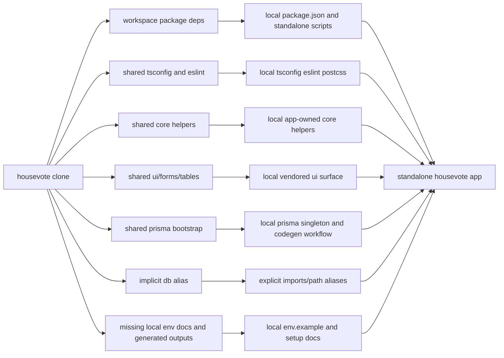

# HouseVote Standalone Extraction Plan

## Goal

Break `housevote` out of the `turbodima` monorepo into a standalone `house-vote` app so it can be installed, developed, built, and deployed as a normal standalone app with:

- no `workspace:*` dependencies
- no runtime imports from `@turbodima/*`
- app-owned auth, DB, UI, and server-action plumbing
- local Prisma generation that works from this repo alone
- clear environment and setup instructions for developers working outside the monorepo

## Decisions Locked In

These implementation decisions are now fixed for this roadmap:

- the standalone package name should be `house-vote`
- Clerk stays
- Prisma + Postgres stay
- generated Prisma and Zod outputs should be generated locally, not committed to git
- CI/deploy is deferred until after the app is independently runnable

## Generated Code Recommendation

### Recommendation

Do **not** commit generated Prisma client or generated Zod files.

Recommended policy:

- keep `generated/client/` and `generated/zod/` as local build artifacts
- generate them with `pnpm prisma generate`
- ignore them in git
- document that `pnpm prisma generate` is part of first-time setup and part of any schema-change workflow

### Plain English

Simple version:

- source code is the stuff humans maintain
- generated code is disposable output

If we commit generated code, the repo gets noisier and easier to break in subtle ways:

- huge diffs for small schema changes
- merge conflicts in files nobody should hand-edit
- stale generated output checked in by accident
- confusion about what the real source of truth is

For this app, the real source of truth should be:

- `prisma/schema.prisma`
- migrations
- app-owned DB/bootstrap code

Not the generated client output.

### Why I Recommend This Here

I think committing generated code would be the wrong default for this extraction.

Reasons:

- this is becoming a normal standalone app repo, so it should behave like a normal Prisma app repo
- Prisma generation is already a standard local workflow
- the generated output is derived from schema, not authored by us
- keeping generated files out of git reduces review noise during ongoing schema work

### The Only Real Downside

The downside is that a fresh clone needs one more setup step:

- `pnpm prisma generate`

But that is a good trade.

It is a predictable developer step, while committed generated code creates persistent repository noise.

### When I Would Recommend Committing It

I would only recommend committing generated outputs if one of these becomes true:

- your deploy/build platform cannot reliably run `prisma generate`
- you intentionally want zero-codegen local setup for non-technical contributors
- a specific generated artifact is required at runtime in an environment where generation is impossible

None of those look like the right default here.

## Plain English Summary

`housevote` is a more serious extraction than `toliks-poems`.

Simple version:

- `toliks-poems` was mostly a Next app borrowing a small amount of shared code
- `housevote` is a product app borrowing a lot of shared code and tooling

This clone still depends on the monorepo in four major ways:

1. shared package dependencies in `package.json`
2. shared TypeScript and ESLint config
3. shared core utilities for responses, validation, auth helpers, and Prisma client setup
4. a much wider shared UI surface including form abstractions, table abstractions, and many shadcn wrappers

On top of that, `housevote` also has a real database layer:

- Prisma schema and migrations
- generated Prisma client
- generated Zod schemas
- `DATABASE_URL` as a hard runtime requirement

So this is not just "copy the app into a new folder". It is "rebuild all the invisible platform assumptions so the app can stand on its own".

## What Is Still Coupled Today

These are the concrete monorepo couplings already visible in the cloned app:

- `package.json` still depends on `@turbodima/configs`, `@turbodima/core`, and `@turbodima/ui`
- `tsconfig.json` still extends `@turbodima/configs/tsconfig/nextjs`
- `eslint.config.mjs` still re-exports `@turbodima/configs/eslint/next-js`
- `next.config.ts` still uses `transpilePackages` for `@turbodima/ui` and `@turbodima/core`
- `src/app/layout.tsx` imports shared `ThemeProvider` and shared `Toaster`
- many feature files import shared UI primitives, generic forms, generic tables, and utility components
- many server actions and DB helpers import shared core helpers like:
  - `@turbodima/core/responses`
  - `@turbodima/core/errors`
  - `@turbodima/core/form-data`
  - `@turbodima/core/types`
  - `@turbodima/core/server-actions`
  - `@turbodima/core/prisma`
  - `@turbodima/core/auth/client/useAuthStatus`
  - `@turbodima/core/constants`
- `db.ts` depends on `@turbodima/core/prisma`
- many files import from bare `'db'`, which is a hidden alias/coupling that needs to be made explicit in standalone form
- Prisma client and Zod outputs are expected under `generated/`, but that folder is not currently present in the standalone clone
- there is no visible `env.example` or `.env.example` in the standalone clone

## Why This Is Harder Than Toliks Poems

### Toliks Poems

- mostly read-only app
- tiny shared package surface
- no real DB/codegen pipeline
- easy to localize the borrowed parts

### HouseVote

- authenticated product app
- real mutable data
- Prisma + migrations + generated code
- many more shared form/table/UI abstractions
- many more shared response/error/action helpers

That means the cleanest plan is still "localize ownership", but the migration has to be phased more carefully.

## Recommendation

### Recommended Direction

Make `housevote` a **fully self-owned standalone app repo**.

That means:

- keep external libraries like Next, Clerk, Prisma, Zod, React Leaflet, Cheerio, etc.
- remove all `@turbodima/*` dependencies
- move the required shared logic into local app-owned code
- make Prisma generation work entirely inside this repo
- replace implicit monorepo aliases with explicit local paths

### What I Do Not Recommend

I do **not** recommend:

- copying the entire monorepo `packages/ui`, `packages/core`, and `packages/configs` directories into this repo
- publishing the monorepo packages just so this app can keep importing them
- trying to heavily redesign the app while extracting it
- trying to rewrite all borrowed UI abstractions from scratch in one pass

That last point matters. For `housevote`, the UI dependency surface is broad enough that a total rewrite would be risky and unnecessarily slow.

## Best Extraction Strategy For This App

This is the key skeptical recommendation:

For `housevote`, do **not** try to be too clever by rewriting everything to "simpler local equivalents" immediately.

That worked for `toliks-poems` because the shared surface was tiny.

For `housevote`, the safer route is:

1. make the repo/tooling standalone
2. localize data/auth/core helpers
3. vendor the used UI surface locally
4. get the app green
5. only then simplify or refactor the borrowed UI layers if desired

Simple version:

- extraction first
- cleanup second

## Working Assumptions For This Plan

This roadmap now assumes:

- the standalone package name is `house-vote`
- Clerk stays
- Prisma + Postgres stay
- the goal is a true standalone app, not a half-detached repo
- generated Prisma and Zod outputs are locally generated and gitignored
- CI/deploy can happen after the app is locally healthy
- the first milestone is:
  - `pnpm install`
  - `pnpm dev`
  - `pnpm build`
  - `pnpm lint`
  - `pnpm prisma generate`
  all working from the standalone repo

## Current To Target Architecture

## Phase 1: Establish Standalone Repo Boundaries

### Plain English

First, stop pretending this app still lives inside a workspace. Give it the repo-level files and scripts a normal app repo needs.

### Technical Breakdown

Create or replace repo-local config so this app can stand on its own:

- replace `workspace:*` dependencies
- replace monorepo config inheritance
- make lint and TS config local
- remove `transpilePackages`
- define package manager and Node expectations
- document env requirements

### Checklist

- [ ] Rename package to `house-vote`
- [ ] Replace all `workspace:*` deps with real npm deps
- [ ] Add local `packageManager` and `engines`
- [ ] Replace `tsconfig.json` inheritance from `@turbodima/configs`
- [ ] Replace `eslint.config.mjs` re-export with local config
- [ ] Keep `postcss.config.mjs` local and valid
- [ ] Remove `transpilePackages` from `next.config.ts`
- [ ] Add local `env.example`
- [ ] Add standalone README/setup docs
- [ ] Confirm static assets still live locally in `public/`

### Suggested Checkpoint Commit

`chore: prepare housevote standalone repo scaffolding`

## Phase 2: Make Prisma And Generated Code Truly Local

### Plain English

Before touching most application code, make the data layer independent. If Prisma generation and DB access are not local-first, the app will never be reliably standalone.

### Technical Breakdown

Current data-layer concerns:

- `prisma/schema.prisma` depends on `DATABASE_URL`
- generated Prisma client is expected under `generated/client`
- generated Zod schemas are expected under `generated/zod`
- `db.ts` depends on a shared helper: `@turbodima/core/prisma`
- many app files import from bare `'db'`

That means extraction must define:

- where generated outputs live
- how they are generated
- how the DB client singleton is built
- how application code imports DB types safely

Recommended target shape:

- `generated/client/` and `generated/zod/` remain app-local outputs
- `lib/db/client.ts` or `db.ts` becomes fully app-owned
- bare `'db'` imports are replaced with a local alias or explicit path
- scripts include generation and migration workflow

### Checklist

- [ ] Replace `@turbodima/core/prisma` in `db.ts`
- [ ] Create local Prisma singleton/client bootstrap
- [ ] Decide whether to keep `db.ts` at repo root or move to `src/lib/db.ts`
- [ ] Replace bare `'db'` imports with explicit local imports or a documented path alias
- [ ] Ensure `prisma generate` creates `generated/client`
- [ ] Ensure `zod-prisma` creates `generated/zod`
- [ ] Add scripts for generation and migration status as needed
- [ ] Add `DATABASE_URL` to env docs
- [ ] Gitignore generated outputs instead of committing them
- [ ] Document that schema changes require regenerating client and Zod outputs

### Suggested Checkpoint Commit

`refactor: localize prisma bootstrap and generated code workflow`

## Phase 3: Localize Shared Core Helpers

### Plain English

A lot of the mutation/query logic is currently leaning on shared helpers for response formatting, validation, error codes, and action typing. These need to become app-owned.

### Technical Breakdown

The shared core surface appears to include at least:

- response helpers
- error enums/utilities
- form-data validation helpers
- server-action helper types
- auth client helpers
- constants like sign-in paths

Recommended target shape:

- `src/lib/core/errors.ts`
- `src/lib/core/responses.ts`
- `src/lib/core/form-data.ts`
- `src/lib/core/types.ts`
- `src/lib/auth/useAuthStatus.ts`
- `src/lib/constants/auth.ts`

This should be done before or alongside UI extraction because many components and actions depend on these shared contracts.

### Checklist

- [ ] Inventory the exact shared core helpers in use
- [ ] Recreate the minimum app-owned versions locally
- [ ] Replace all `@turbodima/core/*` imports
- [ ] Keep response and error contracts stable enough that feature code can be migrated incrementally
- [ ] Re-evaluate whether some shared abstractions are overkill and can be simplified locally

### Suggested Checkpoint Commit

`refactor: replace shared core action and response helpers`

## Phase 4: Localize Shared UI Surface

### Plain English

This is the biggest part of the extraction. `housevote` borrows a lot more UI than `toliks-poems`, so the plan should assume a controlled vendoring pass, not a one-shot rewrite.

### Technical Breakdown

The shared UI surface includes:

- theme provider and theme toggle
- buttons, badges, inputs, cards, dialogs, sheets, tooltips, alerts, labels, avatars
- generic table abstractions
- form abstractions and form fields
- utility components like `Flex`, `MetadataItem`, `ImageWithFallback`, `LinkButton`
- shared `cn` helper

Recommended approach:

- vendor the used surface locally under app-owned paths
- preserve current behavior first
- simplify later once the app is stable and independent

Recommended target structure:

- `src/components/ui/`
- `src/components/form/`
- `src/components/core/`
- `src/lib/utils/cn.ts`

Important skeptical note:

Trying to replace all of this with native/simple alternatives during extraction would likely create a lot of regressions. For this app, portability is the first job.

### Checklist

- [ ] Inventory all `@turbodima/ui/*` imports by category
- [ ] Vendor the used UI components locally
- [ ] Vendor shared table/form abstractions locally
- [ ] Vendor `cn` and any style/token utilities actually used
- [ ] Replace imports in feature code
- [ ] Remove `@turbodima/ui` from `package.json`
- [ ] Remove `transpilePackages` after localizing the UI surface
- [ ] Confirm layout, auth pages, forms, dialogs, tables, and cards still render correctly

### Suggested Checkpoint Commit

`refactor: vendor shared ui surface into standalone housevote`

## Phase 5: Stabilize Auth And Routing

### Plain English

This app appears to assume Clerk is staying, so the goal is not "remove auth". The goal is to make Clerk behavior portable in the standalone repo.

### Technical Breakdown

Key auth/routing touchpoints:

- `src/app/layout.tsx`
- `src/middleware.ts`
- `src/components/HeaderActions.tsx`
- auth route group under `src/app/(auth)/`

Current auth code also depends on shared auth helpers and constants, which means auth stabilization depends on Phase 3.

### Checklist

- [ ] Keep `@clerk/nextjs` as a direct dependency
- [ ] Replace shared auth helper imports with local equivalents
- [ ] Replace shared sign-in path constants with local app constants
- [ ] Verify middleware route protection rules still make sense in standalone form
- [ ] Verify sign-in and sign-up routes still work
- [ ] Verify signed-in owner flows and guest flows still work
- [ ] Document required Clerk env vars

### Suggested Checkpoint Commit

`chore: finalize standalone clerk integration for housevote`

## Phase 6: Environment, Setup, And Developer Experience

### Plain English

A standalone app is only really standalone if another developer can clone it and know how to boot it.

### Technical Breakdown

This app currently appears to lack visible standalone env docs. That is a real blocker because the app needs at least:

- Clerk env
- `DATABASE_URL`
- possibly additional service env later depending on scraping/email/invite work

### Checklist

- [ ] Add `env.example`
- [ ] Document required env vars
- [ ] Document first-run setup:
  - install
  - env
  - prisma generate
  - DB migration or push
  - dev server
- [ ] Decide whether a local seed or sample DB setup is needed
- [ ] Remove monorepo-specific docs that no longer apply or clearly mark them historical

### Suggested Checkpoint Commit

`docs: add standalone setup and environment guide for housevote`

## Phase 7: Validation And Definition Of Done

### Plain English

The extraction is done when a fresh clone of `house-vote` works like a normal app repo, not when imports merely compile.

### Definition Of Done

The app should satisfy all of the following from the standalone repo root:

- `pnpm install`
- `pnpm lint`
- `pnpm build`
- `pnpm dev`
- `pnpm prisma generate`
- DB access works with local env
- there are no runtime imports from `@turbodima/*`
- there are no `workspace:*` dependencies
- no config file reaches outside the repo boundary

### Technical Verification Checklist

- [ ] `rg "@turbodima/" .` returns no runtime/config matches outside historical docs
- [ ] `rg "workspace:\\*|transpilePackages|@turbodima/configs|../../packages" .` returns no active config/runtime matches
- [ ] `pnpm install` succeeds
- [ ] `pnpm prisma generate` succeeds
- [ ] `pnpm lint` succeeds
- [ ] `pnpm build` succeeds
- [ ] `pnpm dev` boots
- [ ] authenticated owner flow works
- [ ] guest invite flow works
- [ ] listing import flow works
- [ ] likes/voting flow works
- [ ] trip creation/edit flow works

### Manual QA Checklist

- [ ] Home page loads
- [ ] Sign-in and sign-up render
- [ ] Owner can create a trip
- [ ] Owner can edit trip details
- [ ] Owner can create and share an invite
- [ ] Invite token page works
- [ ] Guest join flow works
- [ ] Listing import flow works
- [ ] Listing manual creation/edit works
- [ ] Likes update correctly
- [ ] Trips/listings tables render correctly
- [ ] Map/listing cards render correctly
- [ ] Theme toggle works

### Suggested Final Checkpoint Commit

`chore: complete standalone housevote extraction validation`

## Suggested Branch Or PR Breakdown

### Slice 1

Standalone repo scaffolding and local config.

Includes:

- `package.json`
- `tsconfig.json`
- `eslint.config.mjs`
- `next.config.ts`
- env docs

### Slice 2

Prisma and generated code localization.

Includes:

- `db.ts`
- generation scripts
- alias cleanup
- env requirements

### Slice 3

Shared core helper localization.

Includes:

- responses
- errors
- validation helpers
- auth helpers
- constants

### Slice 4

Shared UI vendoring.

Includes:

- form abstractions
- table abstractions
- ui primitives
- layout-level theme/toast components

### Slice 5

Auth stabilization and final verification.

Includes:

- middleware
- header auth state
- auth route validation
- smoke testing

## Biggest Risks

### High Risk

- underestimating how much of the app depends on `@turbodima/ui`
- breaking Prisma generation or generated import paths
- leaving bare `'db'` imports unresolved in standalone form
- extracting shared response/type helpers incorrectly and silently changing action behavior
- trying to refactor the app design while extracting it

### Medium Risk

- Clerk middleware behavior changing subtly after auth helper replacement
- map and listing import features requiring extra env/runtime assumptions later
- generated Zod schema imports breaking if file layout changes

### Low Risk

- replacing repo-level config
- replacing `workspace:*` package references
- documenting env/setup steps

## Recommended First Implementation Pass

If we optimize for the least fragile extraction, this is the order I would use:

1. Make repo config and scripts standalone.
2. Fix Prisma generation and the DB bootstrap first.
3. Replace the shared core helpers the actions depend on.
4. Vendor the shared UI surface locally.
5. Stabilize Clerk and route protection.
6. Add env/setup docs and validate all major flows.

## Scope Estimate

- Expected files touched: `60-140`
- Expected lines changed: `2,500-7,000`
- Performance impact: `mostly neutral`, with possible slight improvement after removing wrapper/config indirection
- Hackiness score: `3/7` if we vendor the used surface carefully and defer cleanup
- Hackiness score: `6/7` if we try to rewrite all shared UI/core abstractions during extraction instead of first making the app portable

