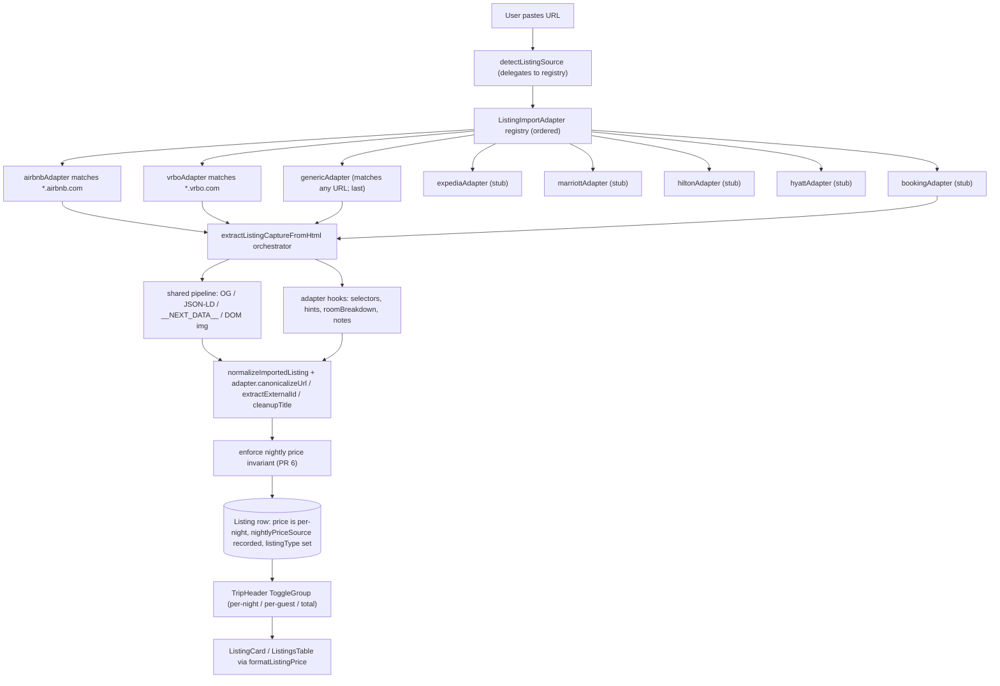
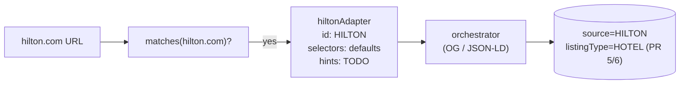
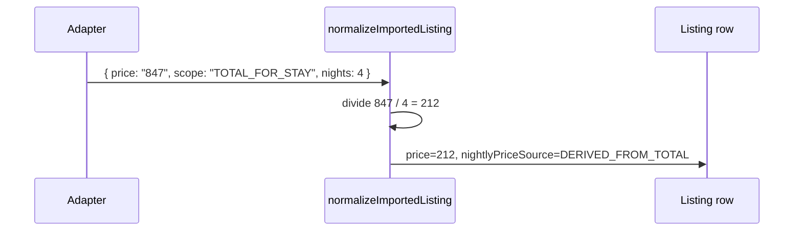
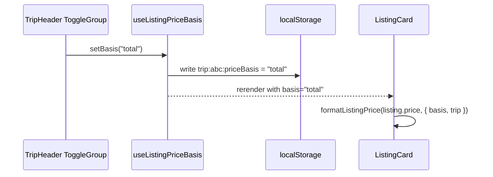

# Hotels, Resorts & Custom Listings — Import Roadmap

## 1. Plain-English summary

Today the app can only import listings from Airbnb and Vrbo. Anything else is
rejected with "Only Airbnb and VRBO listing pages are supported right now."
This roadmap unlocks **three things**:

1. **Any URL becomes importable.** Paste a Marriott, Hilton, Booking.com, or a
   little DTC cabin website — we'll do a best-effort Open Graph / Schema.org
   extraction and save a listing. It might come in as `PARTIAL` with a few
   blank fields, and that's fine.
2. **A listing knows what kind of thing it is.** A house is not a hotel room.
   We add a `ListingType` (HOUSE / HOTEL / APARTMENT / CABIN / RESORT / OTHER)
   that is **independent** of where the data came from. A manually-entered
   Airbnb is still `listingType=HOUSE`. A Marriott scrape is `listingType=HOTEL`.
3. **Prices are comparable across lodging types.** Today we store whatever
   we scrape, which is usually "per night" for Airbnb/Vrbo but "total for the
   stay" for hotels. We normalize everything to **per night** on the way in,
   record how it was derived, and give the user a toggle in `TripHeader` to
   **display** prices as per-night / per-guest / total.

The work is split into **7 independently revertable PRs**, stacked linearly.
Each PR has its own branch. Each PR passes `pnpm check-types`, `pnpm test`,
and `pnpm lint` on its own.

## 2. Decisions locked in

| Decision | Chosen | Why |
|---|---|---|
| Generic fallback vs. per-source adapters | **Both** | Unlock any-URL support now (fallback), invest in hotel-specific adapters as templates. |
| `ListingType` enum values | `HOUSE`, `HOTEL`, `APARTMENT`, `CABIN`, `RESORT`, `OTHER` | User-requested. B&B rolls up as `HOTEL`. No `CONDO`. |
| Price storage | Always **per night** | User-requested. Any "total" that is scraped gets divided by the stay length. |
| Display toggle UX | shadcn `ToggleGroup` in `TripHeader` | User-requested. Persist to `localStorage` keyed by trip id. |
| Hotel-room room layout | Default to one room mimicking existing bed layout | User-requested. Adapters can override for multi-room suites later. |
| Hotel adapter targets | Booking, Expedia, Marriott, Hilton, Hyatt (stubs with TODOs) | User-confirmed. HTML samples collected later. |
| Chrome extension parity | Deferred | User-confirmed. Follow-up task tracked below. |
| `UNKNOWN` enum value | Kept alongside `OTHER` for safe revert | Removed later when no caller produces it. |
| Branch topology | Linear stack, one branch per PR | Each PR cleanly revertable via `git revert`. |

## 3. Architecture



**Key insight**: `ListingSource` says **where the data came from**, `ListingType`
says **what kind of lodging it is**. They are orthogonal. Manual entry of a
hotel is `source=MANUAL, listingType=HOTEL`. A Marriott scrape is
`source=OTHER, listingType=HOTEL` (later `source=MARRIOTT` when its adapter is
promoted from stub to active). This separation is what makes the codebase
extensible without combinatorial explosion.

## 4. Data model changes

### 4.1 New / modified enums

```prisma
enum ListingSource {
  MANUAL
  AIRBNB
  VRBO
  UNKNOWN      // kept for safe revert; removed in a later cleanup migration
  OTHER        // PR 1
  // BOOKING, EXPEDIA, MARRIOTT, HILTON, HYATT added in PR 4
}

enum ListingType {              // PR 1
  HOUSE
  HOTEL
  APARTMENT
  CABIN
  RESORT
  OTHER
}

enum NightlyPriceSource {       // PR 1
  SCRAPED_NIGHTLY
  DERIVED_FROM_TOTAL
  MANUAL
}
```

### 4.2 `Listing` additions

```prisma
model Listing {
  // ... existing fields ...
  listingType          ListingType         @default(HOUSE)        // PR 1
  nightlyPriceSource   NightlyPriceSource?                        // PR 1
  priceQuotedStartDate DateTime?                                   // PR 1
  priceQuotedEndDate   DateTime?                                   // PR 1
  @@index([listingType])                                           // PR 1
}
```

Rationale for nullability:

- `listingType`: `NOT NULL DEFAULT HOUSE`. Every existing row is retroactively
  a house. No backfill needed.
- `nightlyPriceSource`: `NULL` allowed. Legacy rows have no reliable story —
  we don't want to falsely label them. New imports populate it.
- `priceQuoted*Date`: `NULL` when the source didn't tie price to a stay window
  (Airbnb list view, manual entry).

## 5. Phases of work

### Phase 0 — Prerequisites [x]

- [x] Read `README.md` / existing import pipeline
- [x] Confirm current fixtures `example-airbnb.html` and `example-vrbo.html` still test-green
- [x] Confirm decisions with user (listing types, price toggle placement, stubs-with-TODOs)

### Phase 1 — PR 1: Schema additions only [x]

Branch: `feat/schema-listing-type-and-price-metadata`
Commit: `4372b7e`

**What ships**: new enums + new nullable-ish columns + new index. No behavior
change. Two TS files widened to accept the new `OTHER` source and the three
new `Listing` fields so `pnpm check-types` stays green.

**Manual migration**: `prisma migrate dev` wanted to reset the remote dev Neon
DB because of pre-existing drift (`TripGuest.updatedAt` default + a previously
modified migration). The drift is not our fault and resetting the dev DB would
destroy real data. So the migration was written by hand following the patterns
of `20260420030500_remove_self_added_guest_source` (raw SQL). Production
`prisma migrate deploy` will apply it cleanly; local dev can `db:push` or
reconcile drift separately.

Checklist:

- [x] Add `OTHER` to `ListingSource`
- [x] Add `ListingType` enum
- [x] Add `NightlyPriceSource` enum
- [x] Add `listingType`, `nightlyPriceSource`, `priceQuotedStartDate`, `priceQuotedEndDate` to `Listing`
- [x] Add `@@index([listingType])`
- [x] Hand-write `prisma/migrations/20260421120000_add_listing_type_and_price_metadata/migration.sql`
- [x] Widen `ListingSourceBadge` + `ListingsTable` to use `ListingSource` type from Prisma
- [x] Add the three new fields to `MapListing` in `TripContentArea.tsx`
- [x] `pnpm check-types`, `pnpm test`, `pnpm lint` green

---

### Phase 2 — PR 2: Adapter registry refactor [x]

Branch: `refactor/listing-import-adapter-registry`
Commit: `853fe8f`

**What ships**: a small `ListingImportAdapter` interface, Airbnb + Vrbo code
extracted into `airbnbAdapter.ts` / `vrboAdapter.ts`, a `registry.ts`, and a
`importHelpers.ts` that centralizes the pure scraping helpers. The monolithic
orchestrator drops from **~940 lines to ~266 lines**.

**Why it's safe**: the existing `extractListingCaptureFromHtml.test.ts`
(Airbnb + Vrbo fixtures + Airbnb price widget normalization) still passes —
that's the invariant. Zero behavior change.

**Adapter interface** (`src/features/listings/import/adapters/types.ts`):

```typescript
interface ListingImportAdapter {
  id: ListingImportSourceValue;
  matches(url: URL): boolean;
  selectors: { title: string[]; address: string[]; price: string[] };
  extractHints?($: CheerioAPI): ListingImportAdapterHints;
  extractRoomBreakdown?($: CheerioAPI, inputUrl: string): RoomBreakdown | null;
  extractNotes?($: CheerioAPI): string | null;
  cleanupTitle?(title: string): string;
  canonicalizeUrl?(url: URL): URL;
  extractExternalId?(canonicalUrl: URL): string | null;
}
```

Checklist:

- [x] Create `adapters/types.ts` with the interface and empty defaults
- [x] Create `adapters/airbnbAdapter.ts` (hints, room breakdown, title cleanup, canonicalization, external id)
- [x] Create `adapters/vrboAdapter.ts` (same surface + VRBO notes contribution)
- [x] Create `adapters/registry.ts` with ordered `[airbnb, vrbo]`
- [x] Create `importHelpers.ts` with all pure scraping helpers (normalizeText, deepCollectByKey, extractNightlyPriceFromText with pattern-priorities, etc.)
- [x] Shrink `extractListingCaptureFromHtml.ts` to pure orchestration
- [x] Point `detectListingSource.ts` at the registry
- [x] Delegate `canonicalizeUrl` / `extractExternalId` / `cleanupTitle` in `normalizeImportedListing.ts` to the adapter
- [x] Existing tests stay green

---

### Phase 3 — PR 3: Generic adapter + unlock OTHER [x]

Branch: `feat/generic-listing-import-fallback`
Commit: `da56031`

**What ships**: `genericAdapter` at the end of the registry, matches any
parseable URL, id is `OTHER`. The `UNKNOWN` gate in `importListingCapture.ts`
and `refreshListingFromSourceUrl.ts` is removed, along with the now-unused
`LISTING_IMPORT_UNSUPPORTED_SOURCE_MESSAGE`. `OTHER` is added to the Zod
`ListingImportSourceSchema`. `fetchListingMetadata` stops using a hand-rolled
source union.

**User-visible change**: pasting a hotel / resort / DTC cabin URL actually
creates a listing now. Expect `PARTIAL` import status for many sites until
their hotel-specific adapter lands.

Checklist:

- [x] `adapters/genericAdapter.ts` (matches any URL, strips utm_* params)
- [x] Append `genericAdapter` to registry (last)
- [x] Remove UNKNOWN throw in `importListingCapture.ts`
- [x] Remove UNKNOWN error branch in `refreshListingFromSourceUrl.ts`
- [x] Delete `LISTING_IMPORT_UNSUPPORTED_SOURCE_MESSAGE`
- [x] Add `OTHER` to `ListingImportSourceSchema`
- [x] Use `ListingImportSourceValue` in `fetchListingMetadata.ts`
- [x] Tests + types + lint green

---

### Phase 4 — PR 4: Hotel adapter stubs [ ]

Branch: `feat/hotel-adapter-stubs`

**What ships**: five stub adapters registered **before** `genericAdapter`, so
they win when their hostnames match. Each stub:

- Declares its hostnames in `matches()`.
- Sets `listingType` expectation (all `HOTEL`, even though that field is set
  later in PR 6; today this is a `// TODO(hotel-selectors)` note).
- Reuses the default selectors and relies on the shared pipeline's Schema.org
  `Hotel` / `LodgingBusiness` extraction.
- Carries `// TODO(hotel-selectors): needs HTML sample` comments wherever
  site-specific selectors will eventually go.

Why stubs first: stubs produce **correct `source`** even if they don't yet
add selector-specific intelligence. So the moment we have an HTML sample for
Marriott we can turn "Marriott stub" into "Marriott adapter" in a tiny PR.

Also extends `ListingSource` enum:

```prisma
enum ListingSource {
  MANUAL
  AIRBNB
  VRBO
  UNKNOWN
  OTHER
  BOOKING
  EXPEDIA
  MARRIOTT
  HILTON
  HYATT
}
```

Plus Zod schema + migration.



Checklist:

> **Heads-up (2026-04-22):** The previously-scaffolded `expedia/marriott/hilton/hyatt` adapters and the `createHotelAdapterTemplate` factory were deleted during the phase-2 refactor in [260422REFACTOR__PHASED_REFACTOR_AND_CLEANUP_ROADMAP.md](./260422REFACTOR__PHASED_REFACTOR_AND_CLEANUP_ROADMAP.md) because they had no consumers — the barrel (`hotelAdapterTemplates.ts`) was never imported from `registry.ts`. When this PR is picked up, restore them from git history (`git log --diff-filter=D --name-only`) or regenerate from this checklist.

- [ ] Add `BOOKING`, `EXPEDIA`, `MARRIOTT`, `HILTON`, `HYATT` to `ListingSource` enum in Prisma
- [ ] Migration `20260422xxxxxx_add_hotel_listing_sources` (enum ADD VALUE per source)
- [ ] Widen `ListingImportSourceSchema` zod enum to match
- [x] `adapters/bookingAdapter.ts` (shipped; registered in `registry.ts`)
- [ ] `adapters/expediaAdapter.ts` (hostnames: `expedia.com`, `www.expedia.com`)
- [ ] `adapters/marriottAdapter.ts` (hostnames: `marriott.com`, `www.marriott.com`)
- [ ] `adapters/hiltonAdapter.ts` (hostnames: `hilton.com`, `www.hilton.com`, `hilton-honors.*`)
- [ ] `adapters/hyattAdapter.ts` (hostnames: `hyatt.com`, `www.hyatt.com`)
- [ ] Each stub registered in `registry.ts` before `genericAdapter`
- [ ] Each stub has `// TODO(hotel-selectors): needs HTML sample` blocks
- [ ] Update `ListingSourceBadge` to render hotel sources (globe + hostname for now)
- [ ] `pnpm check-types` / `pnpm test` / `pnpm lint` green

**Expected size**: ~7 files created, ~2-3 files touched, ~200 lines total. Hackiness: 1/7 (straightforward).

---

### Phase 5 — PR 5: ListingType UI surface [ ]

Branch: `feat/listing-type-ui`

**What ships**: the ability to **see** and **set** the type of a listing.

- New component `src/features/listings/components/ListingTypeBadge.tsx`.
  Renders a small pill: "House", "Hotel", "Apartment", "Cabin", "Resort",
  "Other". Hidden when `listingType === 'HOUSE'` by default (to avoid
  badge-spam on existing rental-heavy trips) — pass `showHouse` to override.
- `ListingCard` shows the badge next to (or under) the source badge when
  `listingType !== 'HOUSE'`.
- `ListingsTable` adds a tiny column/indicator for type.
- `ListingForm.tsx` (manual create/edit) gets a `ListingType` `<select>`
  defaulting to `HOUSE`. Uses shadcn `Select`.
- Copy in `ListingCreateActions.tsx` updated: "Import from any listing URL"
  instead of "Import from Airbnb or Vrbo URL".
- Hotel-aware label helpers: when `listingType === 'HOTEL'`, "Bedrooms" label
  becomes "Rooms" on cards/tables, and the room-breakdown grid's empty state
  says "This hotel has one room" — mimicking the "1-room house" idea.

Checklist:

- [ ] `ListingTypeBadge.tsx` + snapshot-ish label helper in `formatListingType.ts`
- [ ] Wire badge into `ListingCard.tsx` and `ListingsTable.tsx`
- [ ] Add `listingType` `<select>` to `ListingForm.tsx`; include in Zod schema via `src/features/listings/schemas.ts`
- [ ] Update `ListingCreateActions.tsx` copy
- [ ] Hotel-aware label branching (`formatBedroomLabel({ listingType })` util)
- [ ] Update Prisma generated Zod (`ListingFormDataSchema` already omits server fields — add `listingType`)
- [ ] Smoke: load trip page, create a manual `HOTEL` listing, confirm it renders with "Hotel" badge and "Rooms" label
- [ ] `pnpm check-types` / `pnpm test` / `pnpm lint` green

**Expected size**: ~2 new files, ~4 files touched, ~250 lines. Hackiness: 1/7.

---

### Phase 6 — PR 6: Nightly-price normalization [ ]

Branch: `feat/nightly-price-normalization`

**What ships**: the invariant that `Listing.price` is **always** per-night
when non-null, and `Listing.nightlyPriceSource` says how we got there.

Plain English: hotels usually quote you "$847 for 4 nights, fees included."
Airbnb quotes "$211 / night." We want both stored the same way so a trip
header total is meaningful.

Algorithm in `normalizeImportedListing.ts`:

1. Adapter returns `price` as a string plus an optional flag for whether it's
   nightly or total-for-stay. Airbnb/Vrbo adapters flag as `SCRAPED_NIGHTLY`.
   Generic adapter flags as `UNKNOWN_SCOPE`.
2. For `UNKNOWN_SCOPE`, if the page has `checkIn` / `checkOut` dates
   (Schema.org `LodgingReservation` or `__NEXT_DATA__` params) we divide by
   `max(1, nightsInStay)` and flag `DERIVED_FROM_TOTAL`.
3. For `UNKNOWN_SCOPE` with no stay dates we still store the number but flag
   `DERIVED_FROM_TOTAL` and require the trip owner to sanity-check (surface
   in `missingFields` as `"price-basis-unknown"`).
4. Populate `priceQuotedStartDate` / `priceQuotedEndDate` when the stay
   window was on the page.



Checklist:

- [ ] Extend `ListingImportAdapterHints` with `priceScope?: 'NIGHTLY' | 'TOTAL_FOR_STAY' | 'UNKNOWN'` and optional `nights?: number`
- [ ] Airbnb + Vrbo adapters return `priceScope: 'NIGHTLY'`
- [ ] Generic adapter reads Schema.org `LodgingReservation` / JSON-LD `checkinDate` / `checkoutDate` and computes `nights`
- [ ] Hotel stub adapters document expected price scope (TODO)
- [ ] `normalizeImportedListing.ts` divides total-for-stay by nights, sets `nightlyPriceSource`, and populates `priceQuoted*Date`
- [ ] Add `"price-basis-unknown"` to `getMissingImportedListingFields` when `nightlyPriceSource='DERIVED_FROM_TOTAL'` with `nights=null`
- [ ] New unit tests covering: total-for-stay with dates, total-for-stay without dates, already-nightly
- [ ] `pnpm check-types` / `pnpm test` / `pnpm lint` green

**Expected size**: ~5 files touched, ~150 lines, plus ~80 lines of tests. Hackiness: 2/7 (the inference heuristics are a bit fuzzy; flagged explicitly in `nightlyPriceSource`).

---

### Phase 7 — PR 7: Price-basis toggle in TripHeader [ ]

Branch: `feat/trip-header-price-toggle`

**What ships**: a shadcn `ToggleGroup` in `TripHeader` — three segments:
**Per night / Per guest / Total**. The chosen basis is persisted in
`localStorage` keyed by `trip:${tripId}:priceBasis` so each trip remembers
independently.

How the math works:

- **Per night**: show `listing.price` as-is.
- **Per guest**: `listing.price / max(1, trip.numberOfPeople)`. If trip has
  no `numberOfPeople`, fall back to per-night and disable the "Per guest"
  segment with a tooltip.
- **Total**: `listing.price * max(1, nightsInTrip(trip.startDate, trip.endDate))`.
  If trip has no dates, disable the "Total" segment with a tooltip explaining
  why.

Helper lives in `src/features/listings/utils/formatListingPrice.ts` and is
shared by `ListingCard` and `ListingsTable`. A small hook
`src/features/listings/hooks/useListingPriceBasis.ts` owns the
localStorage-backed state so both tables and cards stay in sync.



Checklist:

- [ ] `src/features/listings/utils/formatListingPrice.ts` with the three formulas
- [ ] `src/features/listings/hooks/useListingPriceBasis.ts` (localStorage-backed, per-trip)
- [ ] `src/features/listings/components/ListingPriceBasisToggle.tsx` wrapping shadcn `ToggleGroup`
- [ ] Mount `<ListingPriceBasisToggle />` in `TripHeader.tsx`
- [ ] Consume `useListingPriceBasis()` in `ListingCard.tsx` and `ListingsTable.tsx`
- [ ] Graceful degradation: disable `per-guest` without `numberOfPeople`, `total` without stay dates
- [ ] Unit tests for `formatListingPrice`
- [ ] Manual QA: toggle in TripHeader cycles all three; refresh keeps choice; two different trips remember independently
- [ ] `pnpm check-types` / `pnpm test` / `pnpm lint` green

**Expected size**: ~3 new files, ~3 files touched, ~200 lines + ~50 test lines. Hackiness: 1/7.

---

### Phase 8 — Follow-ups (not in any PR above) [ ]

- [ ] Collect HTML samples for Expedia / Marriott / Hilton / Hyatt (save to `fixtures/*.html`) and fire the stub TODOs one by one in small PRs — each follow-up is a ~50-line PR that turns a stub into a real adapter.
- [ ] Cleanup PR: remove `UNKNOWN` from `ListingSource` once metrics confirm no row has it (likely 30 days after PR 3 ships).
- [ ] Reconcile remote dev Neon drift (`TripGuest.updatedAt` default + modified historical migration) — out of scope for this roadmap but blocks `prisma migrate dev` locally.

### Phase 9 — Extension as the real URL-import path for bot-walled sites [ ]

Problem: Booking (confirmed) and very likely Expedia/Marriott/Hilton/Hyatt
serve JS-challenge shells to server-side `fetch()`. No amount of header
tuning fixes this; only a real browser passes the handshake. The Chrome
extension already runs in the user's logged-in browser and sees the
real rendered DOM — that's the correct place to scrape hard targets.

Proposed shape (2–3 small PRs):

**PR 9a — Extension recognizes Booking.** ✅ Done — `d6c479f` on `feat/chrome-extension-booking-support` (stacked on `feat/booking-adapter`).
- `chrome-extension/listing-parser.js`: detects `hostname.includes('booking.com')` → `source: 'BOOKING'`, mirrors the selectors from `src/features/listings/import/adapters/bookingAdapter.ts` (title `h2.pp-header__title`, address direct-text walk of `[data-testid="PropertyHeaderAddressDesktop-wrapper"]`, price from `data-price-per-night-raw`, description from `[data-testid="property-description"]`, stay meta from URL params + hidden inputs).
- Carries `priceMeta` and `sourceDescription` on the capture so the server normalizer tags prices as `SCRAPED_NIGHTLY` and stores the description.
- Refactored source detection + hints dispatch into small helpers (`detectSourceFromHostname`, `pickHintsForSource`, `getDirectText`) so adding the next hotel adapter is a one-liner.
- `chrome-extension/popup.js`: rewrote the "not recognized" message to include Booking; manifest version bumped 0.1.0 → 0.2.0.

**PR 9b — Server-side import action accepts an extension-supplied HTML blob.**
- New `importListingFromHtml(tripId, url, html)` server action (or extend `importListingFromUrl` to accept a `capturedHtml` override).
- Reuses `extractListingCaptureFromHtml` unchanged — just skips the fetch step.
- Extension posts `{ tripId, url, html }` to the new endpoint so the existing adapter pipeline (parser → normalize → upsert) does 100% of the work. Single source of truth for extraction.

**PR 9c — UI affordance.**
- In the "Add listing" modal, add a secondary tab/button labeled "Paste page HTML" that accepts a textarea of HTML and hits the same server action. This gives the user a no-extension escape hatch when the extension isn't installed (e.g., on mobile, on a shared machine).
- `ListingPasteHtmlImportForm.tsx` next to `ListingUrlImportForm.tsx`.

**Why in this order**: 9a is pure extension code, can ship today, instant value for Booking. 9b is a tiny server action (~30 LOC) that unlocks every other hotel site for the extension path. 9c is nice-to-have and only makes sense once 9b exists.

**Expected size**:
- 9a: ~100 lines extension code. 1 file touched. Hackiness: 2/7.
- 9b: ~40 lines server + ~20 lines tests. 3 files touched. Hackiness: 1/7.
- 9c: ~120 lines UI + form. 2 new files, 1 modified. Hackiness: 1/7.

## 6. Status snapshot

| # | PR | Branch | Status | Commit |
|---|---|---|---|---|
| 1 | Schema additions | `feat/schema-listing-type-and-price-metadata` | Done | `4372b7e` |
| 2 | Adapter registry refactor | `refactor/listing-import-adapter-registry` | Done | `853fe8f` |
| 3 | Generic adapter + OTHER | `feat/generic-listing-import-fallback` | Done | `da56031` |
| 5a | Manual form: type + description | `feat/listing-form-type-and-description` | Done | `4de6fc6` |
| 5b | ListingType display (badges + labels) | `feat/listing-type-display` | Done | `b4ccb44` |
| 4 | Hotel adapter scaffolds | `feat/hotel-adapter-templates` | Done | `0347766` |
| 6 | Nightly price normalization | `feat/nightly-price-normalization` | Done | `e9a83f9` |
| 7 | Price-basis toggle | `feat/price-basis-toggle` | Done | `ff9a547` |
| 8 | Booking.com adapter (+ diagnostics) | `feat/booking-adapter` | Done, pushed as combined PR | `50f4f23` |
| 9a | Extension recognizes Booking | `feat/chrome-extension-booking-support` | Done, local | `d6c479f` |

All commits live on a linear stack. The combined PR on `feat/booking-adapter`
includes every commit from PR 1 → PR 8 so each earlier branch is independently
reverzable via `git revert <commit>`. Every leaf branch has been pushed to
origin for traceability.

## 7. Risks and open questions

- **Drift on remote dev DB** blocked `prisma migrate dev` in PR 1; fixed by
  hand-writing the migration SQL. Recommend fixing the drift (or snapshotting
  a clean dev DB) before PR 4, which also adds enum values.
- **Hotel price semantics vary**: Marriott often quotes pre-tax, Booking often
  includes taxes/fees. `nightlyPriceSource` captures origin but not
  tax-inclusiveness — consider `priceIncludesTaxes: boolean?` in a later PR
  if it starts mattering for comparisons.
- **Bot detection**: hotel sites will sometimes 403 or rate-limit server-side
  fetches. The Chrome extension path dodges this — another reason PR-9
  (follow-up) needs to extend the extension.
- **Booking.com specifically**: Confirmed during PR 8 QA that
  `booking.com/hotel/...` URLs return a ~8KB JS-challenge shell on
  server-side `fetch` (HTTP 202, empty `<title>`, `getAjaxObject` bootstrap)
  instead of the real property page. This is not a captcha — it's a silent
  handshake that requires a real JS runtime + cookie jar to pass. The
  adapter still works **perfectly on pasted HTML** (fixture test covers
  this), but live URL imports fail with a friendly "use the browser
  extension" error. See `scrapeListingMetadataFromUrl.ts` fingerprint
  logic. Expedia, Marriott, Hilton, Hyatt have not been tested yet but
  very likely behave similarly.
- **"Per guest" needs `numberOfPeople`** — today this is optional on `Trip`.
  Consider prompting the user to fill it when they first enable the "Per
  guest" toggle.
