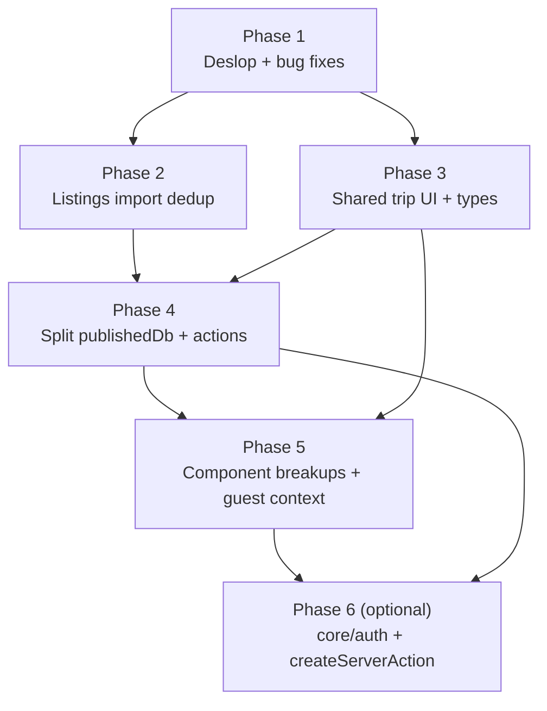

# Phased Refactor and Cleanup Roadmap

## 1. Plain-English summary

The codebase has drifted in a few predictable ways:

- **Some AI-generated "slop" has landed on main.** Silent try/catch, `as unknown as` casts, dead components, stale comments, a form with an `OLD` suffix that is still wired into production.
- **The listings import layer has grown copy-paste cousins.** The same nightly-price regex lives in four files, tracking-param lists in two, "canonicalize URL" in four. Adapters are 80% the same shape.
- **The published-voting code is top-heavy.** `publishedDb.ts` is 652 lines and `publishedTripActions.ts` is 639. Every server action repeats the same `parse → try → call → revalidate → catch` boilerplate.
- **Trip UI has two parallel stacks** (dashboard and `/share/<token>`) that re-implement the same meta pills, share state types, and guest-session plumbing side by side.
- **Core auth + server-action handling is ad-hoc.** Every action does its own Clerk check and its own try/catch with slightly different error codes.

This roadmap breaks the cleanup into **six independently revertable phases**. Per the current workflow we ship each phase as one or more commits on `main` (each commit self-contained and revertable via `git revert`) rather than as a feature branch + PR. Each phase must leave `pnpm check-types`, `pnpm lint`, and `pnpm test` green. The ordering matters: phase 1 fixes real bugs before we touch the files that have them; phase 2 settles the import layer before adding new tests around it; phases 3–4 unify types and shrink the big files before phase 5 breaks up the components that consume them; phase 6 is an optional cross-cutting wrapper that benefits from all the earlier cleanup.

## 2. Decisions locked in before we start

| Decision | Chosen | Why |
|---|---|---|
| One commit (or small stack) per phase, directly on `main` | Yes | Matches current local-only workflow. Each commit is revertable via `git revert`. |
| `ListingFormOLD` disposition | Default: delete and repoint dialog at `ListingForm`. Fallback: rename to `ListingFormWithUrlImport` if there is a reason to keep the URL-import flow separate. | `ListingFormDialog` currently ships with outdated fields (no `listingType`, no `sourceDescription`). The drift is the bug. |
| Hotel adapter stubs | Default: delete `expedia/hilton/marriott/hyatt` adapters and `hotelAdapterTemplates.ts` until they are actually wired into `registry.ts`. Add a TODO back into [docs/260421LISTINGS__HOTELS_AND_CUSTOM_LISTINGS_ROADMAP.md](260421LISTINGS__HOTELS_AND_CUSTOM_LISTINGS_ROADMAP.md). | They are dead weight right now; the roadmap already tracks the real work. |
| Silent fallback removal | Remove them (per standing "let it fail" rule). Where a try is genuinely needed (hot user path), narrow the caught error and rethrow. | Matches your general-rules policy. |
| `runPublishedAction` and `createServerAction` relationship | The published helper from phase 4 is meant to be subsumed by the generic `createServerAction` in phase 6. Phase 4 ships `runPublishedAction` inline and phase 6 migrates it. | Avoids blocking phase 4 on the broader wrapper. |
| Context vs prop drilling for `/share/<token>` | Introduce `PublishedTripGuestContext` in phase 5. | `{ token, share, activeGuest }` flows to ~8 components; context is clearly better. |

## 3. Architecture — phase ordering and dependencies

The only hard dependencies are:

- Phase 4 depends on phase 3 because the shared `PublishedShareState` type removes an extra "fix types" commit from the split.
- Phase 5 depends on phase 3 (shared types) and phase 4 (clean action boundary) so the context and the extracted components land against a stable API.
- Phase 6 depends on phase 4 because it migrates the `runPublishedAction` helper shipped there.

Everything else can be shuffled if priorities change.

## 4. Phase 1 — Deslop and bug fixes

**Commit checkpoint:** `chore: phase 1 deslop and surgical bug fixes`
**Status:** ✅ complete (shipped as `chore(cleanup): phase 1 — deslop and surgical bug fixes` on `main`).

### Plain English

Before any structural refactoring, fix the real bugs and delete the obvious slop. These changes are surgical: each one is a one-file or two-file edit, behavior-preserving except where we deliberately remove a silent fallback. This phase should be fast to review and to revert.

### Technical breakdown — Bugs (behavior changes)

- [x] **`ListingFormDialog` points at the wrong form.** Resolved by deleting the orphan chain: `AddListingButton` → `ListingFormDialog` → `ListingFormOLD` → `fetchListingMetadata`. The in-trip edit sheet is the only entrypoint now.
- [x] **Silent `.catch()` in `joinTripAsGuest`.** Removed. The enclosing transaction rolls back on `throw`, so the swallowed update was pointless.
- [x] **Like-check fallback on trip dashboard.** Removed try/catch; errors from `checkUserLike` now propagate. Also rewrote the reduce to `Object.fromEntries` to tighten the type.
- [x] **Broken absolute import.** Fixed `/src/features/trips/components/TripHeader` → `@/features/trips/components/TripHeader`.
- [x] **Two `normalizeText` implementations with different semantics.** Deleted the local trim-only copy in `normalizeImportedListing.ts`; now uses shared `normalizeText` (collapses whitespace) and `normalizeMultilineText` (preserves line breaks) from `importHelpers.ts` with per-field intent made explicit.
- [x] **`TripOwnerDetails` fallback.** Deleted — the whole component was orphaned.

### Technical breakdown — Deslop (no behavior change)

- [x] Delete unused component files (confirmed zero imports):
  - `src/ui/core/MetadataItem.tsx`
  - `src/ui/core/Flex.tsx`
- [ ] Delete unused schema `genericSearchSchema` from [src/core/schemas.ts](../src/core/schemas.ts). **Deferred:** the `GenericSearchType` type alias is still imported by trip/listing actions, so the schema stays for now.
- [x] Delete unused `InviteStatus` enum and `InvitationUpdateData` from [src/features/trips/types.ts](../src/features/trips/types.ts). Runtime code already uses Prisma's `InviteStatus`.
- [x] Remove `as unknown as` casts:
  - `getListing.ts` was orphan → deleted.
  - `refreshListingFromSourceUrl.ts` now calls `db.listing.findUnique` directly with a `select`, which typechecks without the cast.
- [x] Remove stale/narrative comments in `detectListingSource.ts`, `proxy.ts` (also dropped `/about` and the webhook placeholder from `isPublicRoute`), `ListingsTable.tsx`, `CollaboratorsList.tsx`, `TripHeader.tsx`, `types.ts`.
- [x] Silent localStorage catches:
  - [x] `usePriceBasis.ts` — removed.
  - [ ] `publishedGuestSession.ts` — **kept** because those `try/catch` blocks are validating JSON parsed from user-controlled cookies. That's essential input validation, not error suppression.
- [x] Use `router.refresh()` instead of `window.location.reload()` in `CollaboratorsList.tsx`.
- [x] Update [AGENTS.md](../AGENTS.md) — the stale `VotingAccessCard.tsx` lint claim is gone. `pnpm lint` now passes cleanly (0 warnings).

### Exit criteria

- [x] `pnpm check-types` passes.
- [x] `pnpm lint` passes cleanly (0 warnings — improvement from the stale pre-phase-1 state documented in `AGENTS.md`).
- [x] `pnpm test` passes.
- [ ] Manual smoke: add listing via the trip dashboard dialog; edit listing via the row sheet. *(Owner to verify on next run; the add-listing dialog path was removed entirely along with the orphan chain — add-listing now flows through the URL importer only.)*
- [x] Commit checkpoint: shipped as `chore(cleanup): phase 1 — deslop and surgical bug fixes` on `main`.

### Cost

- ~300 LOC changed, ~20 files touched. Perf neutral. Hackiness **1**.

## 5. Phase 2 — Listings import adapter dedup

**Commit checkpoint:** `refactor(listings): collapse adapter duplication and drop import fallbacks`

### Plain English

Right now the Airbnb, VRBO, Booking, generic, and hotel-template adapters all carry their own copies of the same three or four utility lists: the nightly-price regex, a tracking-param cleanup list, a "strip hash + trailing slash" URL canonicalizer, and a title-suffix cleaner. We pull those into a single helper module so fixing a regex means fixing it once. We also decide what to do with the hotel scaffolds that aren't wired into the registry.

### Technical breakdown

- [x] Consolidate shared adapter helpers. **Decision:** added the new shared exports to the existing `importHelpers.ts` rather than spawning a sibling `adapterHelpers.ts` — `importHelpers.ts` is already the adapter utility file, and a second file just for URL canonicalization felt like indirection for indirection's sake.
  - [x] `DEFAULT_NIGHTLY_PRICE_PATTERNS` already lived in `importHelpers.ts`; the identical copy in `airbnbAdapter.ts` is deleted. Vrbo keeps its re-ordered list with an explanatory comment.
  - [x] `TRACKING_QUERY_PARAMS` centralized; duplicates in `normalizeImportedListing.ts` and `genericAdapter.ts` deleted.
  - [x] `canonicalizeListingUrlShared(url, { stripSearch | stripTrackingParams })` used by airbnb/vrbo/generic plus the no-adapter fallback in `normalizeImportedListing`. Booking's own canonicalizer is kept (it rewrites the path slug).
  - [ ] `cleanupTitle(title, suffix)` — **skipped**. It's a one-liner (`title.replace(suffix, '').trim()`) and factoring it out replaces literal code with equally short indirection for zero deduplication savings. Revisit only if more than three adapters need identical behavior.
- [x] Confirmed `extractFormattedTextFromElement` / `getTextFromSelectors` are only imported from `importHelpers.ts` — no adapter redeclares them.
- [x] Decide the hotel scaffolds: **deleted** `expediaAdapter`, `hiltonAdapter`, `hyattAdapter`, `marriottAdapter`, `hotelAdapterTemplates` AND `createHotelAdapterTemplate` (the factory became orphaned once its four consumers were removed). The 260421 hotels roadmap has been annotated with a recovery note for when that work resumes.
- Remove scraping-side fallbacks per the no-fallbacks rule:
  - [ ] `extractNightlyPriceFromText` in [importHelpers.ts](../src/features/listings/import/importHelpers.ts) — "first `$N` in body" fallback. **Deferred**: the Airbnb fixture (`example-airbnb.html`) relies on this to get any price at all, because its price block only shows "$X" + "$X for N nights" (both are the stay total, not nightly). Dropping the fallback here returns `price: null` for real Airbnb imports. Fixing it properly means adding per-adapter `priceMeta` TOTAL detection so the normalizer divides by nights — that's tracked in phase 7 of the 260421 hotels roadmap. A NOTE comment in `importHelpers.ts` flags the technical debt and why it stays.
  - [x] `buildFallbackTitle` in [normalizeImportedListing.ts](../src/features/listings/import/normalizeImportedListing.ts). **Resolved (2026-04-22)**: `NormalizedImportedListing.title` is now `string | null`; `importListingCapture` throws a user-facing error when the fresh scrape returns null; `refreshListingFromSourceUrl` merges the existing `listing.title` back in so refresh never downgrades an existing title to a placeholder; `upsertImportedListing.buildImportedListingImportPayload` throws as a defense-in-depth invariant at the DB boundary. `Listing.title` stays non-null in Prisma — every listing persisted is guaranteed to have a real title. Shipped as `refactor(listings-import): drop buildFallbackTitle, hard-fail imports without a title` on `main`.
  - [x] Booking `extractCheapestNightly` fallback — removed. The primary signal is `data-price-per-night-raw` which is already a proper per-night rate; the visible-text branch was guessing from whatever dollar amount showed up in the price block if Booking ever dropped the data attribute. Tests green.

### Exit criteria

- [x] [extractListingCaptureFromHtml.test.ts](../src/features/listings/import/extractListingCaptureFromHtml.test.ts) passes with no fixture changes.
- [x] `pnpm check-types` + `pnpm lint` + `pnpm test` all green on `main` after the phase.
- [x] Shipped as three commits: hotel scaffold removal, shared canonicalizer/tracking params, Booking visible-text fallback removal. Full `refactor(listings): collapse adapter duplication and drop import fallbacks` checkpoint is the union of those three.

### Deferrals from the original plan

- `extractNightlyPriceFromText` body-text fallback — kept; removing it regresses Airbnb price capture until per-adapter `priceMeta` TOTAL detection lands (phase 7 of 260421).
- `buildFallbackTitle` — **resolved post-phase-2** via type change + throw. See the checklist entry above for details.
- `cleanupTitle(title, suffix)` abstraction — skipped as too small to justify.
- `createHotelAdapterTemplate.ts` — actively deleted rather than kept as idle scaffold, matching the no-unused-code rule.

### Cost (actual)

- ~200 LOC changed (vs. ~500 estimated — most of the saving came from deleting 6 hotel-adapter files outright). 10 files touched + 6 deleted + 2 roadmap docs. Perf neutral. Hackiness **1**.

## 6. Phase 3 — Cross-cutting UI reuse

**Commit checkpoint:** `refactor(trips): shared meta pills, share-state type, and localStorage hook`
**Status:** ✅ complete. Shipped as four commits on `main` (share-summary types, `TripMetaPill`, `getInitials`, `createLocalStorageSubscriber`).

### Plain English

The dashboard and the public `/share/<token>` page render the same meta pills (location, date range, guests) with slightly different code. The "share state" prop is typed three different ways in three different files. Two hooks re-implement the same localStorage subscription. `getInitials` is a local helper in a component. This phase creates a single version of each of those.

### Technical breakdown

- [x] Created two shared types in [src/features/trips/types.ts](../src/features/trips/types.ts): `TripShareSettings` (and `TripShareState = TripShareSettings & { tripId }` for action responses) plus `OwnerTripShareSummary` (flattened `{ share, listings, comments, guests }` projection of `getOwnerTripShareSummary`). Replaced **five** inline duplicates — the roadmap originally listed three, but the full owner-summary shape was also repeated in `TripSidebar.tsx` and the trip dashboard page:
  - [VotingAccessCard.tsx](../src/features/trips/components/VotingAccessCard.tsx) — now uses `TripShareSettings`.
  - [CollaboratorsList.tsx](../src/features/trips/components/CollaboratorsList.tsx) — now uses `Pick<OwnerTripShareSummary, 'share' | 'guests'>`.
  - [TripSidebar.tsx](../src/features/trips/components/TripSidebar.tsx) — now uses `OwnerTripShareSummary`.
  - [src/app/(app)/trips/[tripId]/page.tsx](../src/app/(app)/trips/[tripId]/page.tsx) — the inline summary type was replaced and the field-by-field identity mapping over `listings` / `comments` / `guests` was dropped (pure slop; shapes already matched structurally).
  - [publishedTripActions.ts](../src/features/trips/actions/publishedTripActions.ts) — `PublishedTripShareState` is now a local alias for `TripShareState`.
- [x] Created [src/features/trips/components/TripMetaPill.tsx](../src/features/trips/components/TripMetaPill.tsx) — a single icon+label pill primitive, not a wrapper row, since the two call sites differ in container styling (`xl:justify-end`, emphatic variant with `shadow-sm sm:text-base`). Replaced the inline pill trios in both:
  - [TripHeader.tsx](../src/features/trips/components/TripHeader.tsx) — passes `DASHBOARD_META_PILL_CLASSNAME = 'shadow-sm sm:text-base'` for the dashboard variant.
  - [PublishedTripMasthead.tsx](../src/features/trips/components/PublishedTripMasthead.tsx) — uses the default styling.
  - Side benefit: the dashboard pills now pick up `max-w-full` / `wrap-break-word` / `shrink-0` defensive styling the masthead already had.
- [x] Created [src/ui/utils/getInitials.ts](../src/ui/utils/getInitials.ts). Behaviour equivalent for typical inputs; edge case improvement: whitespace-only strings now return `'?'` instead of `''` so avatar fallbacks always render a character.
- [x] Created [src/ui/utils/createLocalStorageSubscriber.ts](../src/ui/utils/createLocalStorageSubscriber.ts) — a `useSyncExternalStore`-compatible subscribe/publish pair for localStorage-backed state. Used by both [usePriceBasis.ts](../src/features/trips/hooks/usePriceBasis.ts) (with a `storageKey` filter) and [usePublishedGuestSession.ts](../src/features/trips/hooks/usePublishedGuestSession.ts) (no filter — per-trip keys). No behaviour change.

### Exit criteria

- [ ] Visual diff against staging: dashboard and share page look identical. *(Owner to verify on next run; expected no change other than the minor defensive-styling inheritance on the dashboard pills.)*
- [x] `pnpm check-types`, `pnpm lint`, and `pnpm test` all green on `main` after the phase.
- [x] Shipped as four commits on `main`: share-summary types; `TripMetaPill` primitive; `getInitials` util; `createLocalStorageSubscriber`.

### Cost (actual)

- ~250 LOC changed (matches estimate). 10 files touched + 3 new files. Perf neutral. Hackiness **1**.

## 7. Phase 4 — Split `publishedDb.ts` and `publishedTripActions.ts`

**Status: complete (2026-04-22)** — shipped as three commits on `main`: `12a6242` shared-guard extraction, `4be40a8` publishedDb folder split, `ca9bfab` action boilerplate collapse. See section 7a for the final shape.

### Plain English

These two files have grown to ~650 lines each. They mix types, auth guards, and per-domain functions. Server actions repeat the same 6–8 lines of parse/try/catch/revalidate boilerplate. Splitting them into domain-scoped modules makes them navigable, and a small helper drops the boilerplate. No behavior change — this is purely moving code around and adding one small wrapper.

### Technical breakdown — `publishedDb.ts`

- [x] Split [publishedDb.ts](../src/features/trips/publishedDb/index.ts) into a folder:
  - [x] `src/features/trips/publishedDb/prismaFragments.ts` — Prisma `validator` fragments (`publishedVoteInclude`, `publishedCommentInclude`, `publishedListingInclude`, `publishedTripShareSelect`, `ownerShareListingSelect`, `ownerCommentSelect`). Roadmap originally folded this into `types.ts`; split into its own file so `types.ts` stays purely declarative (no runtime values).
  - [x] `src/features/trips/publishedDb/types.ts` — `Published*Record` / `OwnerTrip*Record` / `DbClient` aliases.
  - [x] `src/features/trips/publishedDb/guards.ts` — `assertTripOwner` (now a one-liner wrapper around the shared guard), `assertPublishedShare`, `assertGuestInTrip`, `assertListingInTrip`, `mapPublishedTripShareRecord`, `normalizeGuestDisplayName`, `findGuestByName`, `createGuest`, `ensureShareRecord`, `getShareByToken`, `getShareByTripId`. `getTripOwnerId` was dropped — it existed only as a stepping-stone inside the old `assertTripOwner`, and the shared helper handles the "trip not found" case directly.
  - [x] `src/features/trips/publishedDb/share.ts` — `getPublishedTripByToken`, `getOwnerTripShareSummary`, `publish`, `unpublish`, `updateSettings`, `rotateToken`.
  - [x] `src/features/trips/publishedDb/guests.ts` — `addOwnerGuest`, `removeGuest`, `claimGuestSession`.
  - [x] `src/features/trips/publishedDb/votes.ts` — `castVote`.
  - [x] `src/features/trips/publishedDb/comments.ts` — `addFeedback`, `setCommentHidden`.
  - [x] `src/features/trips/publishedDb/listings.ts` — `updateGuestListingDetails`, `submitGuestListingUrl`.
  - [x] `src/features/trips/publishedDb/index.ts` — re-assembles the `publishedTrips` namespace from explicit named imports + re-exports the record types. Callers keep importing from `@/features/trips/publishedDb` (the folder's `index.ts` is the resolved module).
- [x] Deduped `assertListingInTrip` vs `assertPotentialListing`: the two functions were the same query with one extra status check, so they're now a single `assertListingInTrip(..., { requirePotential })` helper. The vote path passes `requirePotential: true`.
- [x] Extracted shared `assertTripOwnerId(tripId, userId, action, dbClient?)` into [src/features/trips/guards.ts](../src/features/trips/guards.ts) (top-level, not inside `publishedDb/` — both `db.ts` and `publishedDb/*.ts` need it). Reused from [db.ts](../src/features/trips/db.ts) `rotateImportToken` and `findOrCreateShareableInvite`. `trips.get` stayed on its own collaborator-allowed path as planned.

### Technical breakdown — `publishedTripActions.ts`

- [x] Split [publishedTripActions.ts](../src/features/trips/actions/publishedTripActions.ts) into:
  - [x] `src/features/trips/actions/publishedTripSchemas.ts` — all Zod schemas. The "at least one field" check on `updatePublishedTripSettingsSchema` moved into a `.refine()` so the wrapper handles it uniformly (previously a manual post-parse check inside the action).
  - [x] `src/features/trips/actions/publishedTripActionUtils.ts` — `revalidatePublishedTripPaths`, `requireOwnerUserId`, `toTripShareState` (projector used by the four share-mutating actions so their response shapes match), and the new `runPublishedAction({ input, schema, handler, errorPrefix, validationErrorMessage? })` wrapper. Handlers return `{ tripId, token?, data }` and the wrapper drives revalidation uniformly. `errorPrefix` accepts a function so the feedback action can emit `Failed to add pro:` vs `Failed to add comment:` based on parsed input. Utils file is **not** marked `'use server'` so `runPublishedAction` can't be accidentally exposed as an RPC endpoint.
  - [ ] ~~`src/features/trips/actions/publishedTripOwnerActions.ts` / `publishedTripGuestActions.ts`~~ — **skipped on purpose**. Once the wrapper shrank the monolith from 634 → 366 lines, a permission-based file split became cosmetic, and the north star is sharing code between public and admin flows rather than hardening the boundary between them.
- [x] Replaced `getFeedbackLabel` with `getListingFeedbackConfig(parsed.kind).singularLabel.toLowerCase()`. `singularLabel` is capitalized (`'Comment' | 'Pro' | 'Con'`); lower-casing preserves the old error string (`Failed to add pro:` etc.) byte-for-byte.

### Exit criteria

- [x] `pnpm check-types`, `pnpm lint`, and `pnpm test` all green on `main` after each commit.
- [x] Grep shows no consumer of `publishedTrips` changed its import path. All 13 call sites still import from `@/features/trips/publishedDb` (now resolving to `publishedDb/index.ts`).
- [ ] Full manual pass of the share page. *(Owner to verify in dev: publish, unpublish, rotate link, toggle URL submissions, add guest, cast vote, change vote, add pros/cons/comments, hide comment, submit guest listing URL. Every exported action name, input type, and success-response shape is unchanged, so failures would surface as runtime errors in the dev server or misrouted revalidations — not as compile failures.)*

### Cost (actual)

- ~1400 LOC moved / refactored (roughly matches estimate), 14 files touched including 10 new files and 1 deletion. Three commits:
  - `12a6242` — ~50 LOC, 3 files (1 new). Shared `assertTripOwnerId` preparation.
  - `4be40a8` — 800 insertions / 636 deletions across 10 files (monolith deleted + 8 new domain files + index barrel).
  - `ca9bfab` — 452 insertions / 501 deletions across 3 files (wrapper + schemas extracted, monolith rewritten in place).
- Perf neutral. Hackiness **1**. No runtime behaviour changes beyond the bonus `assertListingInTrip` dedup.

## 8. Phase 5 — Large component breakups + `PublishedTripGuestContext`

**Commit checkpoint:** `refactor(trips): break up large components and introduce PublishedTripGuestContext`

### Plain English

Every row on the `/share/<token>` page passes `{ token, share, activeGuest }` into its actions menu, footer, comments sheet, feedback section, and edit sheet. That's prop drilling across ~8 components. We introduce a context so any component in the tree can read them. While we're here we break up the biggest client components so each file does one thing.

### Technical breakdown — Context

- [ ] Create `src/features/trips/components/PublishedTripGuestContext.tsx` providing `{ token, share, activeGuest }`.
- [ ] Wrap the tree in [PublishedTripPageClient.tsx](../src/features/trips/components/PublishedTripPageClient.tsx).
- [ ] Consume from:
  - [ ] [PublishedListingActionsMenu.tsx](../src/features/trips/components/PublishedListingActionsMenu.tsx)
  - [ ] [PublishedListingCardFooter.tsx](../src/features/trips/components/PublishedListingCardFooter.tsx)
  - [ ] [PublishedListingCommentsSheet.tsx](../src/features/trips/components/PublishedListingCommentsSheet.tsx)
  - [ ] [PublishedListingFeedbackSection.tsx](../src/features/trips/components/PublishedListingFeedbackSection.tsx)
  - [ ] [PublishedListingEditSheet.tsx](../src/features/trips/components/PublishedListingEditSheet.tsx)

### Technical breakdown — Component breakups

- [ ] [PublishedTripPageClient.tsx](../src/features/trips/components/PublishedTripPageClient.tsx) (194):
  - [ ] Extract `usePublishedSharePageLifecycle` (the three effects at 43–68) into a hook file.
  - [ ] Extract `PublishedTripListingsGrid` from the listing rendering (70–115, 127–183).
- [ ] [ListingCard.tsx](../src/features/listings/components/ListingCard.tsx) (337):
  - [ ] Move inline `getStatusVariant` / `getStatusIcon` (119–130) into the existing [listing-status.ts](../src/features/listings/components/listing-status.ts).
  - [ ] Extract `ListingCardDescription` (174–201) and `ListingCardMetrics` (203–233) as sibling components.
- [ ] [CollaboratorsList.tsx](../src/features/trips/components/CollaboratorsList.tsx) (354):
  - [ ] Extract `CollaboratorsInviteForms` (160–225).
  - [ ] Extract `CollaboratorsRoster` (228–354).
- [ ] [TripContentArea.tsx](../src/features/trips/components/TripContentArea.tsx) (193):
  - [ ] Extract `TripPotentialListingsTable`, `TripPotentialListingsMap`, `TripPotentialListingsCards` from the three view branches (117–170).
- [ ] [PublishedListingEditSheet.tsx](../src/features/trips/components/PublishedListingEditSheet.tsx) (243):
  - [ ] Move `formatInitialNumber`, `parseNumberField`, `buildInitialValues` (40–67) into `src/features/trips/utils/publishedListingForm.ts`.
  - [ ] Replace the render-phase `setState` at 89–94 with a `key={listing.id}` remount pattern on the sheet.
- [ ] [ListingActionsMenu.tsx](../src/features/listings/components/ListingActionsMenu.tsx) (269):
  - [ ] Extract the three action handlers (70–160) into a `useListingActions(listing)` hook. The component becomes markup.

### Exit criteria

- [ ] Grep for `{ token, share, activeGuest }` prop passing returns zero hits.
- [ ] Manual smoke: dashboard and share page unchanged visually.
- [ ] `pnpm lint` — the `react-hooks/set-state-in-effect` errors flagged in [AGENTS.md](../AGENTS.md) should be resolved by the remount rewrite.
- [ ] Commit checkpoint: **`refactor(trips): break up large components and introduce PublishedTripGuestContext`**.

### Cost

- ~800 LOC changed, ~15 files touched. Perf slightly better (fewer re-renders from context). Hackiness **2**.

## 9. Phase 6 (optional) — `core/auth` + `createServerAction`

**Commit checkpoint:** `refactor(core): add createServerAction wrapper and migrate actions`

### Plain English

Every server action re-implements `auth()`, a try/catch, and response formatting. This phase extracts one helper that does all three and migrates the obvious actions to use it. Hold off if the churn isn't worth it right now — this phase is explicitly optional.

### Technical breakdown

- [ ] Add `src/core/auth/server/requireUserId.ts` returning `{ userId }` or throwing a typed `UnauthorizedError`.
- [ ] Extend [src/core/server-actions.ts](../src/core/server-actions.ts) with `createServerAction(schema, handler)`:
  - Parses input, calls the handler, wraps result in `createSuccessResponse`.
  - Catches typed errors, maps to `createErrorResponse` with the right code.
  - Absorbs the `runPublishedAction` helper from phase 4.
- [ ] Migrate the natural candidates:
  - [ ] `createTrip`, `updateTrip`.
  - [ ] `createListing`, `updateListing`, `deleteListing`, `updateListingStatus`.
  - [ ] `importListingFromUrl`, `refreshListingFromSourceUrl`.
  - [ ] `toggleLike`.
  - [ ] All of [publishedTripOwnerActions.ts](../src/features/trips/actions/publishedTripOwnerActions.ts) + [publishedTripGuestActions.ts](../src/features/trips/actions/publishedTripGuestActions.ts) (post-phase-4).
- [ ] Leave [acceptInvitation.ts](../src/features/trips/actions/acceptInvitation.ts) out — it's a redirect-style action, not JSON.

### Exit criteria

- [ ] `pnpm check-types` and `pnpm lint` clean.
- [ ] Response contract unchanged from the caller's perspective (check client call sites).
- [ ] Commit checkpoint: **`refactor(core): add createServerAction wrapper and migrate actions`**.

### Cost

- ~600 LOC changed, ~25 files touched. Perf slightly better. Hackiness **2**.

## 10. Pre-flight checks

Before each phase:

- [ ] Start from a clean `main` with a clean working tree (`git status` empty).
- [ ] Run `pnpm check-types && pnpm lint && pnpm test` on `main` first so you know the baseline.

After each phase:

- [ ] Run the same three commands again; none should regress.
- [ ] Commit with the `Commit checkpoint:` message listed for that phase. Use smaller checkpoint commits inside the phase if the diff is large.
- [ ] Tick the phase's checklist in this file (or note intentional deferrals with the reason).

## 11. Open questions before phase 1

- [ ] Confirm `ListingFormOLD` gets deleted (not renamed). If the URL-import flow is a product feature we want to preserve, we rename instead.
- [ ] Confirm hotel-adapter scaffolds get deleted in phase 2 (not wired into the registry now).
- [ ] Confirm the silent localStorage catches get removed entirely (not narrowed).

Resolve these during phase 1 review; the defaults in section 2 stand unless overridden.

## 12. Out of scope

- Prisma schema changes. This roadmap is code-only; schema work continues through the existing migration process.
- Extension changes. The Chrome extension is explicitly untouched.
- Product-facing features. No new screens, no new actions, no new data.
- Test coverage expansion beyond the existing `extractListingCaptureFromHtml.test.ts`. If a phase exposes a missing test, flag it in the PR but don't expand scope mid-phase.
