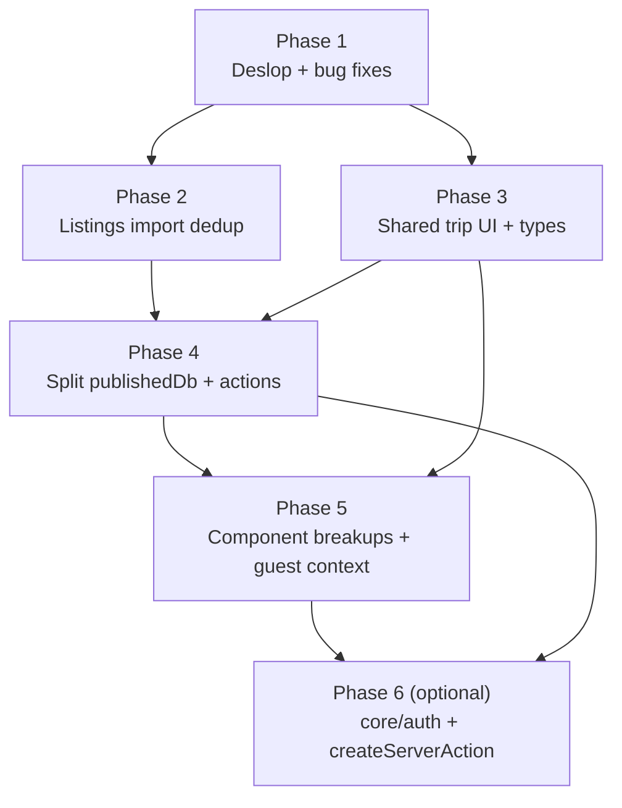

# Phased Refactor and Cleanup Roadmap

## 1. Plain-English summary

The codebase has drifted in a few predictable ways:

- **Some AI-generated "slop" has landed on main.** Silent try/catch, `as unknown as` casts, dead components, stale comments, a form with an `OLD` suffix that is still wired into production.
- **The listings import layer has grown copy-paste cousins.** The same nightly-price regex lives in four files, tracking-param lists in two, "canonicalize URL" in four. Adapters are 80% the same shape.
- **The published-voting code is top-heavy.** `publishedDb.ts` is 652 lines and `publishedTripActions.ts` is 639. Every server action repeats the same `parse → try → call → revalidate → catch` boilerplate.
- **Trip UI has two parallel stacks** (dashboard and `/share/<token>`) that re-implement the same meta pills, share state types, and guest-session plumbing side by side.
- **Core auth + server-action handling is ad-hoc.** Every action does its own Clerk check and its own try/catch with slightly different error codes.

This roadmap breaks the cleanup into **six independently revertable phases**, each on its own branch, each passing `pnpm check-types` and `pnpm lint` on its own. The ordering matters: phase 1 fixes real bugs before we touch the files that have them; phase 2 settles the import layer before adding new tests around it; phases 3–4 unify types and shrink the big files before phase 5 breaks up the components that consume them; phase 6 is an optional cross-cutting wrapper that benefits from all the earlier cleanup.

## 2. Decisions locked in before we start

| Decision | Chosen | Why |
|---|---|---|
| One branch/PR per phase | Yes | Each phase is revertable on its own; conflicts stay small. |
| `ListingFormOLD` disposition | Default: delete and repoint dialog at `ListingForm`. Fallback: rename to `ListingFormWithUrlImport` if there is a reason to keep the URL-import flow separate. | `ListingFormDialog` currently ships with outdated fields (no `listingType`, no `sourceDescription`). The drift is the bug. |
| Hotel adapter stubs | Default: delete `expedia/hilton/marriott/hyatt` adapters and `hotelAdapterTemplates.ts` until they are actually wired into `registry.ts`. Add a TODO back into [docs/260421LISTINGS__HOTELS_AND_CUSTOM_LISTINGS_ROADMAP.md](260421LISTINGS__HOTELS_AND_CUSTOM_LISTINGS_ROADMAP.md). | They are dead weight right now; the roadmap already tracks the real work. |
| Silent fallback removal | Remove them (per standing "let it fail" rule). Where a try is genuinely needed (hot user path), narrow the caught error and rethrow. | Matches your general-rules policy. |
| `runPublishedAction` and `createServerAction` relationship | The published helper from phase 4 is meant to be subsumed by the generic `createServerAction` in phase 6. Phase 4 ships `runPublishedAction` inline and phase 6 migrates it. | Avoids blocking phase 4 on the broader wrapper. |
| Context vs prop drilling for `/share/<token>` | Introduce `PublishedTripGuestContext` in phase 5. | `{ token, share, activeGuest }` flows to ~8 components; context is clearly better. |

## 3. Architecture — phase ordering and dependencies

The only hard dependencies are:

- Phase 4 depends on phase 3 because the shared `PublishedShareState` type removes an extra "fix types" commit from the split.
- Phase 5 depends on phase 3 (shared types) and phase 4 (clean action boundary) so the context and the extracted components land against a stable API.
- Phase 6 depends on phase 4 because it migrates the `runPublishedAction` helper shipped there.

Everything else can be shuffled if priorities change.

## 4. Phase 1 — Deslop and bug fixes

**Branch:** `chore/deslop-and-small-bug-fixes`

### Plain English

Before any structural refactoring, fix the real bugs and delete the obvious slop. These changes are surgical: each one is a one-file or two-file edit, behavior-preserving except where we deliberately remove a silent fallback. This phase should be fast to review and to revert.

### Technical breakdown — Bugs (behavior changes)

- [ ] **`ListingFormDialog` points at the wrong form.** [src/features/listings/forms/ListingFormDialog.tsx](../src/features/listings/forms/ListingFormDialog.tsx) lines 15, 70–75 import from `./ListingFormOLD`. The dialog is therefore missing `listingType` and `sourceDescription`, while the in-trip edit sheet has them. Repoint at the current `ListingForm.tsx` and delete `ListingFormOLD.tsx`. Confirm the "Add listing" modal from the trip page still renders and submits.
- [ ] **Silent `.catch()` in `joinTripAsGuest`.** [src/features/trips/actions/joinTripAsGuest.ts](../src/features/trips/actions/joinTripAsGuest.ts) lines 51–52 call `tripInvitation.update(...).catch()` with no handler. Remove the `.catch`; if the update genuinely can race, handle the specific Prisma error code explicitly.
- [ ] **Like-check fallback on trip dashboard.** [src/app/(app)/trips/[tripId]/page.tsx](../src/app/(app)/trips/%5BtripId%5D/page.tsx) wraps each listing's `checkUserLike` call in a try/catch that defaults `liked = false`. Remove the swallow — let the action-level response fail cleanly.
- [ ] **Broken absolute import.** Same file imports `TripHeader` from `'/src/features/trips/components/TripHeader'` (filesystem-style), not the `@/...` alias. Fix the path.
- [ ] **Two `normalizeText` implementations with different semantics.** [importHelpers.ts](../src/features/listings/import/importHelpers.ts) exports a `normalizeText` that collapses whitespace; [normalizeImportedListing.ts](../src/features/listings/import/normalizeImportedListing.ts) line 16 defines a local `normalizeText` that only trims. This is a real scraping-bug risk. Delete the local one and import the shared one, or rename them to `collapseWhitespace` vs `trimText` to make the difference loud.
- [ ] **`TripOwnerDetails` fallback.** [src/features/trips/components/TripOwnerDetails.tsx](../src/features/trips/components/TripOwnerDetails.tsx) lines 10–38 try/catch the Clerk fetch and return `'Trip Owner'` on failure. There is also a TODO. Delete the fallback and the TODO; let the error propagate so we can fix it when we see it.

### Technical breakdown — Deslop (no behavior change)

- [ ] Delete unused component files (confirmed zero imports):
  - `src/ui/core/MetadataItem.tsx`
  - `src/ui/core/Flex.tsx`
- [ ] Delete unused schema `genericSearchSchema` from [src/core/schemas.ts](../src/core/schemas.ts).
- [ ] Delete unused `InviteStatus` enum and `InvitationUpdateData` from [src/features/trips/types.ts](../src/features/trips/types.ts) lines 60–68. Runtime code already uses Prisma's `InviteStatus`.
- [ ] Remove `as unknown as` casts:
  - [src/features/listings/actions/getListing.ts](../src/features/listings/actions/getListing.ts) line 32 — tighten the `ListingGetOptions` signature instead of casting.
  - [src/features/listings/actions/refreshListingFromSourceUrl.ts](../src/features/listings/actions/refreshListingFromSourceUrl.ts) line 185 — tighten the response type from `importListingCapture`.
- [ ] Remove stale/narrative comments:
  - [src/features/listings/import/detectListingSource.ts](../src/features/listings/import/detectListingSource.ts) lines 4–7 (UNKNOWN→OTHER comment is obsolete — the generic adapter is wired).
  - [src/proxy.ts](../src/proxy.ts) stale `/about` and "Example public API webhook route" comments.
  - [src/features/listings/tables/ListingsTable.tsx](../src/features/listings/tables/ListingsTable.tsx) lines 218–229 — commented-out "Added By" column.
  - [src/features/trips/components/CollaboratorsList.tsx](../src/features/trips/components/CollaboratorsList.tsx) line 80 — `// Re-add useUser hook`.
  - [src/features/trips/components/TripHeader.tsx](../src/features/trips/components/TripHeader.tsx) line 13 — `workaround for upstream type issues`.
  - [src/features/trips/types.ts](../src/features/trips/types.ts) line 7 — placeholder comment.
- [ ] Silent localStorage catches:
  - [src/features/trips/hooks/usePriceBasis.ts](../src/features/trips/hooks/usePriceBasis.ts) lines 21–27 and 63–67.
  - [src/features/trips/constants/publishedGuestSession.ts](../src/features/trips/constants/publishedGuestSession.ts) lines 17–26 and 42–46.
  - Either remove entirely or narrow to `QuotaExceededError`/`SecurityError` with an explanatory comment. Default: remove.
- [ ] Use `router.refresh()` instead of `window.location.reload()` in [CollaboratorsList.tsx](../src/features/trips/components/CollaboratorsList.tsx) line 115, matching the rest of the app.
- [ ] Update [AGENTS.md](../AGENTS.md) line 27 — the claim that `VotingAccessCard.tsx` has `react-hooks/set-state-in-effect` errors is stale (no `useEffect` there anymore). Run `pnpm lint` and write down the actual current known-failing list.

### Exit criteria

- [ ] `pnpm check-types` passes.
- [ ] `pnpm lint` is no worse than before (document the delta in the PR body).
- [ ] `pnpm test` passes.
- [ ] Manual smoke: add listing via the trip dashboard dialog; edit listing via the row sheet; both forms show the same field set.
- [ ] Commit checkpoint: **`chore: phase 1 deslop and surgical bug fixes`**.

### Cost

- ~300 LOC changed, ~20 files touched. Perf neutral. Hackiness **1**.

## 5. Phase 2 — Listings import adapter dedup

**Branch:** `refactor/listings-adapter-helpers`

### Plain English

Right now the Airbnb, VRBO, Booking, generic, and hotel-template adapters all carry their own copies of the same three or four utility lists: the nightly-price regex, a tracking-param cleanup list, a "strip hash + trailing slash" URL canonicalizer, and a title-suffix cleaner. We pull those into a single helper module so fixing a regex means fixing it once. We also decide what to do with the hotel scaffolds that aren't wired into the registry.

### Technical breakdown

- [ ] Create `src/features/listings/import/adapterHelpers.ts` exporting:
  - `NIGHTLY_PRICE_PATTERNS` (currently in [importHelpers.ts](../src/features/listings/import/importHelpers.ts) 185–190, [airbnbAdapter.ts](../src/features/listings/import/adapters/airbnbAdapter.ts) 32–37, [vrboAdapter.ts](../src/features/listings/import/adapters/vrboAdapter.ts) 30–35, [createHotelAdapterTemplate.ts](../src/features/listings/import/adapters/createHotelAdapterTemplate.ts) 68–73).
  - `TRACKING_QUERY_PARAMS` (duplicated in [normalizeImportedListing.ts](../src/features/listings/import/normalizeImportedListing.ts) 109–115 and [genericAdapter.ts](../src/features/listings/import/adapters/genericAdapter.ts) 4–10).
  - `canonicalizeUrl(url, opts)` with options for `stripSearch` and `siteHost`. Used by airbnb/vrbo/generic/template. Booking stays on its own canonicalizer because of `rejectInputUrl` + external-id extraction.
  - `cleanupTitle(title, suffix)` — used by all three real adapters.
- [ ] Migrate adapters to import from `adapterHelpers.ts`. Delete the local copies.
- [ ] Ensure `extractFormattedTextFromElement` and `getTextFromSelectors` are imported from [importHelpers.ts](../src/features/listings/import/importHelpers.ts) (not re-declared in adapters).
- [ ] Decide the hotel scaffolds:
  - [ ] Default path: delete `expediaAdapter.ts`, `hiltonAdapter.ts`, `hyattAdapter.ts`, `marriottAdapter.ts`, `hotelAdapterTemplates.ts`. They are only referenced by the barrel, which is referenced by nothing. Keep `createHotelAdapterTemplate.ts` for when we actually wire a hotel.
  - [ ] Alternative path: wire them into `registry.ts` with documented TODOs. Only do this if you want the "at least they are typechecked" benefit.
- [ ] Remove scraping-side fallbacks per the no-fallbacks rule:
  - [ ] `extractNightlyPriceFromText` in [importHelpers.ts](../src/features/listings/import/importHelpers.ts) 212–224 — "first `$N` in body" fallback. Replace with a clear missing-field on the capture.
  - [ ] `buildFallbackTitle` in [normalizeImportedListing.ts](../src/features/listings/import/normalizeImportedListing.ts) 253. Missing title should surface through `getMissingImportedListingFields`.
  - [ ] Booking `extractCheapestNightly` fallback (lines 102–112) — keep the explicit-currency pass, drop the "first visible `$N`" fallback.

### Exit criteria

- [ ] [extractListingCaptureFromHtml.test.ts](../src/features/listings/import/extractListingCaptureFromHtml.test.ts) passes with no fixture changes.
- [ ] Manual import against Airbnb, VRBO, and Booking fixtures still extracts title, price, images.
- [ ] Commit checkpoint: **`refactor(listings): collapse adapter duplication and drop import fallbacks`**.

### Cost

- ~500 LOC changed, ~10 files touched. Perf neutral. Hackiness **2**.

## 6. Phase 3 — Cross-cutting UI reuse

**Branch:** `refactor/shared-trip-ui-and-types`

### Plain English

The dashboard and the public `/share/<token>` page render the same meta pills (location, date range, guests) with slightly different code. The "share state" prop is typed three different ways in three different files. Two hooks re-implement the same localStorage subscription. `getInitials` is a local helper in a component. This phase creates a single version of each of those.

### Technical breakdown

- [ ] Create one `PublishedShareState` / `PublishedShareSummary` type in [src/features/trips/types.ts](../src/features/trips/types.ts) (or export it from `publishedDb` derived from the Prisma `validator` fragments). Replace the three duplicates:
  - [VotingAccessCard.tsx](../src/features/trips/components/VotingAccessCard.tsx) lines 20–26.
  - [CollaboratorsList.tsx](../src/features/trips/components/CollaboratorsList.tsx) lines 42–63.
  - [publishedTripActions.ts](../src/features/trips/actions/publishedTripActions.ts) lines 85–92.
- [ ] Create `src/features/trips/components/TripMetaPills.tsx` with `location`, `dateRange`, and `guestCount` pills. Replace the inline blocks in:
  - [TripHeader.tsx](../src/features/trips/components/TripHeader.tsx) lines 47–71.
  - [PublishedTripMasthead.tsx](../src/features/trips/components/PublishedTripMasthead.tsx) lines 29–58.
- [ ] Create `src/ui/utils/getInitials.ts`. Replace the local helper in [CollaboratorsList.tsx](../src/features/trips/components/CollaboratorsList.tsx) lines 105–113.
- [ ] Create `src/ui/utils/subscribeLocalStorageKey.ts` (or a small `useSyncedLocalStorageState` hook) that both [usePriceBasis.ts](../src/features/trips/hooks/usePriceBasis.ts) and [usePublishedGuestSession.ts](../src/features/trips/hooks/usePublishedGuestSession.ts) can use. The cookie-mirroring in the published hook composes on top; no behavior change.

### Exit criteria

- [ ] Visual diff against staging: dashboard and share page look identical.
- [ ] `pnpm check-types` clean; one shared `PublishedShareState` in import graph.
- [ ] Commit checkpoint: **`refactor(trips): shared meta pills, share-state type, and localStorage hook`**.

### Cost

- ~250 LOC changed, ~8 files touched. Perf neutral. Hackiness **1**.

## 7. Phase 4 — Split `publishedDb.ts` and `publishedTripActions.ts`

**Branch:** `refactor/split-published-db-and-actions`

### Plain English

These two files have grown to ~650 lines each. They mix types, auth guards, and per-domain functions. Server actions repeat the same 6–8 lines of parse/try/catch/revalidate boilerplate. Splitting them into domain-scoped modules makes them navigable, and a small helper drops the boilerplate. No behavior change — this is purely moving code around and adding one small wrapper.

### Technical breakdown — `publishedDb.ts`

- [ ] Split [publishedDb.ts](../src/features/trips/publishedDb.ts) into a folder:
  - [ ] `src/features/trips/publishedDb/types.ts` — Prisma `validator` fragments + `PublishedTrip*Record` types (current lines 1–131).
  - [ ] `src/features/trips/publishedDb/guards.ts` — `getTripOwnerId`, `assertTripOwner`, `assertPublishedShare`, `assertGuestInTrip`, `assertListingInTrip`, `assertPotentialListing` (147–297).
  - [ ] `src/features/trips/publishedDb/share.ts` — share lifecycle (`getPublishedTripByToken`, `getOwnerTripShareSummary`, `publish`, `unpublish`, `updateSettings`, `rotateToken`).
  - [ ] `src/features/trips/publishedDb/guests.ts` — guest CRUD (`addOwnerGuest`, `removeGuest`, `claimGuestSession`).
  - [ ] `src/features/trips/publishedDb/votes.ts` — `castVote`.
  - [ ] `src/features/trips/publishedDb/comments.ts` — `addFeedback`, `setCommentHidden`.
  - [ ] `src/features/trips/publishedDb/listings.ts` — `updateGuestListingDetails`, `submitGuestListingUrl`.
  - [ ] `src/features/trips/publishedDb/index.ts` — re-export the `publishedTrips` namespace so callers don't change.
- [ ] Dedupe `assertListingInTrip` vs `assertPotentialListing`: the latter should compose on top of the former (not re-query).
- [ ] Extract a shared `assertTripOwnerId(tripId, userId)` into `guards.ts` and reuse from [db.ts](../src/features/trips/db.ts) `rotateImportToken` (366–399) and `findOrCreateShareableInvite` (311–326). Keep `trips.get` on its own collaborator-allowed path.

### Technical breakdown — `publishedTripActions.ts`

- [ ] Split [publishedTripActions.ts](../src/features/trips/actions/publishedTripActions.ts) into:
  - [ ] `src/features/trips/actions/publishedTripSchemas.ts` — all Zod schemas (12–83).
  - [ ] `src/features/trips/actions/publishedTripActionUtils.ts` — `revalidatePublishedTripPaths`, `requireOwnerUserId`, and a new `runPublishedAction(schema, fn)` helper that owns the repeated `safeParse → try → revalidate → response` shape.
  - [ ] `src/features/trips/actions/publishedTripOwnerActions.ts` — owner-only actions (143–370, 598–639).
  - [ ] `src/features/trips/actions/publishedTripGuestActions.ts` — token/guest actions (372–596).
- [ ] Replace `getFeedbackLabel` (541–550) with `getListingFeedbackConfig(kind).singularLabel` from [listing-feedback.ts](../src/features/trips/constants/listing-feedback.ts).

### Exit criteria

- [ ] `pnpm check-types` passes; grep shows no consumer of `publishedTrips` changed its import path.
- [ ] Full manual pass of the share page: publish, unpublish, rotate link, toggle URL submissions, add guest, cast vote, change vote, add pros/cons/comments, hide comment, submit guest listing URL.
- [ ] Commit checkpoint: **`refactor(trips): split publishedDb and publishedTripActions`**.

### Cost

- ~1200 LOC moved, ~15 files added/edited. Perf neutral. Hackiness **2**. Highest-risk non-UI phase.

## 8. Phase 5 — Large component breakups + `PublishedTripGuestContext`

**Branch:** `refactor/published-trip-component-split`

### Plain English

Every row on the `/share/<token>` page passes `{ token, share, activeGuest }` into its actions menu, footer, comments sheet, feedback section, and edit sheet. That's prop drilling across ~8 components. We introduce a context so any component in the tree can read them. While we're here we break up the biggest client components so each file does one thing.

### Technical breakdown — Context

- [ ] Create `src/features/trips/components/PublishedTripGuestContext.tsx` providing `{ token, share, activeGuest }`.
- [ ] Wrap the tree in [PublishedTripPageClient.tsx](../src/features/trips/components/PublishedTripPageClient.tsx).
- [ ] Consume from:
  - [ ] [PublishedListingActionsMenu.tsx](../src/features/trips/components/PublishedListingActionsMenu.tsx)
  - [ ] [PublishedListingCardFooter.tsx](../src/features/trips/components/PublishedListingCardFooter.tsx)
  - [ ] [PublishedListingCommentsSheet.tsx](../src/features/trips/components/PublishedListingCommentsSheet.tsx)
  - [ ] [PublishedListingFeedbackSection.tsx](../src/features/trips/components/PublishedListingFeedbackSection.tsx)
  - [ ] [PublishedListingEditSheet.tsx](../src/features/trips/components/PublishedListingEditSheet.tsx)

### Technical breakdown — Component breakups

- [ ] [PublishedTripPageClient.tsx](../src/features/trips/components/PublishedTripPageClient.tsx) (194):
  - [ ] Extract `usePublishedSharePageLifecycle` (the three effects at 43–68) into a hook file.
  - [ ] Extract `PublishedTripListingsGrid` from the listing rendering (70–115, 127–183).
- [ ] [ListingCard.tsx](../src/features/listings/components/ListingCard.tsx) (337):
  - [ ] Move inline `getStatusVariant` / `getStatusIcon` (119–130) into the existing [listing-status.ts](../src/features/listings/components/listing-status.ts).
  - [ ] Extract `ListingCardDescription` (174–201) and `ListingCardMetrics` (203–233) as sibling components.
- [ ] [CollaboratorsList.tsx](../src/features/trips/components/CollaboratorsList.tsx) (354):
  - [ ] Extract `CollaboratorsInviteForms` (160–225).
  - [ ] Extract `CollaboratorsRoster` (228–354).
- [ ] [TripContentArea.tsx](../src/features/trips/components/TripContentArea.tsx) (193):
  - [ ] Extract `TripPotentialListingsTable`, `TripPotentialListingsMap`, `TripPotentialListingsCards` from the three view branches (117–170).
- [ ] [PublishedListingEditSheet.tsx](../src/features/trips/components/PublishedListingEditSheet.tsx) (243):
  - [ ] Move `formatInitialNumber`, `parseNumberField`, `buildInitialValues` (40–67) into `src/features/trips/utils/publishedListingForm.ts`.
  - [ ] Replace the render-phase `setState` at 89–94 with a `key={listing.id}` remount pattern on the sheet.
- [ ] [ListingActionsMenu.tsx](../src/features/listings/components/ListingActionsMenu.tsx) (269):
  - [ ] Extract the three action handlers (70–160) into a `useListingActions(listing)` hook. The component becomes markup.

### Exit criteria

- [ ] Grep for `{ token, share, activeGuest }` prop passing returns zero hits.
- [ ] Manual smoke: dashboard and share page unchanged visually.
- [ ] `pnpm lint` — the `react-hooks/set-state-in-effect` errors flagged in [AGENTS.md](../AGENTS.md) should be resolved by the remount rewrite.
- [ ] Commit checkpoint: **`refactor(trips): break up large components and introduce PublishedTripGuestContext`**.

### Cost

- ~800 LOC changed, ~15 files touched. Perf slightly better (fewer re-renders from context). Hackiness **2**.

## 9. Phase 6 (optional) — `core/auth` + `createServerAction`

**Branch:** `refactor/core-server-action-wrapper`

### Plain English

Every server action re-implements `auth()`, a try/catch, and response formatting. This phase extracts one helper that does all three and migrates the obvious actions to use it. Hold off if the churn isn't worth it right now — this phase is explicitly optional.

### Technical breakdown

- [ ] Add `src/core/auth/server/requireUserId.ts` returning `{ userId }` or throwing a typed `UnauthorizedError`.
- [ ] Extend [src/core/server-actions.ts](../src/core/server-actions.ts) with `createServerAction(schema, handler)`:
  - Parses input, calls the handler, wraps result in `createSuccessResponse`.
  - Catches typed errors, maps to `createErrorResponse` with the right code.
  - Absorbs the `runPublishedAction` helper from phase 4.
- [ ] Migrate the natural candidates:
  - [ ] `createTrip`, `updateTrip`.
  - [ ] `createListing`, `updateListing`, `deleteListing`, `updateListingStatus`.
  - [ ] `importListingFromUrl`, `refreshListingFromSourceUrl`.
  - [ ] `toggleLike`.
  - [ ] All of [publishedTripOwnerActions.ts](../src/features/trips/actions/publishedTripOwnerActions.ts) + [publishedTripGuestActions.ts](../src/features/trips/actions/publishedTripGuestActions.ts) (post-phase-4).
- [ ] Leave [acceptInvitation.ts](../src/features/trips/actions/acceptInvitation.ts) out — it's a redirect-style action, not JSON.

### Exit criteria

- [ ] `pnpm check-types` and `pnpm lint` clean.
- [ ] Response contract unchanged from the caller's perspective (check client call sites).
- [ ] Commit checkpoint: **`refactor(core): add createServerAction wrapper and migrate actions`**.

### Cost

- ~600 LOC changed, ~25 files touched. Perf slightly better. Hackiness **2**.

## 10. Pre-flight checks

Before each phase branch:

- [ ] Start from a clean `main` (`git checkout main && git pull`).
- [ ] Run `pnpm check-types && pnpm lint && pnpm test` on `main` first so you know the baseline.
- [ ] Cut the phase branch with the name listed at the top of each phase.

After each phase branch:

- [ ] Run the same three commands again; none should regress.
- [ ] Open a PR that references this roadmap and ticks the specific checklist for that phase.
- [ ] Keep PR bodies tight — summary, what changed, how QA should click through it (per the standing PR rule).

## 11. Open questions before phase 1

- [ ] Confirm `ListingFormOLD` gets deleted (not renamed). If the URL-import flow is a product feature we want to preserve, we rename instead.
- [ ] Confirm hotel-adapter scaffolds get deleted in phase 2 (not wired into the registry now).
- [ ] Confirm the silent localStorage catches get removed entirely (not narrowed).

Resolve these during phase 1 review; the defaults in section 2 stand unless overridden.

## 12. Out of scope

- Prisma schema changes. This roadmap is code-only; schema work continues through the existing migration process.
- Extension changes. The Chrome extension is explicitly untouched.
- Product-facing features. No new screens, no new actions, no new data.
- Test coverage expansion beyond the existing `extractListingCaptureFromHtml.test.ts`. If a phase exposes a missing test, flag it in the PR but don't expand scope mid-phase.
