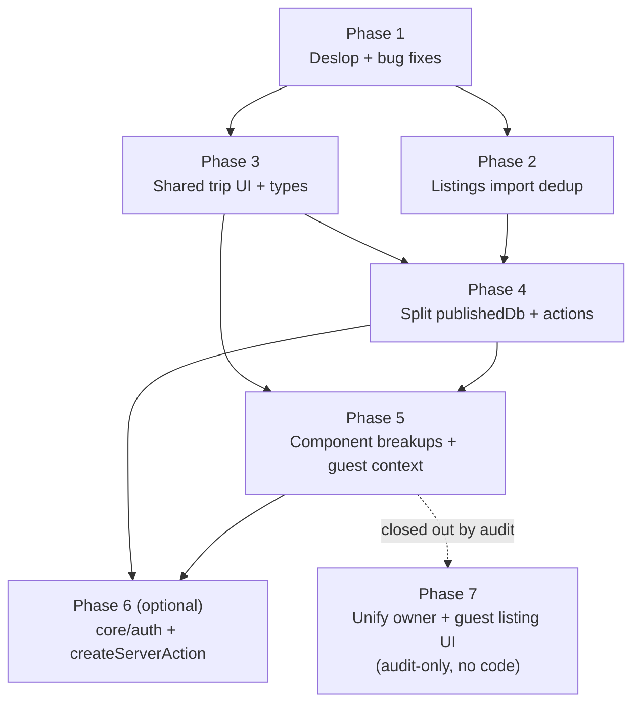

# Phased Refactor and Cleanup Roadmap

## 1. Plain-English summary

The codebase has drifted in a few predictable ways:

- **Some AI-generated "slop" has landed on main.** Silent try/catch, `as unknown as` casts, dead components, stale comments, a form with an `OLD` suffix that is still wired into production.
- **The listings import layer has grown copy-paste cousins.** The same nightly-price regex lives in four files, tracking-param lists in two, "canonicalize URL" in four. Adapters are 80% the same shape.
- **The published-voting code is top-heavy.** `publishedDb.ts` is 652 lines and `publishedTripActions.ts` is 639. Every server action repeats the same `parse → try → call → revalidate → catch` boilerplate.
- **Trip UI has two parallel stacks** (dashboard and `/share/<token>`) that re-implement the same meta pills, share state types, and guest-session plumbing side by side.
- **Core auth + server-action handling is ad-hoc.** Every action does its own Clerk check and its own try/catch with slightly different error codes.

This roadmap breaks the cleanup into **six independently revertable phases**. Per the current workflow we ship each phase as one or more commits on `main` (each commit self-contained and revertable via `git revert`) rather than as a feature branch + PR. Each phase must leave `pnpm check-types`, `pnpm lint`, and `pnpm test` green. The ordering matters: phase 1 fixes real bugs before we touch the files that have them; phase 2 settles the import layer before adding new tests around it; phases 3–4 unify types and shrink the big files before phase 5 breaks up the components that consume them; phase 6 is an optional cross-cutting wrapper that benefits from all the earlier cleanup.

Phase 7 was originally scoped as a follow-up to unify owner and guest listing UI. After the audit documented in §9a, it was **closed out without code changes**: the remaining forks turned out to be legitimate product differences, not accidental duplication. The sharing goal is already satisfied by the phase 3 shared types + phase 5 slot/context boundaries.

## 2. Decisions locked in before we start

| Decision | Chosen | Why |
|---|---|---|
| One commit (or small stack) per phase, directly on `main` | Yes | Matches current local-only workflow. Each commit is revertable via `git revert`. |
| `ListingFormOLD` disposition | Default: delete and repoint dialog at `ListingForm`. Fallback: rename to `ListingFormWithUrlImport` if there is a reason to keep the URL-import flow separate. | `ListingFormDialog` currently ships with outdated fields (no `listingType`, no `sourceDescription`). The drift is the bug. |
| Hotel adapter stubs | Default: delete `expedia/hilton/marriott/hyatt` adapters and `hotelAdapterTemplates.ts` until they are actually wired into `registry.ts`. Add a TODO back into [docs/260421LISTINGS__HOTELS_AND_CUSTOM_LISTINGS_ROADMAP.md](260421LISTINGS__HOTELS_AND_CUSTOM_LISTINGS_ROADMAP.md). | They are dead weight right now; the roadmap already tracks the real work. |
| Silent fallback removal | Remove them (per standing "let it fail" rule). Where a try is genuinely needed (hot user path), narrow the caught error and rethrow. | Matches your general-rules policy. |
| `runPublishedAction` and `createServerAction` relationship | The published helper from phase 4 is meant to be subsumed by the generic `createServerAction` in phase 6. Phase 4 ships `runPublishedAction` inline and phase 6 migrates it. | Avoids blocking phase 4 on the broader wrapper. |
| Context vs prop drilling for `/share/<token>` | Introduce `PublishedTripGuestContext` in phase 5. | `{ token, share, activeGuest }` flows to ~8 components; context is clearly better. |

## 3. Architecture — phase ordering and dependencies



The only hard dependencies are:

- Phase 4 depends on phase 3 because the shared `PublishedShareState` type removes an extra "fix types" commit from the split.
- Phase 5 depends on phase 3 (shared types) and phase 4 (clean action boundary) so the context and the extracted components land against a stable API.
- Phase 6 depends on phase 4 because it migrates the `runPublishedAction` helper shipped there.

Everything else can be shuffled if priorities change.

## 4. Phase 1 — Deslop and bug fixes

**Commit checkpoint:** `chore: phase 1 deslop and surgical bug fixes`
**Status:** ✅ complete (shipped as `chore(cleanup): phase 1 — deslop and surgical bug fixes` on `main`).

### Plain English

Before any structural refactoring, fix the real bugs and delete the obvious slop. These changes are surgical: each one is a one-file or two-file edit, behavior-preserving except where we deliberately remove a silent fallback. This phase should be fast to review and to revert.

### Technical breakdown — Bugs (behavior changes)

- [x] **`ListingFormDialog` points at the wrong form.** Resolved by deleting the orphan chain: `AddListingButton` → `ListingFormDialog` → `ListingFormOLD` → `fetchListingMetadata`. The in-trip edit sheet is the only entrypoint now.
- [x] **Silent `.catch()` in `joinTripAsGuest`.** Removed. The enclosing transaction rolls back on `throw`, so the swallowed update was pointless.
- [x] **Like-check fallback on trip dashboard.** Removed try/catch; errors from `checkUserLike` now propagate. Also rewrote the reduce to `Object.fromEntries` to tighten the type.
- [x] **Broken absolute import.** Fixed `/src/features/trips/components/TripHeader` → `@/features/trips/components/TripHeader`.
- [x] **Two `normalizeText` implementations with different semantics.** Deleted the local trim-only copy in `normalizeImportedListing.ts`; now uses shared `normalizeText` (collapses whitespace) and `normalizeMultilineText` (preserves line breaks) from `importHelpers.ts` with per-field intent made explicit.
- [x] **`TripOwnerDetails` fallback.** Deleted — the whole component was orphaned.

### Technical breakdown — Deslop (no behavior change)

- [x] Delete unused component files (confirmed zero imports):
  - `src/ui/core/MetadataItem.tsx`
  - `src/ui/core/Flex.tsx`
- [ ] Delete unused schema `genericSearchSchema` from [src/core/schemas.ts](../src/core/schemas.ts). **Deferred:** the `GenericSearchType` type alias is still imported by trip/listing actions, so the schema stays for now.
- [x] Delete unused `InviteStatus` enum and `InvitationUpdateData` from [src/features/trips/types.ts](../src/features/trips/types.ts). Runtime code already uses Prisma's `InviteStatus`.
- [x] Remove `as unknown as` casts:
  - `getListing.ts` was orphan → deleted.
  - `refreshListingFromSourceUrl.ts` now calls `db.listing.findUnique` directly with a `select`, which typechecks without the cast.
- [x] Remove stale/narrative comments in `detectListingSource.ts`, `proxy.ts` (also dropped `/about` and the webhook placeholder from `isPublicRoute`), `ListingsTable.tsx`, `CollaboratorsList.tsx`, `TripHeader.tsx`, `types.ts`.
- [x] Silent localStorage catches:
  - [x] `usePriceBasis.ts` — removed.
  - [ ] `publishedGuestSession.ts` — **kept** because those `try/catch` blocks are validating JSON parsed from user-controlled cookies. That's essential input validation, not error suppression.
- [x] Use `router.refresh()` instead of `window.location.reload()` in `CollaboratorsList.tsx`.
- [x] Update [AGENTS.md](../AGENTS.md) — the stale `VotingAccessCard.tsx` lint claim is gone. `pnpm lint` now passes cleanly (0 warnings).

### Exit criteria

- [x] `pnpm check-types` passes.
- [x] `pnpm lint` passes cleanly (0 warnings — improvement from the stale pre-phase-1 state documented in `AGENTS.md`).
- [x] `pnpm test` passes.
- [ ] Manual smoke: add listing via the trip dashboard dialog; edit listing via the row sheet. *(Owner to verify on next run; the add-listing dialog path was removed entirely along with the orphan chain — add-listing now flows through the URL importer only.)*
- [x] Commit checkpoint: shipped as `chore(cleanup): phase 1 — deslop and surgical bug fixes` on `main`.

### Cost

- ~300 LOC changed, ~20 files touched. Perf neutral. Hackiness **1**.

## 5. Phase 2 — Listings import adapter dedup

**Commit checkpoint:** `refactor(listings): collapse adapter duplication and drop import fallbacks`

### Plain English

Right now the Airbnb, VRBO, Booking, generic, and hotel-template adapters all carry their own copies of the same three or four utility lists: the nightly-price regex, a tracking-param cleanup list, a "strip hash + trailing slash" URL canonicalizer, and a title-suffix cleaner. We pull those into a single helper module so fixing a regex means fixing it once. We also decide what to do with the hotel scaffolds that aren't wired into the registry.

### Technical breakdown

- [x] Consolidate shared adapter helpers. **Decision:** added the new shared exports to the existing `importHelpers.ts` rather than spawning a sibling `adapterHelpers.ts` — `importHelpers.ts` is already the adapter utility file, and a second file just for URL canonicalization felt like indirection for indirection's sake.
  - [x] `DEFAULT_NIGHTLY_PRICE_PATTERNS` already lived in `importHelpers.ts`; the identical copy in `airbnbAdapter.ts` is deleted. Vrbo keeps its re-ordered list with an explanatory comment.
  - [x] `TRACKING_QUERY_PARAMS` centralized; duplicates in `normalizeImportedListing.ts` and `genericAdapter.ts` deleted.
  - [x] `canonicalizeListingUrlShared(url, { stripSearch | stripTrackingParams })` used by airbnb/vrbo/generic plus the no-adapter fallback in `normalizeImportedListing`. Booking's own canonicalizer is kept (it rewrites the path slug).
  - [ ] `cleanupTitle(title, suffix)` — **skipped**. It's a one-liner (`title.replace(suffix, '').trim()`) and factoring it out replaces literal code with equally short indirection for zero deduplication savings. Revisit only if more than three adapters need identical behavior.
- [x] Confirmed `extractFormattedTextFromElement` / `getTextFromSelectors` are only imported from `importHelpers.ts` — no adapter redeclares them.
- [x] Decide the hotel scaffolds: **deleted** `expediaAdapter`, `hiltonAdapter`, `hyattAdapter`, `marriottAdapter`, `hotelAdapterTemplates` AND `createHotelAdapterTemplate` (the factory became orphaned once its four consumers were removed). The 260421 hotels roadmap has been annotated with a recovery note for when that work resumes.
- Remove scraping-side fallbacks per the no-fallbacks rule:
  - [ ] `extractNightlyPriceFromText` in [importHelpers.ts](../src/features/listings/import/importHelpers.ts) — "first `$N` in body" fallback. **Deferred**: the Airbnb fixture (`example-airbnb.html`) relies on this to get any price at all, because its price block only shows "$X" + "$X for N nights" (both are the stay total, not nightly). Dropping the fallback here returns `price: null` for real Airbnb imports. Fixing it properly means adding per-adapter `priceMeta` TOTAL detection so the normalizer divides by nights — that's tracked in phase 7 of the 260421 hotels roadmap. A NOTE comment in `importHelpers.ts` flags the technical debt and why it stays.
  - [x] `buildFallbackTitle` in [normalizeImportedListing.ts](../src/features/listings/import/normalizeImportedListing.ts). **Resolved (2026-04-22)**: `NormalizedImportedListing.title` is now `string | null`; `importListingCapture` throws a user-facing error when the fresh scrape returns null; `refreshListingFromSourceUrl` merges the existing `listing.title` back in so refresh never downgrades an existing title to a placeholder; `upsertImportedListing.buildImportedListingImportPayload` throws as a defense-in-depth invariant at the DB boundary. `Listing.title` stays non-null in Prisma — every listing persisted is guaranteed to have a real title. Shipped as `refactor(listings-import): drop buildFallbackTitle, hard-fail imports without a title` on `main`.
  - [x] Booking `extractCheapestNightly` fallback — removed. The primary signal is `data-price-per-night-raw` which is already a proper per-night rate; the visible-text branch was guessing from whatever dollar amount showed up in the price block if Booking ever dropped the data attribute. Tests green.

### Exit criteria

- [x] [extractListingCaptureFromHtml.test.ts](../src/features/listings/import/extractListingCaptureFromHtml.test.ts) passes with no fixture changes.
- [x] `pnpm check-types` + `pnpm lint` + `pnpm test` all green on `main` after the phase.
- [x] Shipped as three commits: hotel scaffold removal, shared canonicalizer/tracking params, Booking visible-text fallback removal. Full `refactor(listings): collapse adapter duplication and drop import fallbacks` checkpoint is the union of those three.

### Deferrals from the original plan

- `extractNightlyPriceFromText` body-text fallback — kept; removing it regresses Airbnb price capture until per-adapter `priceMeta` TOTAL detection lands (phase 7 of 260421).
- `buildFallbackTitle` — **resolved post-phase-2** via type change + throw. See the checklist entry above for details.
- `cleanupTitle(title, suffix)` abstraction — skipped as too small to justify.
- `createHotelAdapterTemplate.ts` — actively deleted rather than kept as idle scaffold, matching the no-unused-code rule.

### Cost (actual)

- ~200 LOC changed (vs. ~500 estimated — most of the saving came from deleting 6 hotel-adapter files outright). 10 files touched + 6 deleted + 2 roadmap docs. Perf neutral. Hackiness **1**.

## 6. Phase 3 — Cross-cutting UI reuse

**Commit checkpoint:** `refactor(trips): shared meta pills, share-state type, and localStorage hook`
**Status:** ✅ complete. Shipped as four commits on `main` (share-summary types, `TripMetaPill`, `getInitials`, `createLocalStorageSubscriber`).

### Plain English

The dashboard and the public `/share/<token>` page render the same meta pills (location, date range, guests) with slightly different code. The "share state" prop is typed three different ways in three different files. Two hooks re-implement the same localStorage subscription. `getInitials` is a local helper in a component. This phase creates a single version of each of those.

### Technical breakdown

- [x] Created two shared types in [src/features/trips/types.ts](../src/features/trips/types.ts): `TripShareSettings` (and `TripShareState = TripShareSettings & { tripId }` for action responses) plus `OwnerTripShareSummary` (flattened `{ share, listings, comments, guests }` projection of `getOwnerTripShareSummary`). Replaced **five** inline duplicates — the roadmap originally listed three, but the full owner-summary shape was also repeated in `TripSidebar.tsx` and the trip dashboard page:
  - [VotingAccessCard.tsx](../src/features/trips/components/VotingAccessCard.tsx) — now uses `TripShareSettings`.
  - [CollaboratorsList.tsx](../src/features/trips/components/CollaboratorsList.tsx) — now uses `Pick<OwnerTripShareSummary, 'share' | 'guests'>`.
  - [TripSidebar.tsx](../src/features/trips/components/TripSidebar.tsx) — now uses `OwnerTripShareSummary`.
  - [src/app/(app)/trips/[tripId]/page.tsx](../src/app/(app)/trips/[tripId]/page.tsx) — the inline summary type was replaced and the field-by-field identity mapping over `listings` / `comments` / `guests` was dropped (pure slop; shapes already matched structurally).
  - [publishedTripActions.ts](../src/features/trips/actions/publishedTripActions.ts) — `PublishedTripShareState` is now a local alias for `TripShareState`.
- [x] Created [src/features/trips/components/TripMetaPill.tsx](../src/features/trips/components/TripMetaPill.tsx) — a single icon+label pill primitive, not a wrapper row, since the two call sites differ in container styling (`xl:justify-end`, emphatic variant with `shadow-sm sm:text-base`). Replaced the inline pill trios in both:
  - [TripHeader.tsx](../src/features/trips/components/TripHeader.tsx) — passes `DASHBOARD_META_PILL_CLASSNAME = 'shadow-sm sm:text-base'` for the dashboard variant.
  - [PublishedTripMasthead.tsx](../src/features/trips/components/PublishedTripMasthead.tsx) — uses the default styling.
  - Side benefit: the dashboard pills now pick up `max-w-full` / `wrap-break-word` / `shrink-0` defensive styling the masthead already had.
- [x] Created [src/ui/utils/getInitials.ts](../src/ui/utils/getInitials.ts). Behaviour equivalent for typical inputs; edge case improvement: whitespace-only strings now return `'?'` instead of `''` so avatar fallbacks always render a character.
- [x] Created [src/ui/utils/createLocalStorageSubscriber.ts](../src/ui/utils/createLocalStorageSubscriber.ts) — a `useSyncExternalStore`-compatible subscribe/publish pair for localStorage-backed state. Used by both [usePriceBasis.ts](../src/features/trips/hooks/usePriceBasis.ts) (with a `storageKey` filter) and [usePublishedGuestSession.ts](../src/features/trips/hooks/usePublishedGuestSession.ts) (no filter — per-trip keys). No behaviour change.

### Exit criteria

- [ ] Visual diff against staging: dashboard and share page look identical. *(Owner to verify on next run; expected no change other than the minor defensive-styling inheritance on the dashboard pills.)*
- [x] `pnpm check-types`, `pnpm lint`, and `pnpm test` all green on `main` after the phase.
- [x] Shipped as four commits on `main`: share-summary types; `TripMetaPill` primitive; `getInitials` util; `createLocalStorageSubscriber`.

### Cost (actual)

- ~250 LOC changed (matches estimate). 10 files touched + 3 new files. Perf neutral. Hackiness **1**.

## 7. Phase 4 — Split `publishedDb.ts` and `publishedTripActions.ts`

**Status: complete (2026-04-22)** — shipped as three commits on `main`: `12a6242` shared-guard extraction, `4be40a8` publishedDb folder split, `ca9bfab` action boilerplate collapse. See section 7a for the final shape.

### Plain English

These two files have grown to ~650 lines each. They mix types, auth guards, and per-domain functions. Server actions repeat the same 6–8 lines of parse/try/catch/revalidate boilerplate. Splitting them into domain-scoped modules makes them navigable, and a small helper drops the boilerplate. No behavior change — this is purely moving code around and adding one small wrapper.

### Technical breakdown — `publishedDb.ts`

- [x] Split [publishedDb.ts](../src/features/trips/publishedDb/index.ts) into a folder:
  - [x] `src/features/trips/publishedDb/prismaFragments.ts` — Prisma `validator` fragments (`publishedVoteInclude`, `publishedCommentInclude`, `publishedListingInclude`, `publishedTripShareSelect`, `ownerShareListingSelect`, `ownerCommentSelect`). Roadmap originally folded this into `types.ts`; split into its own file so `types.ts` stays purely declarative (no runtime values).
  - [x] `src/features/trips/publishedDb/types.ts` — `Published*Record` / `OwnerTrip*Record` / `DbClient` aliases.
  - [x] `src/features/trips/publishedDb/guards.ts` — `assertTripOwner` (now a one-liner wrapper around the shared guard), `assertPublishedShare`, `assertGuestInTrip`, `assertListingInTrip`, `mapPublishedTripShareRecord`, `normalizeGuestDisplayName`, `findGuestByName`, `createGuest`, `ensureShareRecord`, `getShareByToken`, `getShareByTripId`. `getTripOwnerId` was dropped — it existed only as a stepping-stone inside the old `assertTripOwner`, and the shared helper handles the "trip not found" case directly.
  - [x] `src/features/trips/publishedDb/share.ts` — `getPublishedTripByToken`, `getOwnerTripShareSummary`, `publish`, `unpublish`, `updateSettings`, `rotateToken`.
  - [x] `src/features/trips/publishedDb/guests.ts` — `addOwnerGuest`, `removeGuest`, `claimGuestSession`.
  - [x] `src/features/trips/publishedDb/votes.ts` — `castVote`.
  - [x] `src/features/trips/publishedDb/comments.ts` — `addFeedback`, `setCommentHidden`.
  - [x] `src/features/trips/publishedDb/listings.ts` — `updateGuestListingDetails`, `submitGuestListingUrl`.
  - [x] `src/features/trips/publishedDb/index.ts` — re-assembles the `publishedTrips` namespace from explicit named imports + re-exports the record types. Callers keep importing from `@/features/trips/publishedDb` (the folder's `index.ts` is the resolved module).
- [x] Deduped `assertListingInTrip` vs `assertPotentialListing`: the two functions were the same query with one extra status check, so they're now a single `assertListingInTrip(..., { requirePotential })` helper. The vote path passes `requirePotential: true`.
- [x] Extracted shared `assertTripOwnerId(tripId, userId, action, dbClient?)` into [src/features/trips/guards.ts](../src/features/trips/guards.ts) (top-level, not inside `publishedDb/` — both `db.ts` and `publishedDb/*.ts` need it). Reused from [db.ts](../src/features/trips/db.ts) `rotateImportToken` and `findOrCreateShareableInvite`. `trips.get` stayed on its own collaborator-allowed path as planned.

### Technical breakdown — `publishedTripActions.ts`

- [x] Split [publishedTripActions.ts](../src/features/trips/actions/publishedTripActions.ts) into:
  - [x] `src/features/trips/actions/publishedTripSchemas.ts` — all Zod schemas. The "at least one field" check on `updatePublishedTripSettingsSchema` moved into a `.refine()` so the wrapper handles it uniformly (previously a manual post-parse check inside the action).
  - [x] `src/features/trips/actions/publishedTripActionUtils.ts` — `revalidatePublishedTripPaths`, `requireOwnerUserId`, `toTripShareState` (projector used by the four share-mutating actions so their response shapes match), and the new `runPublishedAction({ input, schema, handler, errorPrefix, validationErrorMessage? })` wrapper. Handlers return `{ tripId, token?, data }` and the wrapper drives revalidation uniformly. `errorPrefix` accepts a function so the feedback action can emit `Failed to add pro:` vs `Failed to add comment:` based on parsed input. Utils file is **not** marked `'use server'` so `runPublishedAction` can't be accidentally exposed as an RPC endpoint.
  - [ ] ~~`src/features/trips/actions/publishedTripOwnerActions.ts` / `publishedTripGuestActions.ts`~~ — **skipped on purpose**. Once the wrapper shrank the monolith from 634 → 366 lines, a permission-based file split became cosmetic, and the north star is sharing code between public and admin flows rather than hardening the boundary between them.
- [x] Replaced `getFeedbackLabel` with `getListingFeedbackConfig(parsed.kind).singularLabel.toLowerCase()`. `singularLabel` is capitalized (`'Comment' | 'Pro' | 'Con'`); lower-casing preserves the old error string (`Failed to add pro:` etc.) byte-for-byte.

### Exit criteria

- [x] `pnpm check-types`, `pnpm lint`, and `pnpm test` all green on `main` after each commit.
- [x] Grep shows no consumer of `publishedTrips` changed its import path. All 13 call sites still import from `@/features/trips/publishedDb` (now resolving to `publishedDb/index.ts`).
- [ ] Full manual pass of the share page. *(Owner to verify in dev: publish, unpublish, rotate link, toggle URL submissions, add guest, cast vote, change vote, add pros/cons/comments, hide comment, submit guest listing URL. Every exported action name, input type, and success-response shape is unchanged, so failures would surface as runtime errors in the dev server or misrouted revalidations — not as compile failures.)*

### Cost (actual)

- ~1400 LOC moved / refactored (roughly matches estimate), 14 files touched including 10 new files and 1 deletion. Three commits:
  - `12a6242` — ~50 LOC, 3 files (1 new). Shared `assertTripOwnerId` preparation.
  - `4be40a8` — 800 insertions / 636 deletions across 10 files (monolith deleted + 8 new domain files + index barrel).
  - `ca9bfab` — 452 insertions / 501 deletions across 3 files (wrapper + schemas extracted, monolith rewritten in place).
- Perf neutral. Hackiness **1**. No runtime behaviour changes beyond the bonus `assertListingInTrip` dedup.

## 8. Phase 5 — Large component breakups + `PublishedTripGuestContext`

**Status: complete (2026-04-22)** — shipped as seven commits on `main`. The roadmap's single `Commit checkpoint` was intentionally split into a commit stack so each boundary is independently revertable via `git revert`. Owner smoke-tested the share page and edit sheet after the context migration (commit `a211440`) before the remaining commits landed.

### Plain English

Every row on the `/share/<token>` page used to pass `{ token, share, activeGuest }` into its actions menu, footer, comments sheet, feedback section, and edit sheet. That was prop drilling across ~5 components. A new `PublishedTripGuestContext` now carries those values for the whole subtree so every descendant can read whatever slice it needs. While we were in those files we also broke up the biggest client components so each file does one thing, extracted two hooks (`useListingActions`, `usePublishedSharePageLifecycle`), and moved form-parsing utils out of the edit sheet.

### Technical breakdown — Context (commit `a211440`)

- [x] Created [PublishedTripGuestContext.tsx](../src/features/trips/components/PublishedTripGuestContext.tsx) providing `{ token, share, activeGuest }`. The context type declares `activeGuest` as non-null by contract because the provider is only mounted after `PublishedTripPageClient` has resolved a guest session. A consumer rendered outside the provider throws a clear error — the intended failure mode for a page that cannot function without a guest.
- [x] Wrapped the grid in [PublishedTripPageClient.tsx](../src/features/trips/components/PublishedTripPageClient.tsx) with `PublishedTripGuestProvider`.
- [x] Migrated the five consumers to read from context instead of props:
  - [x] [PublishedListingActionsMenu.tsx](../src/features/trips/components/PublishedListingActionsMenu.tsx) — drops `token`, `activeGuest`, `guestEditsAllowed` props; keeps only `listing`.
  - [x] [PublishedListingCardFooter.tsx](../src/features/trips/components/PublishedListingCardFooter.tsx) — drops `token`, `activeGuest`, `commentsOpen`, `votingOpen`.
  - [x] [PublishedListingCommentsSheet.tsx](../src/features/trips/components/PublishedListingCommentsSheet.tsx) — drops `token`, `activeGuest`, `commentsOpen`.
  - [x] [PublishedListingFeedbackSection.tsx](../src/features/trips/components/PublishedListingFeedbackSection.tsx) — drops `token`, `activeGuest`, `commentsOpen`. Dead "pick your guest name first" branches removed since the context guarantees non-null.
  - [x] [PublishedListingEditSheet.tsx](../src/features/trips/components/PublishedListingEditSheet.tsx) — drops `token`, `activeGuest`. The runtime `if (!activeGuest)` guard and the button's `!activeGuest` disable flag are both gone.

### Technical breakdown — Component breakups

- [x] [PublishedTripPageClient.tsx](../src/features/trips/components/PublishedTripPageClient.tsx) (commit `5839615`): extracted `usePublishedSharePageLifecycle` (visibility poll + two redirect effects) into [src/features/trips/hooks/usePublishedSharePageLifecycle.ts](../src/features/trips/hooks/usePublishedSharePageLifecycle.ts) and `PublishedTripListingsGrid` (sort + winner + vote handler + listings map) into [src/features/trips/components/PublishedTripListingsGrid.tsx](../src/features/trips/components/PublishedTripListingsGrid.tsx). The page is now ~50 lines (down from 194): grab the guest session, call the lifecycle hook, render the provider, render the grid.
- [x] [ListingCard.tsx](../src/features/listings/components/ListingCard.tsx) (commit `b4d8589`): moved `getStatusVariant` + `getStatusIcon` into a new [ListingStatusBadge.tsx](../src/features/listings/components/ListingStatusBadge.tsx) component (packaged together rather than as two separate exported helpers — callers render the badge directly instead of calling two functions). Extracted [ListingCardDescription.tsx](../src/features/listings/components/ListingCardDescription.tsx) and [ListingCardMetrics.tsx](../src/features/listings/components/ListingCardMetrics.tsx) as sibling components. `ListingCard.tsx` drops ~75 lines of inline JSX.
- [x] [CollaboratorsList.tsx](../src/features/trips/components/CollaboratorsList.tsx) (commit `2b5f14a`): split into [CollaboratorsInviteForms.tsx](../src/features/trips/components/CollaboratorsInviteForms.tsx) (owner-only invite + add-guest forms) and [CollaboratorsRoster.tsx](../src/features/trips/components/CollaboratorsRoster.tsx) (published guests + legacy guest names + trip team + empty state). Each sub-component owns its own pending flag so add-guest and remove-guest spinners are independent.
- [x] [TripContentArea.tsx](../src/features/trips/components/TripContentArea.tsx) (commit `9140f18`): extracted [TripPotentialListingsMap.tsx](../src/features/trips/components/TripPotentialListingsMap.tsx) and [TripPotentialListingsCards.tsx](../src/features/trips/components/TripPotentialListingsCards.tsx). `TripPotentialListingsTable` was **deliberately kept inline** — it's a 7-line pass-through to `ListingsTable` and extracting would add indirection without clear payoff.
- [x] [PublishedListingEditSheet.tsx](../src/features/trips/components/PublishedListingEditSheet.tsx) (commit `baf1b40`): moved `formatInitialNumber`, `parseNumberField`, `buildInitialValues` into [src/features/trips/utils/publishedListingForm.ts](../src/features/trips/utils/publishedListingForm.ts).
- [ ] ~~Replace the render-phase `setState` at 89–94 with a `key={listing.id}` remount pattern on the sheet.~~ **Skipped on purpose.** The existing `if (prevOpen !== open) setValues(...)` is the modern React "store information from previous renders" pattern (literally cited in the code comment from react.dev). No lint rule fires on it. A `key={listing.id}` remount would be a regression: `listing.id` is stable per card, so the sheet would never remount between opens, and form values would stick at whatever they were on first open instead of re-seeding from latest server data. To preserve current semantics you'd need `key={`${listing.id}-${openCounter}`}` with an explicit bump on open, which is more convoluted than the pattern we already have.
- [x] [ListingActionsMenu.tsx](../src/features/listings/components/ListingActionsMenu.tsx) (commit `50ec6bf`): extracted refresh/toggle/delete handlers and pending flags into [src/features/listings/hooks/useListingActions.ts](../src/features/listings/hooks/useListingActions.ts). The hook accepts an `onActionComplete` callback so the component keeps ownership of dropdown-menu open state. Component drops ~80 lines of action wiring.

### Commits

1. `b4d8589` — `refactor(listings): split ListingCard into status badge + description + metrics`
2. `baf1b40` — `refactor(trips): move PublishedListingEditSheet form utils into shared module`
3. `9140f18` — `refactor(trips): split TripContentArea view branches into dedicated components`
4. `2b5f14a` — `refactor(trips): split CollaboratorsList into InviteForms + Roster`
5. `a211440` — `refactor(trips): introduce PublishedTripGuestContext and collapse prop drilling` *(risk point — owner smoked after this)*
6. `5839615` — `refactor(trips): extract share-page lifecycle hook and listings grid`
7. `50ec6bf` — `refactor(listings): extract useListingActions hook from ListingActionsMenu`

### Exit criteria

- [x] Grep for `{ token, share, activeGuest }` prop passing returns zero hits — all five consumers read from context.
- [x] `pnpm check-types`, `pnpm lint`, `pnpm test` all green on `main` after each commit.
- [x] Manual smoke (owner, after commit 5 / `a211440`): share page renders, votes update, pros/cons tabs post to slim lists, comments sheet opens and posts, edit sheet saves price/beds, collaborators add/remove with independent pending flags, owner trip page renders all three view modes.
- [ ] ~~`react-hooks/set-state-in-effect` errors resolved by remount rewrite.~~ **Not applicable.** No such lint errors exist in this codebase — the roadmap item was based on a misdiagnosis. See the skipped remount entry above.

### Cost (actual)

- ~800 LOC changed across 21 files (8 new, 13 modified), matching the estimate. Shipped as 7 commits. Perf slightly better (five components no longer re-render when unrelated vote state changes at the grid level). Hackiness **1**.

## 9. Phase 6 — `core/auth` + `createServerAction`

**Status: complete (2026-04-22)** — shipped as six commits on `main`. The original roadmap listed phase 6 as a single checkpoint; after surveying the action layer I split it into six revertable commits and **narrowed the migration scope** (see "Deliberate skips" below). Pre-flight discussion with the owner locked in: reduced scope, standalone `toggleLike` bugfix, normalize auth code to `UNAUTHENTICATED` in migrated actions only.

### Plain English

Every server action used to re-implement `auth()`, a try/catch, and response formatting by hand. This phase adds one wrapper (`createServerAction`) that does all three, plus a small `requireUserId` helper that throws a typed `UnauthenticatedError`. Then it migrates the actions where the wrapper actually pays off — the symmetric "auth → validate → db → revalidate" shape — and leaves the more permission-heavy actions on the inline pattern because a wrapper wouldn't have saved much there.

### Technical breakdown

#### `src/core/auth/server/requireUserId.ts` (commit `14a42ea`)

- [x] New module exports `requireUserId(message?)` which calls Clerk's `auth()` and throws an `UnauthenticatedError` when no session is present.
- [x] `UnauthenticatedError` is a named subclass so the wrapper can distinguish "not signed in" from other thrown errors and emit the correct response code.

#### `createServerAction` (commit `40383ac`)

- [x] Added to [src/core/server-actions.ts](../src/core/server-actions.ts). Signature:

  ```ts
  createServerAction<TInput, TData>({
    input: unknown,
    schema: z.ZodType<TInput>,
    requireAuth: true | false,        // discriminated: if true, handler gets `userId: string`
    errorPrefix: string | ((input) => string),
    validationErrorMessage?: string,
    handler: (ctx) => Promise<{ data: TData; revalidate?: readonly string[] }>,
  })
  ```
- [x] Behavior: parse → (maybe) auth → run handler → `revalidatePath` each returned path → wrap in `createSuccessResponse`. `UnauthenticatedError` is caught first and becomes `UNAUTHENTICATED` without the `errorPrefix`; everything else is caught and becomes `PROCESSING_ERROR` with the prefix applied.
- [x] Lives in a plain (not `'use server'`) module on purpose — it's called from server actions, not exposed as one.

#### `toggleLike` revalidate bug (commit `7be3992`)

- [x] Standalone fix commit. The previous implementation called `revalidatePath('/trips/[tripId]')` with the literal bracket string — Next.js treats that as a literal path segment without a second `type: 'page'` arg, so no cache entry was invalidated. Replaced with a real-tripId lookup + revalidation of `/trips/<tripId>` and `/trips`. Landed before the migration commit so the fix is independently revertable.

#### Symmetric action migration (commit `3105556`)

- [x] [createTrip](../src/features/trips/actions/createTrip.ts)
- [x] [updateTrip](../src/features/trips/actions/updateTrip.ts)
- [x] [createListing](../src/features/listings/actions/createListing.ts)
- [x] [importListingFromUrl](../src/features/listings/actions/importListingFromUrl.ts)
- [x] [toggleLike](../src/features/likes/actions/toggleLike.ts) (now also uses the wrapper)
- [x] Added `errorResponseDataToString` to [src/core/errors.ts](../src/core/errors.ts) to flatten a downstream `BasicApiResponse.error` (which can be `string | Record<string, string[]>`) into a thrown-message string.
- [x] Auth error code normalized: these five actions now emit `UNAUTHENTICATED` instead of `UNAUTHORIZED` when no Clerk session is present. Verified via repo-wide grep that no client code matches on the code string.

#### Published action migration (commit `44baa4b`)

- [x] All twelve actions in [publishedTripActions.ts](../src/features/trips/actions/publishedTripActions.ts) now use `createServerAction`. Owner actions opt into `requireAuth: true`; guest actions pass `requireAuth: false` since their authorization comes from a share token.
- [x] [publishedTripActionUtils.ts](../src/features/trips/actions/publishedTripActionUtils.ts) slimmed down. Removed: `runPublishedAction` (absorbed by the wrapper), `requireOwnerUserId` (replaced by `requireAuth: true`), `PublishedActionResult` (replaced by the wrapper's `ServerActionResult`), and the old action-style `revalidatePublishedTripPaths`. Kept: `toTripShareState` (unchanged) and a renamed `publishedTripRevalidationPaths(tripId, token?)` that returns the paths array for the wrapper to apply.

### Deliberate skips

- ~~Migrate `updateListing`, `deleteListing`, `updateListingStatus`~~ — **Skipped on purpose.** These actions have a `fetch-existing-row → permission check against fetched data → db` pipeline. The permission check is real product logic, not boilerplate. A wrapper that handled it would either force each call site to pass a `checkPermission(data, userId)` callback (boilerplate in a less readable place) or miss the authorization step entirely. Leaving them on the inline pattern keeps the three-file section of the codebase honest about what it's doing.
- ~~Migrate `refreshListingFromSourceUrl`~~ — **Skipped on purpose.** Same shape as above, and the auth/revalidate block is < 5% of the file. Wrapping would be a rounding error on readability.
- ~~Migrate `acceptInvitation.ts` / `handleInvitation`~~ — Redirect-style action (calls `redirect()` from the error branch too); the wrapper's JSON-response contract isn't applicable.
- ~~Migrate `joinTripAsGuest`, `createInvitation`, `generateShareableInvite`, `generateTripImportToken`, `getTrips`, `getTrip`, `getTripGuests`, `getListings*`, `checkUserLike`, `getLikeCount`, `getGuestCollaborators`~~ — Read-side or one-off flows, not the symmetric shape that benefits from the wrapper.

### Commits

1. `7be3992` — `fix(likes): revalidate the real trip path after toggling a like`
2. `14a42ea` — `refactor(core): add requireUserId helper and UnauthenticatedError`
3. `40383ac` — `refactor(core): add createServerAction wrapper`
4. `3105556` — `refactor(actions): migrate symmetric actions to createServerAction`
5. `44baa4b` — `refactor(trips): migrate published actions onto createServerAction`
6. *(this commit)* — `docs(roadmap): mark phase 6 complete`

### Exit criteria

- [x] `pnpm check-types`, `pnpm lint`, and `pnpm test` all green on `main` after each commit.
- [x] No caller-side behavior change: callers see the same `success / data / error / code` shape on both paths. Auth-failure code changes from `UNAUTHORIZED` to `UNAUTHENTICATED` in migrated actions; zero client code in the repo matches on the code string.
- [x] `runPublishedAction`, `requireOwnerUserId`, and `PublishedActionResult` no longer exist in the codebase (grep returns zero hits).

### Cost (actual)

- ~550 LOC changed across 10 files (1 new, 9 modified), 1 deletion expected (old `publishedTripActionUtils` helpers). Shipped as six commits. Perf neutral. Hackiness **1**.

## 9a. Phase 7 — Unify owner + guest listing UI

**Status: closed out by audit (2026-04-22).** No code shipped. The stub that originally framed this phase turned out to overstate the duplication; the audit below is preserved so a future refactor pass doesn't re-litigate the question.

### Plain English

Phase 7 was originally scoped as "the menus and permission logic fork — collapse them." After finishing phase 6 the author audited both listing surfaces side-by-side and concluded that most of the apparent fork is **legitimate product difference**, not accidental duplication. Unifying would have added ~130 LOC of a capability-bag component, removed ~200 LOC from the two existing menus, and concealed two different "edit" semantics inside one API — exactly the anti-pattern flagged at the end of phase 6. The more honest outcome is to leave the current shape alone and document why.

### Audit — what's actually shared vs. forked

| | Owner dashboard (`/trips/<id>`) | Public share (`/share/<token>`) |
|---|---|---|
| Card shell, photo carousel, badges, metrics, description, price display, room breakdown | **Shared** via [`ListingCard`](../src/features/listings/components/ListingCard.tsx) + its `actionsMenu` / `footerContent` / `imageOverlayContent` slots | Same |
| Guest/share state plumbing | N/A | **Shared** via [`PublishedTripGuestContext`](../src/features/trips/components/PublishedTripGuestContext.tsx) for the five descendants that need it |
| Action wrappers | **Shared** via [`createServerAction`](../src/core/server-actions.ts) | Same |
| Actions menu | [`ListingActionsMenu`](../src/features/listings/components/ListingActionsMenu.tsx) — View listing, Edit (full form), Refresh from source, Reject/Unreject, Delete | [`PublishedListingActionsMenu`](../src/features/trips/components/PublishedListingActionsMenu.tsx) — View source, Edit details (price/beds/notes only) |
| Edit sheet | [`ListingFormSheet`](../src/features/listings/forms/ListingFormSheet.tsx) → full form; `updateListing` action; `ListingFormDataSchema`; `Listing` Prisma type | [`PublishedListingEditSheet`](../src/features/trips/components/PublishedListingEditSheet.tsx) → 4 fields; `updatePublishedTripListingDetails` action; `updateListingDetailsSchema`; `PublishedTripListingRecord` type |
| Footer | [`LikeButton`](../src/features/likes/components/LikeButton.tsx) only | [`PublishedListingCardFooter`](../src/features/trips/components/PublishedListingCardFooter.tsx) — votes/pros/cons tabs + vote button + comments sheet |

### Why each remaining fork is intentional

- **Edit sheets** — Different schemas, different server actions, different data models, different field sets. The owner edits the canonical listing; the guest submits a subset the owner can accept or override. Forcing these into one component would carry two meanings of "edit" through the same API. **Keep separate.**
- **Kebab menus** — After the edit-sheet decision above, the menus collapse to "render a dropdown shell + View source item + (one or five) action items." The only mechanical duplication is ~15 LOC of shadcn `DropdownMenu` chrome, which is itself the generic abstraction. Extracting a `<ListingActionsMenuShell>` over shadcn's already-generic primitives would be indirection-on-indirection. **Keep separate.**
- **Footers** — `LikeButton` vs. vote+pros+cons+comments are different product surfaces, not duplicated code. The owner's "like" and the guest's "vote" use different data models (`Like` row per user vs. single vote per guest per trip). Unifying would be a product decision ("should the owner dashboard show vote tallies instead of likes?"), not a refactor. **Keep separate.**

### Rejected options (from the original stub)

- ~~**Capability-driven `ListingKebab`**~~ — Would save ~40–60 LOC net while adding one component whose API has to express both owner-edit and guest-edit-details semantics. Fails the "don't reintroduce boilerplate in a different shape" test.
- ~~**Role-derived wrapper**~~ — Same trade-off as above; moves the permission logic into helpers but keeps the conflated `canEdit` boolean.
- ~~**Unified engagement footer**~~ — Requires a product decision to fold `Like` into `Vote`. Out of scope for a refactor phase.

### What actually lives in the codebase today

- `ListingCard` is the shared primitive; both surfaces compose it.
- `PublishedTripGuestContext` is the shared plumbing for the guest side.
- `createServerAction` is the shared server-side wrapper.
- Two thin, honest menu composers — each ~90–170 LOC — that render only the items their surface actually supports.

That's the phase 7 goal ("share as much code as possible between public and admin") already satisfied at the layer where sharing makes sense.

### Exit criteria

- [x] Audit performed against both listing surfaces.
- [x] Audit findings documented above so the next refactor pass starts here instead of redoing the analysis.
- [x] Roadmap status updated from `in-progress` to `complete`.
- [x] No code changes shipped.

### Cost (actual)

- 0 LOC of app code changed. ~60 LOC of roadmap doc changed. Perf neutral. Hackiness **0** — not doing unnecessary work is a feature.

### If a future phase revisits this

The honest triggers for reopening phase 7 are all **product-driven**, not refactor-driven:

- The owner dashboard gains a "vote tallies for admin" feature → reuse `PublishedListingCardFooter` directly with a read-only guest context shim.
- The guest menu gains more actions (e.g. "hide this listing from the board") → at 4+ items, extract a shared shell may pay off.
- `Like` and `Vote` get merged at the schema level → unify the footer at the same time.

## 10. Pre-flight checks

Before each phase:

- [ ] Start from a clean `main` with a clean working tree (`git status` empty).
- [ ] Run `pnpm check-types && pnpm lint && pnpm test` on `main` first so you know the baseline.

After each phase:

- [ ] Run the same three commands again; none should regress.
- [ ] Commit with the `Commit checkpoint:` message listed for that phase. Use smaller checkpoint commits inside the phase if the diff is large.
- [ ] Tick the phase's checklist in this file (or note intentional deferrals with the reason).

## 11. Open questions before phase 1

- [ ] Confirm `ListingFormOLD` gets deleted (not renamed). If the URL-import flow is a product feature we want to preserve, we rename instead.
- [ ] Confirm hotel-adapter scaffolds get deleted in phase 2 (not wired into the registry now).
- [ ] Confirm the silent localStorage catches get removed entirely (not narrowed).

Resolve these during phase 1 review; the defaults in section 2 stand unless overridden.

## 12. Out of scope

- Prisma schema changes. This roadmap is code-only; schema work continues through the existing migration process.
- Extension changes. The Chrome extension is explicitly untouched.
- Product-facing features. No new screens, no new actions, no new data.
- Test coverage expansion beyond the existing `extractListingCaptureFromHtml.test.ts`. If a phase exposes a missing test, flag it in the PR but don't expand scope mid-phase.
