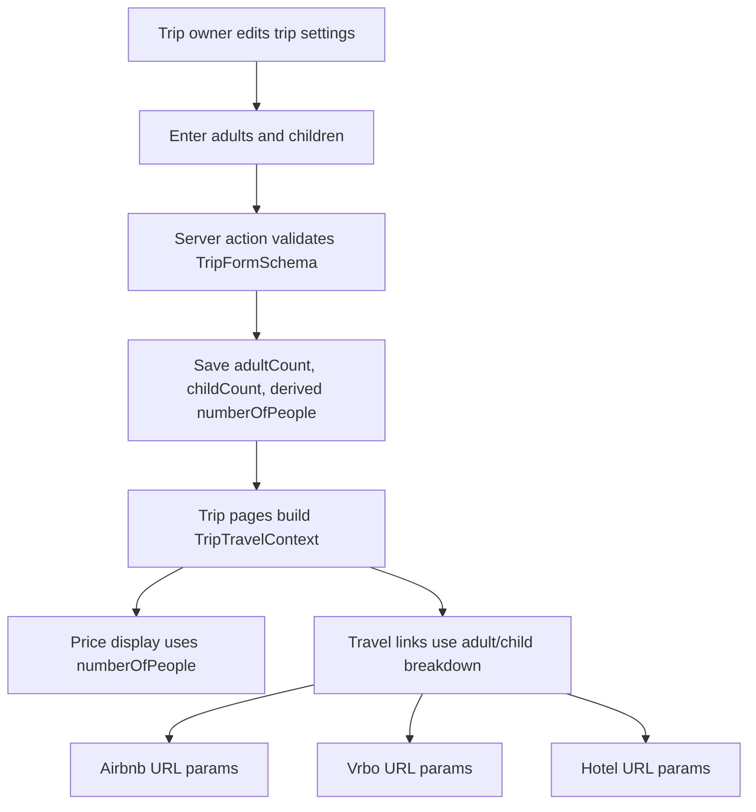

# Trip Guest Breakdown Roadmap

## Plain English Summary

Airbnb, Vrbo, and hotel sites do not all treat "12 guests" the same way. Many booking URLs need to know how many guests are adults and how many are children. Some hotel/OTA sites may also need child ages later.

Right now House Vote only stores one trip-level number: `numberOfPeople`. That is enough for per-guest pricing, but it is not enough for precise outbound booking/search links. The clean solution is to store a small guest breakdown on the `Trip` itself, derive the existing total from that breakdown, and keep existing screens working while the app gradually switches to the richer structure.

The recommendation is:

- Add `adultCount`, `childCount`, and eventually optional child ages.
- Keep `numberOfPeople` for now as a derived total so existing pricing and display code does not break.
- Update trip forms to show "Adults" and "Children" instead of only "Number of People".
- Update travel URL builders to use the structured values for Airbnb, Vrbo, Booking/hotel links, and listing-specific deep links.
- Add tests around URL generation because these provider schemas are brittle.

## Current State

The current trip model stores:

- `Trip.numberOfPeople Int?`
- `Trip.startDate DateTime?`
- `Trip.endDate DateTime?`
- `Trip.location String?`

The trip form currently renders a single `Number of People` field in `src/features/trips/forms/TripForm.tsx`.

The form schema validates that value as `numberOfPeople` in `src/features/trips/schemas.ts`.

The field is used for:

- Trip header display: `12 guests`
- Price basis calculations: total/per-guest price display
- Airbnb/Vrbo search links
- Airbnb/Vrbo listing deep links
- Public trip page guest-count display

## Design Goals

- Preserve existing trip behavior while adding better travel-site links.
- Keep pricing math simple by continuing to expose a total guest count.
- Avoid a hard cutover that breaks old trips with only `numberOfPeople`.
- Keep the UI understandable for non-technical trip owners.
- Do not overbuild child ages until a provider URL or hotel workflow requires it.

## Proposed Data Model

### Phase 1 Model

Add two nullable integer fields to `Trip`:

```prisma
model Trip {
  // existing fields
  numberOfPeople Int?
  adultCount     Int?
  childCount     Int?
}
```

Simple rule:

- `adultCount + childCount = numberOfPeople`
- If the trip only has legacy `numberOfPeople`, treat that total as adults until the owner edits the trip.

This is not perfect, but it is honest. We do not know historical child counts, so pretending otherwise would be worse.

### Possible Phase 2 Model

If hotel providers need child ages, add a separate JSON field or child-age relation later:

```prisma
model Trip {
  childAges Json?
}
```

Use JSON first only if the app does not need querying/filtering by child age. If we later need structured queries, use a relation.

## Recommended Type Shape

Create a reusable trip guest context type:

```ts
export interface TripGuestBreakdown {
  adultCount: number | null;
  childCount: number | null;
  childAges?: number[] | null;
}

export interface TripTravelContext extends TripGuestBreakdown {
  numberOfPeople: number | null;
  startDate: Date | null;
  endDate: Date | null;
}
```

Keep `numberOfPeople` in the context because pricing logic should not need to know about adult/child split.

## URL Mapping

### Airbnb

Use both current known date spellings because Airbnb room pages appear to accept/require different names in different contexts:

- `checkin`
- `checkout`
- `check_in`
- `check_out`

Guest params:

- `numberOfAdults=<adultCount>`
- `adults=<adultCount>`
- `guests=<total>`
- `numberOfChildren=<childCount>`
- `numberOfInfants=0`
- `numberOfPets=0`

Plain English: Airbnb needs both total guest-ish fields and explicit adult/child fields. We should send all known compatible fields instead of relying on one fragile spelling.

### Vrbo

Vrbo adult params:

- `adults=<adultCount>`

Vrbo child params are more awkward. The reference URL uses:

- `children=1_7%2C1_8`

That appears to encode child age entries, not just a child count. If we only know `childCount`, we have two choices:

- Do not send `children` yet, and rely on adults/date being correct.
- Send a neutral/unknown age format only after manual browser testing confirms Vrbo accepts it.

Recommendation: do not invent fake child ages. Add child count now, but only include Vrbo `children` once the app captures child ages or we confirm a count-only schema.

### Hotel Sites

Hotel providers vary a lot:

- Booking.com often uses adults/children/children ages.
- Expedia/Hotels.com often use travelers arrays or child age params.
- Marriott/Hilton may use adults/children per room.

Recommendation: create provider-specific URL builder adapters rather than stuffing every provider into one generic query builder.

## Mermaid Flow



## Implementation Phases

## Phase 1: Schema And Migration

Plain English: give the database somewhere to store adults and children, without breaking old trips.

Technical plan:

- Add nullable `adultCount` and `childCount` fields to `Trip`.
- Create a Prisma migration with a descriptive name, for example `add_trip_guest_breakdown`.
- Backfill existing rows:
  - `adultCount = numberOfPeople`
  - `childCount = 0`
  - leave `numberOfPeople` unchanged
- Review the generated SQL before applying.

Checkpoint commit:

- `feat(trips): add guest breakdown fields`

Checklist:

- [ ] Update `prisma/schema.prisma`.
- [ ] Generate a migration with `pnpm prisma migrate dev --create-only --name add_trip_guest_breakdown` or the repo-approved equivalent.
- [ ] Review migration SQL for data preservation.
- [ ] Add backfill SQL to preserve existing totals.
- [ ] Run `pnpm db:generate`.
- [ ] Run `pnpm check-types`.

## Phase 2: Form Schema And Server Actions

Plain English: teach the create/edit trip flow to accept adults and children, while still saving the total for old pricing code.

Technical plan:

- Update `TripSchema` and `TripFormSchema`.
- Add validation:
  - adults must be a non-negative integer
  - children must be a non-negative integer
  - at least one adult/child if either field is present
  - derived total must be positive when saved
- In `createTrip` and `updateTrip`, normalize input before calling `trips.create` / `trips.update`.
- Prefer a helper such as `normalizeTripGuestBreakdown()` to avoid duplicating create/update logic.

Checkpoint commit:

- `feat(trips): validate guest breakdown input`

Checklist:

- [ ] Add adult/child fields to `TripFormSchema`.
- [ ] Create a small helper to derive `numberOfPeople`.
- [ ] Use that helper in create/update server actions or DB layer.
- [ ] Add unit tests if there is already a nearby test pattern; otherwise cover through type/lint and UI smoke testing.
- [ ] Verify legacy trips with only `numberOfPeople` still display correctly.

## Phase 3: Trip Settings UI

Plain English: replace the single "Number of People" field with a clearer guest section.

Recommended UI:

- Adults
- Children
- Total guests preview, read-only

For the screenshot example:

- Adults: `12`
- Children: `0`
- Total: `12 guests`

Technical plan:

- Update `TripForm.tsx`.
- Keep the `numberOfPeople` hidden or derived server-side. Prefer server-side derivation so the client cannot submit an inconsistent total.
- Update the initial form data mapping in `TripHeader.tsx`.
- Update the trip meta pill to show something like:
  - `12 guests`
  - or `8 adults, 4 children` when children are present.

Checkpoint commit:

- `feat(trips): collect adults and children in trip form`

Checklist:

- [ ] Replace `Number of People` with adult/child inputs.
- [ ] Add a simple total preview.
- [ ] Confirm edit form pre-fills from existing trips.
- [ ] Confirm create form defaults are sensible.
- [ ] Confirm mobile layout remains usable.

## Phase 4: Shared Trip Context Helpers

Plain English: stop passing random trip fields around by hand. Create one small helper that turns a trip into the context pricing and travel links need.

Technical plan:

- Add a utility, for example `src/features/trips/utils/tripTravelContext.ts`.
- Include:
  - `adultCount`
  - `childCount`
  - `numberOfPeople`
  - `startDate`
  - `endDate`
- Add a fallback:
  - if `adultCount`/`childCount` are missing, use `numberOfPeople` as adults and `0` children.
- Update `TripHeader`, `TripContentArea`, published trip code, listing cards, and table props to consume this helper.

Checkpoint commit:

- `refactor(trips): centralize trip travel context`

Checklist:

- [ ] Add helper and type.
- [ ] Replace duplicate context construction.
- [ ] Preserve existing `TripPriceContext` behavior or make it derive from the new context.
- [ ] Confirm no `any` types are introduced.
- [ ] Run `pnpm check-types`.

## Phase 5: Travel URL Builders

Plain English: now that we know adults and children separately, use that split in outbound links.

Technical plan:

- Update `generateAirbnbUrl()` and `generateTravelListingUrl()` to accept structured guest context.
- Update Vrbo builder to use adults correctly and defer child age params unless confirmed.
- Add provider adapter shape for hotels:

```ts
interface TravelProviderUrlParams {
  startDate?: TravelDateValue;
  endDate?: TravelDateValue;
  adultCount?: number | null;
  childCount?: number | null;
  childAges?: number[] | null;
  numberOfPeople?: number | null;
}
```

Checkpoint commit:

- `feat(trips): use guest breakdown in travel links`

Checklist:

- [ ] Update Airbnb search links.
- [ ] Update Airbnb listing deep links.
- [ ] Update Vrbo search/listing links.
- [ ] Add tests for adult-only and adult-plus-children trips.
- [ ] Manually test generated links in browser for Airbnb and Vrbo.
- [ ] Ask for browser/devtools output only if provider redirects strip params unexpectedly.

## Phase 6: Public Trip And Pricing Surfaces

Plain English: public voters and collaborators should see the same guest summary, but pricing should continue using total guests.

Technical plan:

- Update `publishedTripShareSelect` to include new fields.
- Update published masthead guest pill.
- Update published listing card travel context.
- Keep price basis math based on total `numberOfPeople`.

Checkpoint commit:

- `feat(trips): show guest breakdown on published trips`

Checklist:

- [ ] Include new trip fields in published Prisma select.
- [ ] Update public masthead display.
- [ ] Update published listing URL context.
- [ ] Verify anonymous public share page still works.

## Phase 7: QA And Rollout

Plain English: test the old path, the new path, and real provider links before shipping.

QA checklist:

- [ ] Create a trip with adults only.
- [ ] Create a trip with adults and children.
- [ ] Edit an old trip that only had `numberOfPeople`.
- [ ] Confirm the trip header displays the right guest text.
- [ ] Confirm per-guest pricing still divides by total guests.
- [ ] Open Airbnb search link and verify dates + adult/child counts.
- [ ] Open Airbnb listing card link and verify dates + adult/child counts.
- [ ] Open Vrbo search link and verify dates + adult count.
- [ ] Open Vrbo listing card link and verify dates + adult count.
- [ ] Test public share page listing links.

Validation commands:

- [ ] `pnpm lint`
- [ ] `pnpm check-types`
- [ ] `pnpm test`

## Open Questions

- Should infants and pets be modeled now, or left as `0` until requested?
- Do we need child ages for the first version, or can children be count-only?
- Should `numberOfPeople` remain stored permanently, or become a derived-only concept later?
- Should collaborators be allowed to edit guest breakdown, or owner only?
- Do we want per-room guest breakdown for hotels, or just trip-level totals?

## Recommendation

Start with `adultCount` and `childCount`, keep `numberOfPeople`, and do not add child ages until we have a concrete hotel/Vrbo URL need. That gives Airbnb enough information immediately and avoids fake data for providers that need child ages.

## Expected Scope

- Expected files touched: 12-18 files across Prisma schema/migration, trip form/schema/actions, trip display components, travel URL utilities, and tests.
- Expected lines changed: 350-650 lines, depending on how much test coverage is added.
- Performance hit: negligible. This is simple form data, derived totals, and URL query construction.
- Hackiness score: 2/7 for the adult/child model; 4/7 if we try to fake Vrbo/hotel child ages without collecting real ages.
