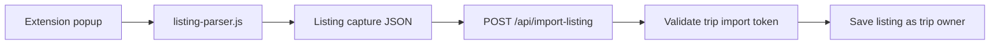
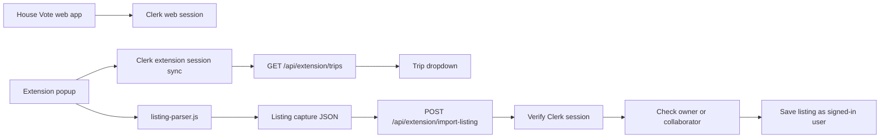
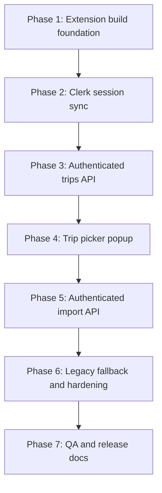
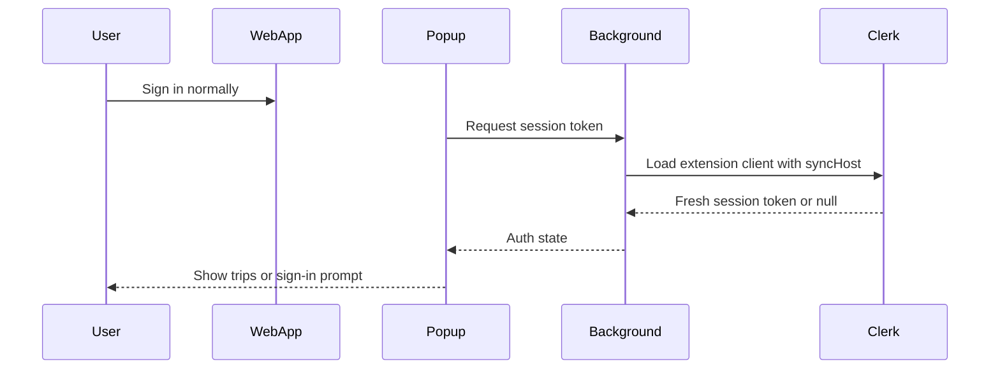
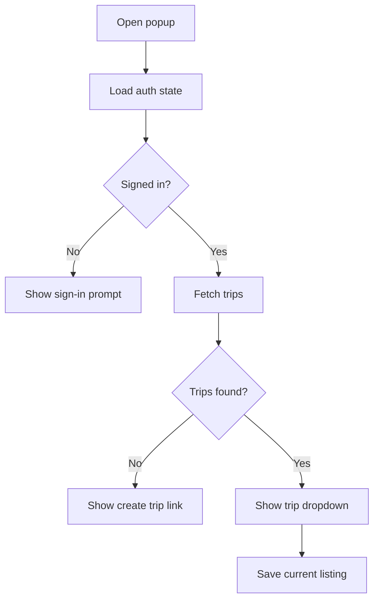

# Chrome Extension Session Sync And Trip Picker Roadmap

## Plain English Summary

The Chrome extension currently asks users to copy a trip id and import token from House Vote into the extension. That works technically, but it is a bad user experience and it creates a weird mental model: users are already signed in to House Vote, yet the extension asks them for a secret string.

The target experience should be:

1. The user signs in to House Vote in the normal web app.
2. The extension recognizes that same signed-in session through Clerk's Chrome extension session sync.
3. The extension shows a dropdown of trips the signed-in user owns or collaborates on.
4. The user opens Airbnb, Vrbo, or Booking.com and clicks "Save to House Vote."
5. The backend imports the listing as the actual signed-in user, not as a shared trip token.

Simple version: stop asking users to paste credentials. Let the extension use the user's existing House Vote login, then ask only "which trip should this listing go into?"

## Recommendation

Use **Clerk Chrome Extension SDK with web-session sync**.

This is option 3 from the discussion. It is better than a standalone extension login because House Vote is already a web app with Clerk. Users should not have to authenticate twice unless the browser state truly requires it.

This is also better than inventing our own extension pairing token. A custom token system would mean we own token issuance, rotation, expiry, revocation, storage, and security review. Clerk already owns the session layer.

## Current State

The extension is a small Manifest V3 static extension:

- `chrome-extension/manifest.json`
- `chrome-extension/popup.html`
- `chrome-extension/popup.css`
- `chrome-extension/popup.js`
- `chrome-extension/listing-parser.js`

The current extension stores these values in Chrome local storage:

- `houseVoteAppUrl`
- `houseVoteTripId`
- `houseVoteImportToken`
- `houseVoteDebugMode`

The current save flow posts to `src/app/api/import-listing/route.ts`:



Current API behavior:

- The route allows public CORS with `Access-Control-Allow-Origin: *`.
- The request body must include `tripId`, `importToken`, and `capture`.
- The import token is checked with `trips.validateImportToken(tripId, importToken)`.
- The listing is saved with `addedById` set to the trip owner returned by token validation.

That last point matters. A collaborator using the current extension is not importing as themselves. They are importing through the owner's shared token.

## Desired State

The new extension flow should look like this:



User-facing behavior:

- If the user is signed in, the popup shows their available trips.
- If the user is signed out, the popup shows a clear "Sign in to House Vote" action.
- If the user has no trips, the popup links them to create a trip.
- If a trip tab is already open, the extension can preselect that trip.
- The previous manual token setup can stay behind an "Advanced manual setup" disclosure during rollout.

## Non-Goals

- Do not scrape the import token out of the House Vote DOM.
- Do not keep expanding the public token API as the main extension path.
- Do not build a custom long-lived app token system unless Clerk session sync proves unworkable.
- Do not rewrite the listing parser in this project. The parser is already useful and can be reused.
- Do not create a new Prisma model unless a later phase needs explicit device/session revocation outside Clerk.

## Key Technical Decisions

| Decision | Recommendation | Why |
|---|---|---|
| Extension auth model | Clerk Chrome Extension SDK with `syncHost` | Reuses the web app session instead of asking users to log in twice. |
| Backend API style | New authenticated route handlers under `/api/extension/*` | Browser extensions cannot call server actions directly in a clean way; route handlers are the right boundary for cross-origin extension fetches. |
| Existing token API | Keep temporarily as legacy fallback | Reduces release risk while the new extension path is tested. |
| Listing parser | Reuse `listing-parser.js` initially | Keeps scope focused on auth/trip selection, not scraping changes. |
| Trip authorization | Owner or collaborator can import | Matches existing trip access rules from `trips.getByUser()`. |
| `addedById` | Use the signed-in Clerk user id | Better auditability than saving everything as the owner. |
| Extension build setup | Add a real build step if needed | Clerk's extension SDK is package-based; trying to bolt it onto raw static JS is likely brittle. |

## Architecture Notes

### Why This Is Not Just A Dropdown

The dropdown itself is easy. The real work is giving the extension a trustworthy way to ask the backend, "Which trips can this user access?"

Right now the backend trusts a trip import token. With session sync, the backend trusts Clerk auth, then checks trip membership. That is cleaner because authorization lives on the server and follows the same rules as the app.

### Why A New API Route Is Better Than Reusing `/api/import-listing`

The existing route is built around shared-token auth:

```ts
{
  tripId: string;
  importToken: string;
  capture: ListingImportCapture;
}
```

The new authenticated route should accept:

```ts
{
  tripId: string;
  capture: ListingImportCapture;
}
```

The server should derive `userId` from Clerk, not from the request body.

### Expected Route Shape

```text
GET  /api/extension/trips
POST /api/extension/import-listing
```

Possible response shape for `GET /api/extension/trips`:

```ts
interface ExtensionTripOption {
  id: string;
  name: string;
  location: string | null;
  startDate: string | null;
  endDate: string | null;
  listingCount: number;
  role: 'owner' | 'collaborator';
}
```

Possible request shape for `POST /api/extension/import-listing`:

```ts
interface ExtensionImportListingRequest {
  tripId: string;
  capture: ListingImportCapture;
}
```

### Authorization Rule

The server should allow import when:

- `trip.userId === userId`, or
- the user appears in `trip.collaborators`.

This should be enforced inside the import route even if `/api/extension/trips` only returns authorized trips. Never trust the dropdown as authorization.

## Required Clerk And Extension Setup

Clerk's Chrome Extension SDK needs extension-specific configuration. Before implementation, confirm the exact current Clerk dashboard steps against the latest docs, but expect at least:

- Add `@clerk/chrome-extension` to the extension build.
- Configure a stable Chrome extension key/id for development and production.
- Add the extension origin to Clerk allowed origins, for example `chrome-extension://<extension-id>`.
- Configure `syncHost` to the House Vote web origin.
- Use a background service worker or equivalent token helper so tokens are fresh even after the popup closes.
- Add required Manifest V3 permissions and extension pages.

Plain English: Clerk needs to know that this Chrome extension is allowed to talk to the same Clerk app as the website. Chrome also needs the extension id to stay stable, otherwise the allowed origin changes.

## Extension Build Decision

The current extension is raw HTML/CSS/JS. That is simple, but Clerk's extension SDK is imported from packages, so we probably need a bundler.

Recommended path:

1. Add a minimal extension build pipeline, likely Vite.
2. Keep source files under `chrome-extension/src`.
3. Build output to `chrome-extension/dist`.
4. Load `chrome-extension/dist` in Chrome during development.
5. Keep `listing-parser.js` either copied as a static asset or moved into source and emitted unchanged.

This is less hacky than manually vendoring package bundles or loading remote scripts. Chrome extensions cannot load arbitrary remote code, and the Chrome Web Store will reject that pattern.

Possible folder shape:

```text
chrome-extension/
  package.json? or root package scripts
  manifest.json or manifest.template.json
  src/
    background.ts
    popup.html
    popup.ts
    popup.css
    listing-parser.js
    api.ts
    auth.ts
    storage.ts
    trips.ts
  dist/
```

Open question for implementation: whether to keep extension dependencies in the root `package.json` or give `chrome-extension` its own package metadata. Since this repo is not a monorepo and uses pnpm only, the simplest first pass is likely root-level scripts and dependencies.

## Rollout Strategy

Do this in small PRs. The risky parts are auth and extension build setup, so each checkpoint should leave the app working.



## Phase 0: Product And Security Checks

Plain English: before writing code, confirm the UX and security assumptions so we do not build a clever flow users cannot actually use.

Technical plan:

- Confirm the deployed House Vote origin that should be used as `syncHost`.
- Confirm development origin behavior for `http://localhost:3000`.
- Confirm whether production distribution is Chrome Web Store, unpacked extension, or internal install.
- Confirm whether collaborators should be allowed to import listings through the extension. The recommendation is yes.
- Confirm whether the old token flow should stay visible as a temporary fallback. The recommendation is yes, behind "Advanced manual setup."

Checklist:

- [ ] Confirm production app origin.
- [ ] Confirm Chrome extension distribution plan.
- [ ] Confirm stable extension id/key strategy.
- [ ] Confirm collaborators can import into shared trips.
- [ ] Confirm manual token fallback stays for one release.
- [ ] Check Clerk docs for latest Chrome Extension SDK setup and allowed-origin requirements.

Checkpoint commit:

```bash
git commit -m "docs: plan extension session sync rollout"
```

## Phase 1: Extension Build Foundation

Plain English: make the extension buildable in a way that can safely import packages like Clerk.

Technical plan:

- Add a build pipeline for the extension.
- Keep the existing popup UI and parser behavior working before auth changes.
- Add root scripts using `pnpm`, for example:
  - `pnpm extension:build`
  - `pnpm extension:watch`
- Make the extension manifest point to built popup/background assets.
- Preserve current permissions initially, then tighten later.
- Decide whether `manifest.json` remains source or whether a template emits `dist/manifest.json`.

Likely files:

- `package.json`
- `chrome-extension/manifest.json`
- `chrome-extension/src/popup.html`
- `chrome-extension/src/popup.ts`
- `chrome-extension/src/popup.css`
- `chrome-extension/src/listing-parser.js`
- `chrome-extension/src/background.ts`
- extension build config file

Checklist:

- [x] Add extension build dependencies with `pnpm`.
- [x] Move popup source into an extension source directory.
- [x] Preserve current popup behavior after build.
- [x] Ensure `listing-parser.js` is available to `chrome.scripting.executeScript`.
- [x] Add a background service worker entry, even if it only handles a health-check message at first.
- [x] Document how to load the built extension locally.
- [x] Run `pnpm extension:build`.
- [x] Run `pnpm lint`.
- [x] Run `pnpm check-types`.

Checkpoint commit:

```bash
git commit -m "chore: add chrome extension build pipeline"
```

Hackiness warning: this phase is where a shortcut would hurt most. Avoid manually copying package code into the extension. Use a real build step.

## Phase 2: Clerk Session Sync In The Extension

Plain English: teach the extension who the current House Vote user is by syncing with the website's Clerk session.

Technical plan:

- Add `@clerk/chrome-extension`.
- Initialize Clerk in the extension with the publishable key and `syncHost`.
- Add a background helper that can return a fresh session token.
- Add popup states:
  - loading auth
  - signed out
  - signed in
  - auth error
- Add a "Sign in to House Vote" button that opens the web app sign-in route.
- Add a "Refresh session" action for stale extension state.

Expected auth flow:



Checklist:

- [x] Add Clerk extension dependency.
- [x] Add extension env/config for Clerk publishable key.
- [x] Add `syncHost` config for local and production origins.
- [x] Configure manifest permissions required by Clerk.
- [x] Add background token helper.
- [x] Add popup signed-out state.
- [x] Add popup signed-in state showing the Clerk user/session status.
- [ ] Test signed-in web app -> extension recognizes session.
- [ ] Test signed-out web app -> extension prompts sign-in.
- [x] Run `pnpm extension:build`.
- [x] Run `pnpm lint`.
- [x] Run `pnpm check-types`.

Checkpoint commit:

```bash
git commit -m "feat: sync chrome extension with clerk session"
```

## Phase 3: Authenticated Trips API

Plain English: give the extension a safe backend endpoint that returns only trips the signed-in user can access.

Technical plan:

- Add `GET /api/extension/trips`.
- Use Clerk server auth in the route handler.
- Return `401` when there is no signed-in user.
- Query trips where the user is owner or collaborator.
- Return a small, extension-specific DTO instead of raw Prisma records.
- Include enough display info for a useful dropdown:
  - trip id
  - name
  - location
  - start date
  - end date
  - listing count
  - role
- Sort by recently created or recently updated. Current `trips.getByUser()` defaults to `createdAt desc`; that is acceptable for the first pass.

Likely files:

- `src/app/api/extension/trips/route.ts`
- `src/features/trips/db.ts` or a new small query helper
- `src/features/trips/types.ts` if shared types are useful

Response example:

```json
{
  "success": true,
  "data": [
    {
      "id": "clx...",
      "name": "Summer family trip",
      "location": "Maine",
      "startDate": "2026-07-10T00:00:00.000Z",
      "endDate": "2026-07-17T00:00:00.000Z",
      "listingCount": 12,
      "role": "owner"
    }
  ]
}
```

Checklist:

- [x] Add route handler for `GET /api/extension/trips`.
- [x] Add schema or DTO type for extension trip options.
- [x] Authenticate with Clerk server auth.
- [x] Return 401 for unauthenticated requests.
- [x] Return only owner/collaborator trips.
- [x] Avoid exposing import tokens or private relation data.
- [ ] Add unit tests or route-level tests if the repo has a practical pattern for route handlers.
- [x] Run `pnpm lint`.
- [x] Run `pnpm check-types`.
- [x] Run `pnpm test`.

Checkpoint commit:

```bash
git commit -m "feat: add authenticated extension trips api"
```

## Phase 4: Trip Picker Popup

Plain English: replace the manual trip id/token setup with a real dropdown.

Technical plan:

- When signed in, fetch `/api/extension/trips` with `Authorization: Bearer <token>`.
- Store the selected trip id in Chrome local storage.
- Show an empty state when no trips exist.
- Add a "Create trip" or "Open House Vote" link.
- If a House Vote trip tab is already open, preselect that trip if it is in the authorized trips list.
- Keep parser debug mode available, but separate it from the main happy path.
- Hide the legacy manual token fields under "Advanced manual setup" during rollout.

Popup states:



Likely files:

- `chrome-extension/src/popup.html`
- `chrome-extension/src/popup.ts`
- `chrome-extension/src/popup.css`
- `chrome-extension/src/api.ts`
- `chrome-extension/src/storage.ts`
- `chrome-extension/src/trips.ts`

Checklist:

- [ ] Add trip dropdown markup.
- [ ] Add API client helper that attaches the Clerk token.
- [ ] Fetch trips on popup open.
- [ ] Persist selected trip id.
- [ ] Preselect the current open trip tab when possible.
- [ ] Add signed-out UI.
- [ ] Add no-trips UI.
- [ ] Move manual trip id/token fields behind an advanced disclosure.
- [ ] Update status messages to mention Airbnb, Vrbo, and Booking.com.
- [ ] Run `pnpm extension:build`.
- [ ] Manually load the extension and verify popup states.

Checkpoint commit:

```bash
git commit -m "feat: add trip picker to chrome extension"
```

## Phase 5: Authenticated Extension Import API

Plain English: save listings through the signed-in user's session instead of the shared import token.

Technical plan:

- Add `POST /api/extension/import-listing`.
- Validate the request body with a schema based on `ListingImportCaptureSchema`.
- Authenticate with Clerk server auth.
- Check the signed-in user can access the requested trip.
- Call `importListingCapture` with:
  - `tripId`
  - `capture`
  - `importMethod: 'EXTENSION'`
  - `addedById: userId`
- Revalidate `/trips/${tripId}` if needed.
- Return the same import result shape currently used by the popup where possible.

Likely files:

- `src/app/api/extension/import-listing/route.ts`
- `src/features/listings/import/schemas.ts`
- maybe `src/features/trips/guards.ts` or `src/features/trips/db.ts`

Request example:

```json
{
  "tripId": "clx...",
  "capture": {
    "source": "AIRBNB",
    "url": "https://www.airbnb.com/rooms/...",
    "title": "Lake house",
    "price": "450"
  }
}
```

Checklist:

- [ ] Add extension import request schema without `importToken`.
- [ ] Add authenticated import route handler.
- [ ] Return 401 when missing auth.
- [ ] Return 403 when the user cannot access the trip.
- [ ] Save `addedById` as the signed-in user.
- [ ] Preserve missing-field warnings in the response.
- [ ] Preserve `tripPath` in the response so the extension can show "Open Saved Trip."
- [ ] Add tests for unauthorized, forbidden, and successful import if practical.
- [ ] Run `pnpm lint`.
- [ ] Run `pnpm check-types`.
- [ ] Run `pnpm test`.

Checkpoint commit:

```bash
git commit -m "feat: add authenticated extension import api"
```

## Phase 6: Wire Popup Save Flow To Authenticated Import

Plain English: make the new dropdown save button actually use the new secure backend route.

Technical plan:

- Change the popup save path:
  - get selected trip id
  - capture current tab
  - get Clerk token
  - post to `/api/extension/import-listing`
- Keep legacy manual-token save path only when the user explicitly chooses advanced manual setup.
- Improve status messages:
  - "Choose a trip first."
  - "Sign in to House Vote first."
  - "Could not parse this page."
  - "You do not have access to this trip."
- Keep the existing capture preview/debug behavior.

Checklist:

- [ ] Replace default save flow with authenticated route.
- [ ] Keep advanced legacy save flow separate.
- [ ] Ensure selected trip id is required.
- [ ] Ensure auth token is required.
- [ ] Preserve parser debug preview.
- [ ] Preserve success message and "Open Saved Trip" link.
- [ ] Test Airbnb import.
- [ ] Test Vrbo import.
- [ ] Test Booking.com import.
- [ ] Test collaborator import shows correct `addedById`.
- [ ] Run `pnpm extension:build`.
- [ ] Run `pnpm lint`.
- [ ] Run `pnpm check-types`.

Checkpoint commit:

```bash
git commit -m "feat: import extension listings with synced session"
```

## Phase 7: Hardening And Legacy Token Cleanup

Plain English: once the new flow works, reduce the old shared-secret surface area.

Technical plan:

- Keep `/api/import-listing` for one release if needed.
- Add clearer comments marking it as legacy/manual-token import.
- Consider restricting CORS instead of `*`.
- Add a deprecation note to `TripImportTokenCard`.
- Remove or hide `TripImportTokenCard` from the main edit sheet once the authenticated extension is stable.
- If keeping manual setup permanently, move it to an advanced/admin-only area.

Important: do not delete the old path in the same PR that introduces the new path. That makes rollback harder.

Checklist:

- [ ] Confirm authenticated extension import works for owner.
- [ ] Confirm authenticated extension import works for collaborator.
- [ ] Confirm manual token fallback still works, if kept.
- [ ] Decide whether `/api/import-listing` remains public.
- [ ] Add deprecation copy to browser import token UI.
- [ ] Create a follow-up ticket/PR for removing token fallback.
- [ ] Run `pnpm lint`.
- [ ] Run `pnpm check-types`.

Checkpoint commit:

```bash
git commit -m "chore: mark manual extension token flow as legacy"
```

## Phase 8: QA And Release Notes

Plain English: this is auth plus a browser extension, so manual QA matters more than usual.

Technical plan:

- Test local app at `http://localhost:3000`.
- Test production/staging app origin if available.
- Test extension reload after closing/reopening popup.
- Test stale session behavior.
- Test user switching:
  - sign in as user A
  - select a trip
  - sign out/sign in as user B
  - ensure user A's selected trip is not used if user B cannot access it
- Test collaborator permissions.
- Test no-trip state.
- Test parser behavior on Airbnb, Vrbo, and Booking.com.

QA checklist:

- [ ] Signed-out popup shows sign-in prompt.
- [ ] Sign-in button opens House Vote sign-in.
- [ ] Signed-in popup loads trips.
- [ ] Trip dropdown persists selected trip.
- [ ] Open House Vote trip tab can preselect matching trip.
- [ ] Airbnb listing saves to selected trip.
- [ ] Vrbo listing saves to selected trip.
- [ ] Booking.com listing saves to selected trip.
- [ ] Saved listing opens the correct trip.
- [ ] Collaborator can import into shared trip.
- [ ] Non-collaborator cannot import into another user's trip.
- [ ] User switch does not leak prior trip access.
- [ ] Manual fallback works or is intentionally hidden.

Checkpoint commit:

```bash
git commit -m "docs: add chrome extension session sync qa notes"
```

## Suggested PR Breakdown

### PR 1: Extension Build Foundation

Goal: make the extension buildable and keep current behavior.

Includes:

- Extension build setup.
- Source folder reorganization.
- Background service worker stub.
- Build docs.

Validation:

- `pnpm extension:build`
- `pnpm lint`
- `pnpm check-types`
- Manual extension load.

### PR 2: Clerk Session Sync

Goal: extension can detect House Vote sign-in state.

Includes:

- Clerk extension SDK.
- `syncHost` config.
- Signed-in/signed-out popup states.
- Background token helper.

Validation:

- Sign in on web app.
- Open extension and verify session detected.
- Sign out and verify prompt.

### PR 3: Trips API And Dropdown

Goal: signed-in extension can show authorized trips.

Includes:

- `GET /api/extension/trips`.
- Trip dropdown UI.
- Selected trip persistence.
- No-trips state.

Validation:

- Owner trips appear.
- Collaborator trips appear.
- Unauthorized trips do not appear.

### PR 4: Authenticated Import

Goal: extension imports listing as signed-in user.

Includes:

- `POST /api/extension/import-listing`.
- Popup save flow uses authenticated API.
- Legacy manual setup remains behind advanced UI.

Validation:

- Owner import works.
- Collaborator import works.
- Unauthorized import fails.
- Airbnb, Vrbo, and Booking.com still parse.

### PR 5: Legacy Flow Hardening

Goal: reduce reliance on copy/paste tokens after new flow is stable.

Includes:

- Deprecation copy for import token card.
- CORS review for old import endpoint.
- Follow-up cleanup ticket for removing manual token flow.

Validation:

- New flow remains default.
- Manual fallback is available only where intended.

## Risks And Mitigations

| Risk | Why It Matters | Mitigation |
|---|---|---|
| Clerk extension setup is more involved than expected | Extension auth can be finicky across local/prod origins | Make Phase 2 its own PR and verify before building more UI on top. |
| Extension id changes during development | Clerk allowed origin depends on extension id | Use a stable extension key early. |
| Current static extension cannot import Clerk cleanly | Package-based SDK needs bundling | Add a real build step in Phase 1. |
| Token refresh fails when popup closes | Popup lifecycle is short | Use a background service worker token helper. |
| User switches accounts | Stored selected trip might belong to previous user | Validate selected trip against fetched authorized trips every popup open. |
| Public `/api/import-listing` remains too permissive | `Access-Control-Allow-Origin: *` plus shared token is broad | Treat old route as legacy and tighten after new flow ships. |
| Collaborator import attribution changes behavior | Listings will now show the collaborator as added-by | This is intended, but QA should verify UI labels still make sense. |

## Testing Plan

Automated checks:

- `pnpm lint`
- `pnpm check-types`
- `pnpm test`
- `pnpm extension:build`

Manual browser checks:

- Load unpacked built extension.
- Sign in to House Vote web app.
- Open extension and confirm trip dropdown.
- Save one Airbnb listing.
- Save one Vrbo listing.
- Save one Booking.com listing.
- Open saved trip and confirm listings appear.
- Repeat as collaborator.
- Repeat signed out.
- Repeat after switching users.

## Performance Notes

Expected app impact is negligible:

- One small authenticated `GET /api/extension/trips` when the popup opens.
- One authenticated `POST /api/extension/import-listing` per saved listing.
- Listing parsing still happens in the browser tab, same as today.
- Backend import still uses the existing normalization/upsert pipeline.

Potential optimization later:

- Cache trips in extension storage for the popup, but always refresh on open before saving.
- Add a manual refresh button if users create a trip while the popup is open.

## Security Notes

- The extension should never send a user id in the request body.
- The server should derive user identity from Clerk auth only.
- The server must check trip access on every import request.
- The selected trip id in Chrome storage is a preference, not an authorization grant.
- Do not expose import tokens through the new trips API.
- Do not load remote scripts in the extension.
- Keep extension host permissions as narrow as practical after parser requirements are reviewed.

## Final Recommendation

Build Option 3 in the phased shape above.

The cleanest product outcome is a synced-session extension with a trip dropdown. The cleanest engineering path is to first add a real extension build foundation, then Clerk session sync, then authenticated trip/import APIs. Trying to skip the build/auth foundation would make this more fragile than the current token workflow.

Estimated scope:

- Files touched: 8-12 in the main implementation, more if the extension build setup expands.
- Lines changed: roughly 400-800 for the complete synced-session flow.
- Performance hit: negligible.
- Hackiness score: 2/7 if implemented with Clerk session sync and a real build step; 4/7 or worse if forced into the current static JS structure without bundling.
