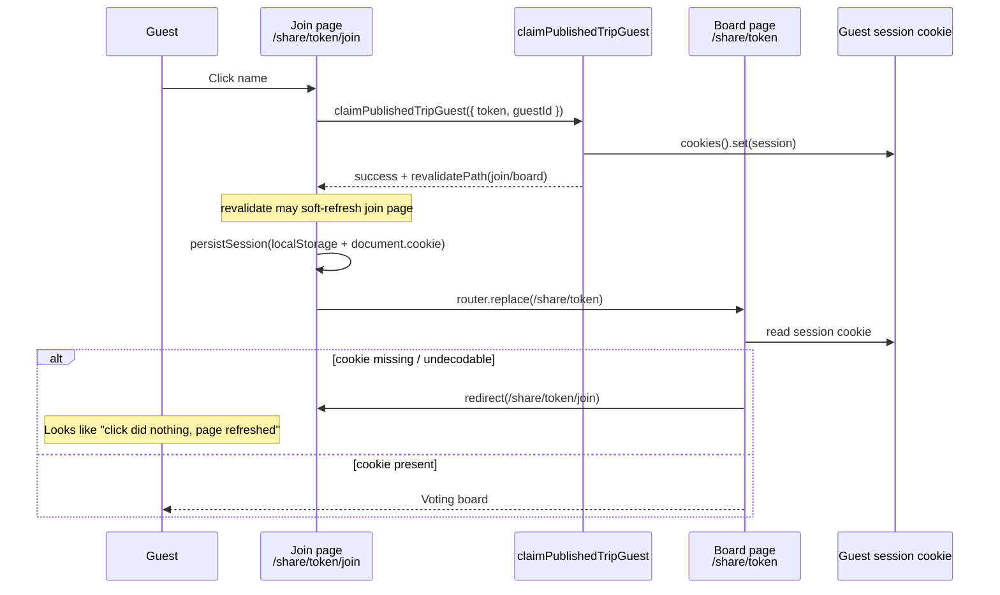
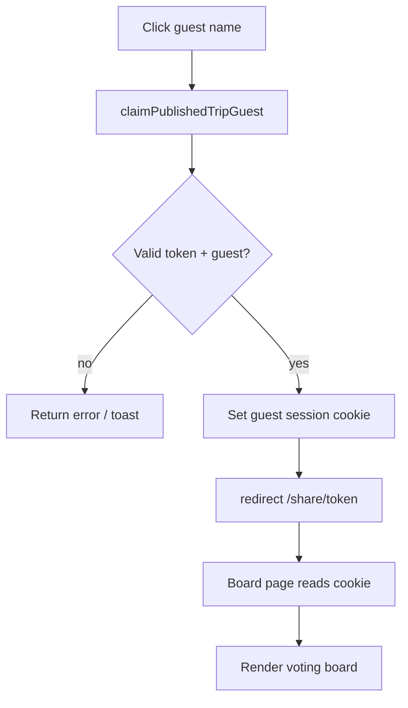

# Public Guest Name Picker Refresh Bug Fix

## Plain English Summary

On the public voting join page (`/share/<token>/join`), guests must click their name before they can vote. Right now, clicking a name feels broken: **nothing useful happens and the page just refreshes**.

Simple version of what should happen:

1. Guest opens the share link.
2. If they have not picked a name yet, they land on the join page.
3. They click their name.
4. The app remembers who they are (cookie + localStorage).
5. They land on the voting board and can vote.

What appears to be happening instead:

1. Guest clicks a name.
2. The claim request runs.
3. Something in the "save session → go to board" handoff fails or races.
4. They end up back on the join page (or the join page soft-refreshes in place), so it looks like a no-op refresh.

This is **not** the Chrome extension flow. It is the public share route under `src/app/(public)/share/`.

---

## Suspected Root Cause

### Why this smells like a session bounce (not a dead button)

The name buttons in `PublishedTripGuestPicker` already use the shared `Button` component, which defaults to `type="button"`. They are **not** inside a `<form>`. So this is unlikely to be the classic "button submits a GET form and reloads the page" HTML bug.

The more likely failure mode is a **join → board → join bounce**:



### Evidence already in the codebase

There is already a prior fix for this exact class of bug:

- Commit `d25fb4a` — `fix(trips): persist published guest session before board navigation`
- It added `cookies().set(...)` inside `claimPublishedTripGuest`
- It changed client navigation from `router.push` + `router.refresh` to `router.replace`

So this bug has happened before. The current code still uses that pattern, which means either:

1. The previous fix was incomplete (cookie set + client `replace` can still race), or
2. A nearby change made the race worse again (most suspiciously: revalidating the join/board routes during claim).

### Highest-probability technical culprits (ranked)

| Rank | Culprit | Why it matches the symptom |
|---|---|---|
| 1 | Board page server-gates on cookie, then `redirect` back to join | One missed/late cookie = instant bounce to join = "refresh" |
| 2 | `claimPublishedTripGuest` revalidates `/share/<token>` and `/share/<token>/join` | Claim does not mutate trip data, but revalidation soft-refreshes the current join page and races with client navigation |
| 3 | Cookie encode/decode mismatch | Value is `encodeURIComponent(JSON)`; Next/browser may already decode once; names with `%` can make `decodeURIComponent` throw → session treated as missing |
| 4 | `createServerAction` + client navigation pattern | Cookie is set in an action that returns JSON; navigation is a second request. Same-response `redirect()` would be safer |
| 5 | Action validation / claim failure | Would normally toast; only keep if DevTools shows a failed action and no toast is visible |

### Important landmine if we use server `redirect()`

`createServerAction` catches **all** errors and turns them into `{ success: false }`. Next.js `redirect()` works by throwing a special redirect error. If we call `redirect()` inside a `createServerAction` handler without rethrowing redirect errors, the redirect will be swallowed and returned as a processing error.

Existing invite flow (`handleInvitation`) calls `redirect()` outside that helper. Any claim+redirect fix must either:

- keep claim outside `createServerAction`, or
- teach `createServerAction` to rethrow `isRedirectError` / `notFound` errors.

---

## Current Architecture (relevant pieces)

| Piece | Path | Role |
|---|---|---|
| Join page | `src/app/(public)/share/[token]/join/page.tsx` | Renders guest picker when unpublished-or-no-session entry happens |
| Board page | `src/app/(public)/share/[token]/page.tsx` | **Server-redirects to join if cookie session missing** |
| Guest picker UI | `src/features/trips/components/PublishedTripGuestPicker.tsx` | Click name → claim action → persist → `router.replace(board)` |
| Claim action | `src/features/trips/actions/publishedTripActions.ts` (`claimPublishedTripGuest`) | Validates token/guest, sets cookie, revalidates paths |
| Session helpers | `src/features/trips/constants/publishedGuestSession.ts` | Cookie/localStorage key + serialize/encode/decode |
| Session hook | `src/features/trips/hooks/usePublishedGuestSession.ts` | Client mirror of session (localStorage + `document.cookie`) |
| Board lifecycle | `src/features/trips/hooks/usePublishedSharePageLifecycle.ts` | Polls refresh; clears bad sessions and bounces to join |

### Session storage contract (today)

- Key: `housevote_published_guest_<tripId>`
- Value: URL-encoded JSON `{ guestId, guestDisplayName }`
- Written by:
  - server action (`cookies().set`)
  - client hook (`localStorage` + `document.cookie`)
- Read by:
  - board/join server pages (`cookies().get` + decode)
  - client hook (`localStorage`)

---

## Goals

1. Clicking a guest name always lands the guest on the voting board on the first try.
2. No join-page soft-refresh "flash" that looks like a broken control.
3. Session persistence remains available to both server components and client components.
4. Avoid hacky query-param session handoffs unless diagnosis proves we need a temporary bridge.
5. Leave a regression path so this does not silently come back.

Non-goals for this fix:

- Redesigning the public voting UI
- Changing how owners add/remove guest names
- Chrome extension auth/import work

---

## Recommended Fix Direction (default)

**Prefer the robust Next.js pattern: set the cookie in the server action, then `redirect()` to the board in the same response.**

Why this is better than another client-side tweak:

- Cookie and navigation travel together in one response.
- The board page's existing cookie gate sees the session on first render.
- We stop depending on "action returns → client writes storage → client navigates → server reads cookie" timing.

Fallback / incremental path if we want the smallest diff first:

1. Stop revalidating share join/board paths from `claimPublishedTripGuest`.
2. Keep client `persistSession`, but navigate with a full load (`window.location.assign`) only if soft navigation still races.
3. Then follow up with the server `redirect()` cleanup so we are not stuck with a hard navigation hack.

Hackiness guide for options:

| Option | Hackiness (1-7) | Notes |
|---|---|---|
| Remove unnecessary revalidate on claim | 1 | Safe, likely partial fix |
| Server cookie + `redirect()` in claim | 1-2 | Best long-term; needs redirect-error rethrow |
| Client `window.location.assign` after persist | 3 | Works, but bypasses App Router navigation |
| Pass guest id in query string as bridge | 6 | Temporary only; do not leave in |

---

## Open Questions (answer before / during Phase 1)

- [ ] When you click a name, does the URL briefly become `/share/<token>` and then bounce back to `/join`, or does it never leave `/join`?
- [ ] In DevTools → Network, does the server action for `claimPublishedTripGuest` return `success: true`?
- [ ] After the click, does Application → Cookies show `housevote_published_guest_<tripId>`?
- [ ] Do you want the **minimal** fix first, or go straight to the **server redirect** robust fix?

If those answers are unavailable, Phase 1 below is designed to gather them quickly.

---

## Implementation Plan

### PR strategy

Ship as **one focused PR** unless Phase 1 reveals a larger session-architecture rewrite.

Suggested PR title prefix: `fix(trips): ...`

Suggested PR body sections (when opening later):

- Summary
- Simple-English summary
- QA engineer UI test steps

---

## Phase 0 — Confirm the failure mode (no product code changes)

**Goal:** Prove whether this is a cookie bounce, a soft revalidation refresh, or an action failure.

**Why first:** The previous fix already set the cookie in the action. Guessing again without Network evidence risks another incomplete patch.

### Checklist

- [ ] Open a published share link in a private window (no existing guest cookie).
- [ ] Land on `/share/<token>/join`.
- [ ] Open DevTools → Network + Application → Cookies.
- [ ] Click a guest name once.
- [ ] Record:
  - [ ] Final URL
  - [ ] Whether `/share/<token>` was requested
  - [ ] Whether that request got a 307/redirect back to `/join`
  - [ ] Server action response body (`success`, error message)
  - [ ] Whether `Set-Cookie` appears on the action response
  - [ ] Whether `housevote_published_guest_<tripId>` exists after click
  - [ ] Whether a toast appeared
- [ ] Checkpoint note (no commit required): paste findings into the PR description or a short comment in this doc under "Phase 0 findings".

### Phase 0 findings (verified 2026-07-28)

Ruled OUT by direct testing against the live Neon DB + local dev server:

- **Input validation is fine.** Real guest IDs are cuid v1 (`cmnk59r3y0003qkop5y8l6pbd`, 25 chars) and pass `z.string().cuid()`; real tokens pass `z.string().uuid()`. So `claimPublishedTripGuest` does not fail schema validation.
- **Server cookie gate is correct.** `curl` against `/share/<token>`:
  - no cookie → `307` redirect to `/join` (expected)
  - correct `housevote_published_guest_<tripId>` cookie → `200` board (expected)
- **Cookie encode/decode round-trips fine** (`encodeURIComponent(JSON)` ↔ `decodeURIComponent` + parse).
- **Toaster is mounted** in the root layout, so it IS available on the public route — a claim failure would show a toast.

### COULD NOT REPRODUCE LOCALLY (verified 2026-07-28, second pass)

I then drove a **real headless Chrome via CDP** through the exact flow against the live Neon DB, clicking a real guest name ("Jim Bob") on the join page. Results:

- **`next dev`, original code (with `revalidate`):** click → lands on `/share/<token>` board, picker gone, cookie set. **PASS** (2/2 runs)
- **`next dev`, fix applied (no `revalidate`):** **PASS**
- **Production build (`next build` + `next start`), original code:** **PASS** (3/3 runs)

**Conclusion: the reported bug does NOT reproduce in local dev or a local production build with an automated real-browser click.** The `revalidate`-race hypothesis is therefore **NOT confirmed** — the flow works with the original code. Removing `revalidate` is still a defensible micro-improvement, but it is **not proven to fix the reported symptom**, so it should not be shipped as "the fix" without a real reproduction.

### What this points to (environment/deployment-specific)

Because it works locally end-to-end, the failure is most likely specific to the user's runtime conditions. Prioritized suspects to confirm WITH the user:

1. **Deployed environment, not local.** Hosting/CDN edge caching of the dynamic `/share/[token]` route, edge middleware behavior, or Clerk production instance differences.
2. **HTTPS cookie handling.** The session cookie is set `sameSite: 'lax'` **without `secure`**. On a deployed HTTPS origin, stricter browsers / privacy settings may drop it → board bounces back to join → looks like a refresh. (Local test was HTTP, so this path was not exercised.)
3. **Pre-existing stale session** in the user's browser (localStorage/cookie for a guest id that no longer exists) triggering the lifecycle bounce.
4. **Browser-specific** (Safari / mobile / third-party-cookie blocking) rather than Chromium.
5. **Client JS/hydration error** in the real page that prevents the `onClick` from wiring — would show in the console.

### Needed to move forward (blocking questions)

- [ ] Is this on the **deployed site** or **local dev**? Exact URL/origin?
- [ ] Which **browser + OS** (and does it happen in a fresh incognito window)?
- [ ] Any **Console errors** and the **Network** entries when clicking (does the server action POST fire? does a request to `/share/<token>` return 307?)?
- [ ] After clicking, is there a `housevote_published_guest_*` cookie in Application → Cookies?

---

## Phase 1 — Smallest safe server-side correction

**Goal:** Remove the most obvious self-inflicted race without changing the whole navigation model yet.

**Explanation:** Claiming a guest session does **not** change listings, votes, or guest roster data in a way the join page needs to re-fetch. Revalidating `/share/<token>` and `/share/<token>/join` during claim can soft-refresh the page the user is currently on and race with `router.replace`.

### Technical changes

1. In `claimPublishedTripGuest`, stop returning share-page revalidation paths.
   - Prefer `revalidate: []` / omit revalidate entirely for claim.
   - Do **not** remove cookie setting.
2. Keep client `persistSession` + `router.replace` for now if Phase 0 showed the action succeeds and cookie is set.
3. If Phase 0 showed cookie missing on the board request, skip ahead to Phase 2 instead of spending time polishing client navigation.

### Files likely touched

- [ ] `src/features/trips/actions/publishedTripActions.ts`
- [ ] Optionally a tiny unit/assertion around claim result shape if tests exist nearby

### Checkpoint commit

```text
fix(trips): stop revalidating share pages when claiming guest session

Claiming a name only establishes a browser session. Revalidating the
join/board routes races client navigation and can make name clicks look
like a no-op refresh.
```

### Checklist

- [ ] Remove share/join revalidation from claim action
- [ ] Manually retest name click in a fresh private window
- [ ] Confirm join page no longer soft-refreshes in place on click
- [ ] Confirm board loads when cookie is present
- [ ] Commit checkpoint if this alone fixes it
- [ ] If not fixed, continue to Phase 2 without shipping a false sense of completion

---

## Phase 2 — Robust claim → board handoff (recommended)

**Goal:** Make session establishment and navigation atomic.

### Plain English

Instead of:

1. server says "ok"
2. browser remembers name
3. browser asks for the board page

do:

1. server remembers the name (cookie)
2. server immediately sends the browser to the board

### Technical design



### Implementation options

#### Option A (preferred): server `redirect()` after cookie set

1. Update `claimPublishedTripGuest` to:
   - validate input
   - claim guest
   - set cookie
   - `redirect(`/share/${token}`)`
2. Ensure redirect errors are not swallowed:
   - either call `redirect` outside `createServerAction`, or
   - update `createServerAction` to rethrow when `isRedirectError(error)` is true
3. Update `PublishedTripGuestPicker` to either:
   - submit claim via form/`useTransition` and let the redirect navigate, or
   - still call the action and let Next follow the redirect response
4. Keep client `persistSession` as a mirror for client components **before/after** redirect if still needed, or rely on cookie + server `initialSession` hydration.

#### Option B (if Option A is awkward with current action helper): route handler

1. Add a tiny POST route/handler that sets the cookie and redirects.
2. Point the picker at that handler with a form POST.
3. Only use this if server-action redirect proves messy with current abstractions.

**Recommendation:** Option A. Option B is more moving parts.

### `createServerAction` hardening (if Option A)

In `src/core/server-actions.ts`:

- [ ] Import `isRedirectError` from `next/dist/client/components/redirect-error` (or the supported public path for the installed Next version)
- [ ] In the `catch` block, rethrow redirect errors before converting to `createErrorResponse`
- [ ] Consider the same for `notFound()` errors if any action uses them later

This is a good generic fix. The invite action already relies on redirect-by-throw; the shared helper should not flatten those into API errors.

### Files likely touched

- [ ] `src/core/server-actions.ts`
- [ ] `src/features/trips/actions/publishedTripActions.ts`
- [ ] `src/features/trips/components/PublishedTripGuestPicker.tsx`
- [ ] Possibly `src/features/trips/hooks/usePublishedGuestSession.ts` if client mirror timing changes

### Checkpoint commit

```text
fix(trips): redirect to board after claiming published guest session

Set the guest cookie and navigate in the same server response so the
board page cookie gate cannot bounce users back to join.
```

### Checklist

- [ ] Claim sets cookie
- [ ] Claim redirects to board in the same flow
- [ ] `createServerAction` rethrows redirect errors
- [ ] Guest picker no longer depends on fragile `replace` timing
- [ ] Fresh private-window click lands on board once
- [ ] Switching guest from the board still returns to join and allows re-pick
- [ ] Existing vote/comment/listing guest actions still receive the same session shape
- [ ] Commit checkpoint

---

## Phase 3 — Harden session read/write edge cases

**Goal:** Prevent "cookie exists but board thinks it does not".

### Technical tasks

- [ ] Audit `encodePublishedGuestSessionCookieValue` / `decodePublishedGuestSessionCookieValue`
  - Decide whether manual `encodeURIComponent` is still needed with Next cookie APIs
  - Make decode resilient if the value is already decoded JSON
  - Never throw away a valid JSON session because `decodeURIComponent` failed on a guest name containing `%`
- [ ] Add a small pure helper test for:
  - normal names
  - names with spaces
  - names with `%`
  - already-decoded cookie values
- [ ] Confirm board gate uses the same decode helper as the action write path
- [ ] Confirm clear-session paths delete both cookie and localStorage

### Suggested decode strategy

```ts
function decodePublishedGuestSessionCookieValue(rawValue: string | undefined) {
  if (!rawValue) return null;

  // Try raw JSON first (Next/browser may already decode).
  const direct = parsePublishedGuestSession(rawValue);
  if (direct) return direct;

  try {
    return parsePublishedGuestSession(decodeURIComponent(rawValue));
  } catch {
    return null;
  }
}
```

### Checkpoint commit

```text
fix(trips): harden published guest session cookie decoding

Accept both raw JSON and URI-encoded cookie values so board gating does
not treat a valid guest session as missing.
```

### Checklist

- [ ] Decode helper handles raw + encoded values
- [ ] Unit tests cover `%` and space cases
- [ ] Manual retest with a guest name containing `%` if easy to create
- [ ] Commit checkpoint

---

## Phase 4 — Regression guard + cleanup

**Goal:** Make sure this does not silently return.

### Checklist

- [ ] Add a focused test around claim action behavior where practical:
  - validation failure still returns error response
  - successful claim sets cookie (and redirects if Phase 2 adopted)
- [ ] Manual QA script (also for PR):
  - [ ] Owner publishes trip and adds at least 2 guest names
  - [ ] Open share link in private window
  - [ ] Verify join page lists names
  - [ ] Click name A → lands on board, top bar shows "Voting as A"
  - [ ] Refresh board → still voting as A
  - [ ] Click name in top bar / switch guest → back to join
  - [ ] Click name B → board as B
  - [ ] Vote once as B and confirm it sticks after refresh
- [ ] Remove any temporary hard-navigation bridge from Phase 1 if Phase 2 made it unnecessary
- [ ] Update this doc status to `done` when shipped
- [ ] Final commit / PR

Suggested final commit if cleanup remains:

```text
test(trips): cover published guest session claim and cookie decode
```

---

## Out of Scope / Explicitly Rejected (for now)

- [ ] Query-param session bridge (`?guestId=...`) as a permanent design — too easy to share/leak identity, hacky
- [ ] Removing the board cookie gate entirely without a replacement client gate — can flash empty board states and weaken server-side assumptions
- [ ] Reworking owner guest roster UX
- [ ] Chrome extension session sync work

---

## Effort Snapshot

| Item | Estimate |
|---|---|
| Files touched | 3-6 |
| Lines changed | ~40-120 |
| Performance impact | Negligible (removes unnecessary revalidation; one redirect instead of action + client nav) |
| Hackiness of recommended end state | **2 / 7** |
| Hackiness if we only ship `window.location.assign` | **3 / 7** (acceptable temporary, not final) |

---

## Suggested Chronological Order for the Developer

1. [ ] Run Phase 0 diagnosis in a private window with DevTools open.
2. [ ] Classify the failure (`bounce`, `soft-refresh`, `action-error`).
3. [ ] Land Phase 1 (remove claim revalidation) and retest.
4. [ ] If still broken, land Phase 2 (cookie + server redirect + redirect-error rethrow).
5. [ ] Land Phase 3 cookie decode hardening + tests.
6. [ ] Run Phase 4 QA script and open/fix the PR.
7. [ ] Checkpoint commit after each phase that changes code.

---

## Quick Reference: Key Code Today

Guest picker click handler:

```ts
// PublishedTripGuestPicker.tsx
const result = await claimPublishedTripGuest({ token, guestId });
persistSession({ guestId: result.data.guestId, guestDisplayName: result.data.guestDisplayName });
router.replace(`/share/${token}`);
```

Board gate:

```ts
// share/[token]/page.tsx
if (!initialSession) {
  redirect(`/share/${token}/join`);
}
```

Claim side effects:

```ts
// publishedTripActions.ts
cookieStore.set(...);
return {
  data: { tripId, guestId, guestDisplayName },
  revalidate: publishedTripRevalidationPaths(tripId, token), // includes join + board
};
```

---

## Definition of Done

- [ ] Clicking a guest name on `/share/<token>/join` lands on `/share/<token>` on the first click
- [ ] No visible join-page refresh loop
- [ ] Refreshing the board keeps the same guest session
- [ ] Switching guests still works
- [ ] Cookie decode no longer drops valid sessions
- [ ] Checkpoint commits exist per phase
- [ ] QA steps above pass in a private window
